# TÀI LIỆU PHÂN TÍCH NGHIỆP VỤ & THIẾT KẾ KỸ THUẬT
## Module Quản lý Test Case (Test Case Management – TCM)
### ABP Framework 10.6 · .NET 10 · Angular 22 · Reusable Module `Acme.TestCaseManagement`

| Mục | Nội dung |
| :--- | :--- |
| Mục đích | Trình bày nghiệp vụ, quy tắc, mô hình dữ liệu và thiết kế kỹ thuật của module để duyệt trước khi tích hợp vào hệ thống ABP của công ty |
| Đối tượng đọc | Trưởng nhóm / quản lý kỹ thuật, QA Lead, lập trình viên tích hợp |
| Tài liệu liên quan | `specs/001-test-case-management/{spec,plan,tasks}.md`, `Acme.TestCaseManagement/README.md`, `docs/HUONG_DAN_SU_DUNG.md` |
| Ghi chú | Tài liệu mô tả **hệ thống như đã xây dựng**. Những gì nằm ngoài phạm vi hiện tại được nêu riêng ở mục 12 |

---

## MỤC LỤC
1. Tổng quan và phạm vi
2. Tác nhân và phân quyền
3. Kiến trúc tổng thể
4. Mô hình nghiệp vụ và dữ liệu
5. Quy trình nghiệp vụ
6. Danh mục Use Case
7. Quy tắc nghiệp vụ
8. Báo cáo và chỉ số
9. Yêu cầu phi chức năng
10. Tích hợp vào ứng dụng ABP của công ty
11. Kiểm thử và chất lượng
12. Giới hạn, ngoài phạm vi và hướng phát triển
- Phụ lục A: Thuật ngữ · Phụ lục B: Danh sách API · Phụ lục C: Mã lỗi nghiệp vụ

---

## 1. TỔNG QUAN VÀ PHẠM VI

### 1.1. Bối cảnh và vấn đề
Đội QA quản lý test bằng Excel / Google Sheets gặp các vấn đề lặp lại:

| Vấn đề | Hậu quả |
| :--- | :--- |
| Mỗi đợt release nhân bản một sheet | Kịch bản gốc đổi thì sheet cũ không theo; sheet mới mất lịch sử |
| Sửa trạng thái Fail thành Pass khi retest | Mất bằng chứng lần Fail đầu, không đo được tỷ lệ lỗi tái hiện |
| Kịch bản sửa giữa chừng | Các đợt test cũ đổi nội dung theo, biên bản nghiệm thu sai so với dữ liệu lúc chạy |
| Không có số liệu tổng hợp | PM / PO không biết đã chạy bao nhiêu, nghẽn ở đâu |
| Nhiều dự án dùng chung một nơi | Test, kế hoạch, yêu cầu của các dự án lẫn vào nhau |

### 1.2. Mục tiêu
1. Một **thư viện test case dùng lâu dài**, tách khỏi từng đợt chạy.
2. **Phiên bản bất biến**: kết quả chạy luôn trỏ về đúng nội dung đã chạy.
3. **Lịch sử chạy không ghi đè**: nhiều lần chạy cho cùng một test, giữ nguyên lần Fail.
4. **Truy vết yêu cầu** và **cổng chất lượng** trước khi nghiệm thu.
5. **Tách theo dự án** để nhiều dự án dùng chung hệ thống mà không lẫn dữ liệu.
6. **Đóng gói như module ABP** để cắm vào ứng dụng ABP của công ty (đăng nhập, quyền, audit, đa tenant dùng chung).

### 1.3. Vì sao tự xây trên ABP
| Lý do | Giải thích |
| :--- | :--- |
| Dữ liệu nội bộ | Kịch bản và lỗi không rời khỏi hệ thống của công ty |
| Không phí bản quyền theo người dùng | So với dịch vụ SaaS tính theo từng người dùng |
| Dùng chung hạ tầng ABP | Đăng nhập, phân quyền, audit, đa tenant có sẵn |
| Tùy biến | Có thể mở rộng theo quy trình nội bộ (ví dụ Jira) |

### 1.4. Phạm vi chức năng

**Trong phạm vi (đã xây dựng):**

| Nhóm | Chức năng |
| :--- | :--- |
| Dự án | Tạo, sửa, lưu trữ, xóa khi trống; dự án mặc định; chọn dự án đang làm việc |
| Thư viện test | Cây suite lồng nhau, test case có bước, tag, bộ lọc; vòng duyệt; phiên bản bất biến; nhóm bước dùng chung |
| Kế hoạch và thực thi | Test plan; test run (trong hoặc ngoài plan); run item gắn đúng phiên bản; gán người test; ghi kết quả đơn lẻ hoặc hàng loạt; nhiều lần chạy |
| Lỗi và truy vết | Liên kết lỗi (Jira, GitHub…) vào lần chạy Fail; requirement; ma trận truy vết RTM |
| Chất lượng | Quality Gate cấu hình được; nghiệm thu (Sign-off) nhiều người ký có băng SHA-256 |
| Báo cáo | Dashboard (pass rate, tốc độ, burn-down, mật độ lỗi); phát hiện test chập chờn (flaky) |
| Nhập / xuất | Test case và kết quả chạy ra Excel / CSV; nhập có chạy thử, tất cả hoặc không gì |
| Đính kèm | Ảnh, log, video cho test case và cho từng lần chạy |
| Tự động hóa | Endpoint nhận kết quả từ CI/CD bằng API key, ánh xạ qua `AutomationId` (phần giao diện tắt mặc định) |
| AI | Gợi ý bước kiểm thử từ nội dung yêu cầu, người dùng duyệt trước khi thêm |
| Giao diện | Thư viện trang Angular 22, tiếng Anh và tiếng Việt |

**Ngoài phạm vi hiện tại:** xem mục 12.

### 1.5. Nguyên tắc thiết kế cốt lõi
- **Tách thư viện và thực thi.** Cây thư viện là tài sản tri thức dùng lại qua nhiều Sprint nên **không chứa** Sprint hay Milestone. Plan và Run mới là ngữ cảnh thực thi (môi trường, thời gian).
- **Bất biến.** Phiên bản test case không sửa được; lần chạy (attempt) không sửa, không xóa.
- **Không phụ thuộc host.** Module không khóa ngoại tới bảng người dùng của host; chỉ dùng trừu tượng của ABP (người dùng hiện tại, tenant, audit, phân quyền).
- **Tương thích ngược.** Dữ liệu tạo ra khi chưa chọn dự án rơi vào dự án mặc định nên client cũ vẫn chạy.

---

## 2. TÁC NHÂN VÀ PHÂN QUYỀN

### 2.1. Tác nhân

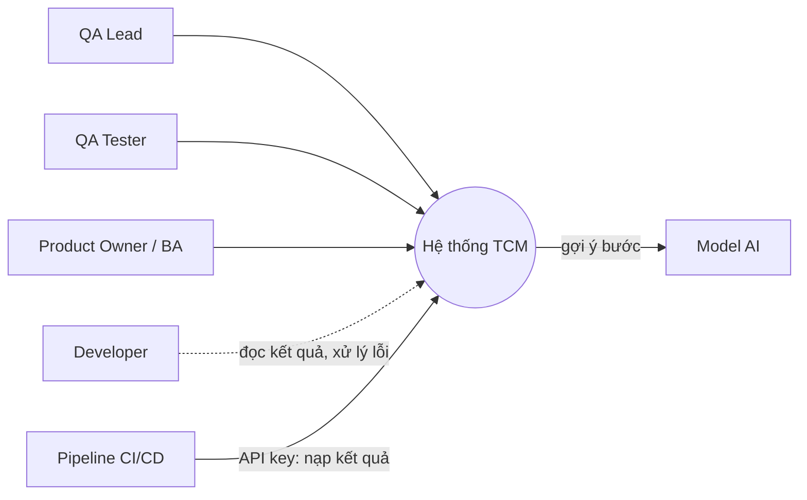
```mermaid
flowchart LR
    QL["QA Lead"]
    QT["QA Tester"]
    PO["Product Owner / BA"]
    DEV["Developer"]
    CI["Pipeline CI/CD"]
    AI["Model AI"]
    SYS(("Hệ thống TCM"))
    QL --> SYS
    QT --> SYS
    PO --> SYS
    DEV -.->|"đọc kết quả, xử lý lỗi"| SYS
    CI -->|"API key: nạp kết quả"| SYS
    SYS -->|"gợi ý bước"| AI
```

### 2.2. Ma trận trách nhiệm RACI

```
R: Responsible (thực hiện) | A: Accountable (chịu trách nhiệm chính)
C: Consulted (tham vấn)    | I: Informed (nhận thông tin)
```

| Hoạt động | QA Lead | QA Tester | Developer | PO / BA |
| :--- | :---: | :---: | :---: | :---: |
| Quản lý dự án | A / R | I | I | I |
| Soạn thảo test case | A | R | C | C |
| Duyệt / đưa về nháp / ngừng dùng | A / R | I | I | C |
| Lập plan, tạo run, gán người test | A / R | I | I | I |
| Thực thi run, ghi kết quả | A | R | I | I |
| Quản lý requirement | C | C | I | A / R |
| Cấu hình Quality Gate | A / R | C | I | C |
| Ký nghiệm thu | R | C | I | A / R |

### 2.3. Danh mục quyền (nhóm `TestCaseManagement`)
Quyền `Default` cho phép **đọc**; quyền con cho phép **thay đổi**. Quyền được cấp trong màn hình Roles của host.

| Quyền | Quyền con | Cho phép |
| :--- | :--- | :--- |
| `TestCases` | `Create`, `Update`, `Delete` | Tạo, sửa, xóa test case |
| | `Approve` | Gửi duyệt, duyệt, đưa về nháp, ngừng dùng |
| | `SuggestSteps` | Hỏi AI gợi ý bước (tách riêng vì nội dung rời hệ thống) |
| `Projects` | `Manage` | Tạo, sửa, lưu trữ, xóa dự án. Mọi người dùng đăng nhập đều **đọc** được danh sách dự án |
| `TestSuites` | `Manage` | Tạo, sửa, di chuyển, xóa suite |
| `TestPlans` | `Manage` | Quản lý plan; tạo run, thêm test, gán người, hoàn tất run |
| `TestRuns` | `Execute` | Ghi kết quả; quản lý liên kết lỗi |
| `Requirements` | `Manage` | Quản lý requirement và liên kết với test case |
| `QualityGates` | `Manage` | Quản lý cổng chất lượng |
| `SignOff` | `Approve` | Bắt đầu và ký nghiệm thu |
| `SharedSteps` | `Manage` | Quản lý nhóm bước dùng chung, cập nhật hàng loạt |
| `ApiKeys` | `Manage` | Tạo, thu hồi API key |
| `AutomationResults` | `Publish` | Nạp kết quả automation (quyền duy nhất của API key) |

Phân quyền hiện áp dụng **toàn hệ thống**, chưa có quyền riêng theo từng dự án (xem mục 12).

---

## 3. KIẾN TRÚC TỔNG THỂ

### 3.1. Bối cảnh hệ thống

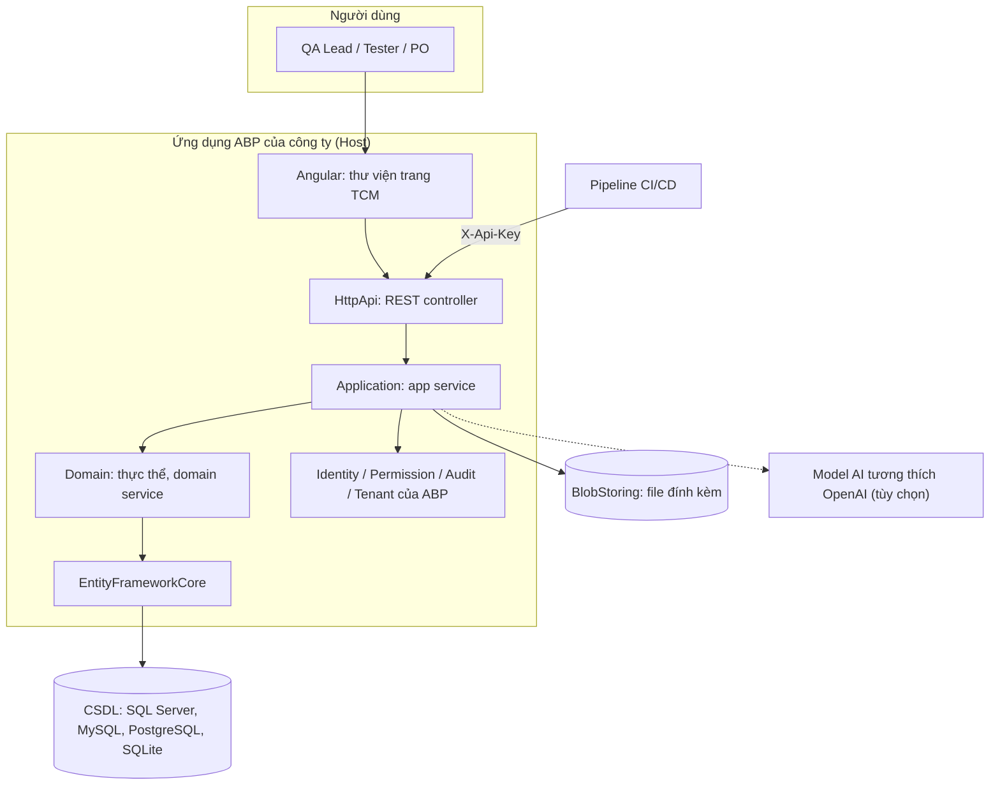
```mermaid
flowchart TB
    subgraph Users["Người dùng"]
        U1["QA Lead / Tester / PO"]
    end
    subgraph Host["Ứng dụng ABP của công ty (Host)"]
        UI["Angular: thư viện trang TCM"]
        API["HttpApi: REST controller"]
        APP["Application: app service"]
        DOM["Domain: thực thể, domain service"]
        EF["EntityFrameworkCore"]
        ID["Identity / Permission / Audit / Tenant của ABP"]
    end
    DB[("CSDL: SQL Server, MySQL, PostgreSQL, SQLite")]
    BLOB[("BlobStoring: file đính kèm")]
    CI["Pipeline CI/CD"]
    LLM["Model AI tương thích OpenAI (tùy chọn)"]
    U1 --> UI
    UI --> API
    CI -->|"X-Api-Key"| API
    API --> APP --> DOM --> EF --> DB
    APP --> BLOB
    APP -.-> LLM
    APP --> ID
```

### 3.2. Các tầng và gói

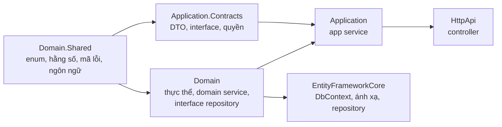
```mermaid
flowchart LR
    DS["Domain.Shared<br/>enum, hằng số, mã lỗi, ngôn ngữ"]
    D["Domain<br/>thực thể, domain service,<br/>interface repository"]
    AC["Application.Contracts<br/>DTO, interface, quyền"]
    A["Application<br/>app service"]
    E["EntityFrameworkCore<br/>DbContext, ánh xạ, repository"]
    H["HttpApi<br/>controller"]
    DS --> D
    DS --> AC
    D --> A
    AC --> A
    D --> E
    A --> H
```

| Gói | Vai trò | Tham chiếu từ |
| :--- | :--- | :--- |
| `Acme.TestCaseManagement.Domain.Shared` | enum, hằng số, mã lỗi, ngôn ngữ en / vi | mọi tầng |
| `…Domain` | aggregate, domain service, interface repository | host (gián tiếp) |
| `…Application.Contracts` | DTO, interface app service, định nghĩa quyền | host và ứng dụng client |
| `…Application` | app service | host |
| `…EntityFrameworkCore` | DbContext, ánh xạ bảng, repository | host |
| `…HttpApi` | REST controller | host |
| `angular/projects/test-case-management` | giao diện Angular (chia sẻ dạng thư mục mã nguồn) | ứng dụng Angular của host |

Ngoài ra có **host mẫu** (`host/Acme.TestCaseManagement.HttpApi.Host`: SQLite, JWT, Swagger) dùng để chạy thử độc lập.

### 3.3. Hai cách đặt cơ sở dữ liệu
| Cách | Mô tả |
| :--- | :--- |
| Dùng `TestCaseManagementDbContext` của module | Đọc chuỗi kết nối `TestCaseManagement`, lùi về `Default`; host chọn nhà cung cấp |
| **Nhúng model vào DbContext của host** (khuyến nghị) | `[ReplaceDbContext(typeof(ITestCaseManagementDbContext))]`, khai báo đủ `DbSet`, gọi `builder.ConfigureTestCaseManagement()` |

Bảng có tiền tố `Tcm` (`TcmTestCases`, `TcmTestRuns`…), đổi được bằng `TestCaseManagementDbProperties`. Module **không kèm migration** vì nhà cung cấp CSDL thuộc về host.

### 3.4. Lớp giao diện Angular
- Shell có thanh chọn dự án ở đầu; mọi trang tải lại khi đổi dự án.
- Trang: Dashboard, Test repository, Plans and runs (chi tiết run), Requirements và RTM, Quality gates, Sign-off, Shared steps, Projects, Automation (tắt mặc định).
- Trang mang style riêng bọc trong `.tcm`, không làm hỏng style của host; menu và quyền tích hợp với host ABP.

---

## 4. MÔ HÌNH NGHIỆP VỤ VÀ DỮ LIỆU

### 4.1. Phân cấp tổng quát

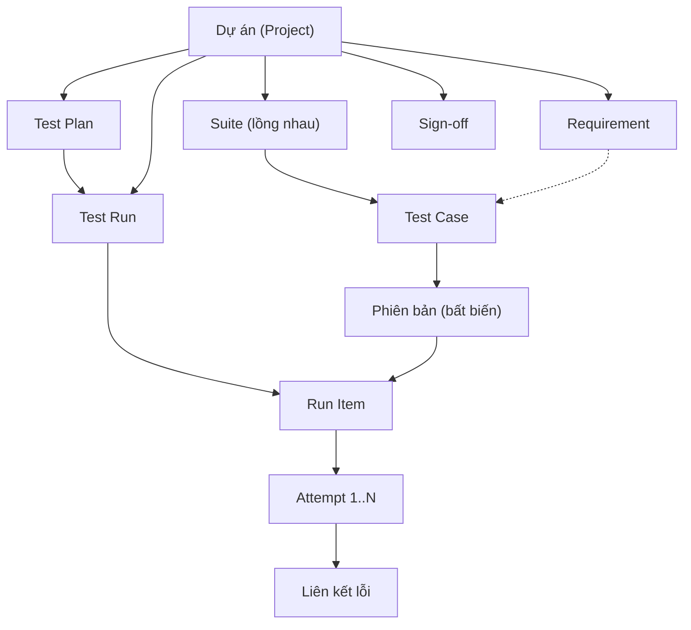
```mermaid
flowchart TD
    P["Dự án (Project)"]
    P --> S["Suite (lồng nhau)"] --> TC["Test Case"]
    TC --> V["Phiên bản (bất biến)"]
    P --> PL["Test Plan"] --> R["Test Run"]
    P --> R
    R --> RI["Run Item"] --> EX["Attempt 1..N"] --> DF["Liên kết lỗi"]
    V --> RI
    P --> RQ["Requirement"]
    RQ -.-> TC
    P --> SO["Sign-off"]
```

### 4.2. Sơ đồ thực thể (ERD)

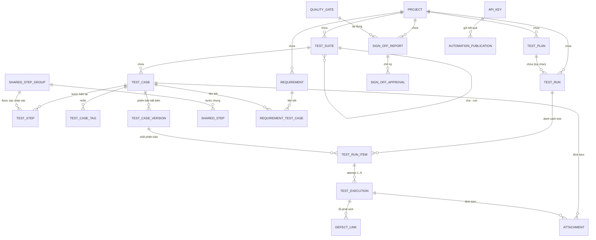
```mermaid
erDiagram
    PROJECT ||--o{ TEST_SUITE : "chứa"
    PROJECT ||--o{ TEST_PLAN : "chứa"
    PROJECT ||--o{ REQUIREMENT : "chứa"
    PROJECT ||--o{ TEST_RUN : "chứa"
    PROJECT ||--o{ SIGN_OFF_REPORT : "chứa"

    TEST_SUITE ||--o{ TEST_SUITE : "cha - con"
    TEST_SUITE ||--o{ TEST_CASE : "chứa"
    TEST_CASE ||--o{ TEST_STEP : "bước hiện tại"
    TEST_CASE ||--o{ TEST_CASE_TAG : "nhãn"
    TEST_CASE ||--o{ TEST_CASE_VERSION : "phiên bản bất biến"
    SHARED_STEP_GROUP ||--o{ SHARED_STEP : "bước chung"
    SHARED_STEP_GROUP ||--o{ TEST_STEP : "được sao chép vào"

    REQUIREMENT ||--o{ REQUIREMENT_TEST_CASE : "liên kết"
    TEST_CASE ||--o{ REQUIREMENT_TEST_CASE : "liên kết"

    TEST_PLAN ||--o{ TEST_RUN : "chứa (tùy chọn)"
    TEST_RUN ||--o{ TEST_RUN_ITEM : "danh sách test"
    TEST_CASE_VERSION ||--o{ TEST_RUN_ITEM : "chốt phiên bản"
    TEST_RUN_ITEM ||--o{ TEST_EXECUTION : "attempt 1..N"
    TEST_EXECUTION ||--o{ DEFECT_LINK : "lỗi phát sinh"
    TEST_CASE ||--o{ ATTACHMENT : "đính kèm"
    TEST_EXECUTION ||--o{ ATTACHMENT : "đính kèm"

    QUALITY_GATE ||--o{ SIGN_OFF_REPORT : "áp dụng"
    SIGN_OFF_REPORT ||--o{ SIGN_OFF_APPROVAL : "chữ ký"
    API_KEY ||--o{ AUTOMATION_PUBLICATION : "gửi kết quả"
```

Người dùng được lưu dưới dạng `Guid` (id) và audit của ABP; module **không có khóa ngoại** tới bảng người dùng của host. Mọi thực thể hỗ trợ `TenantId` (đa tenant).

### 4.3. Mô tả thực thể

| Thực thể | Trường chính | Ghi chú |
| :--- | :--- | :--- |
| **Project** (`TcmProjects`) | `Key`, `Name`, `Description`, `IsArchived` | `Key` 2–10 ký tự chữ hoa / số, bắt đầu bằng chữ, duy nhất, không đổi |
| **TestSuite** | `ProjectId`, `ParentId?`, `Name`, `Description`, `Order` | Cây không giới hạn cấp |
| **TestCase** | `SuiteId`, `Code`, `Title`, `Description`, `Preconditions`, `Postconditions`, `Priority`, `Severity`, `Status`, `ExecutionType`, `Kind`, `Layer`, `AutomationId?`, `IsFlaky`, `CurrentVersion`, `Steps`, `Tags` | Thuộc dự án thông qua suite; `Code` duy nhất toàn thư viện |
| **TestStep** | thứ tự, hành động, dữ liệu test, kết quả mong đợi, liên kết nhóm bước chung | |
| **TestCaseVersion** | `TestCaseId`, `VersionNumber`, `Title`, `Preconditions`, `Postconditions`, `StepsJson`, `ChangeSummary?` | Bản chụp bất biến lúc duyệt |
| **SharedStepGroup / SharedStep** | tên, các bước, số hiệu chỉnh sửa (revision) | Test case giữ **bản sao riêng** kèm liên kết |
| **TestPlan** | `ProjectId`, `Name`, `Description`, `MilestoneId?`, `StartDate`, `EndDate`, `Status` | |
| **TestRun** | `ProjectId`, `TestPlanId?`, `Title`, `Environment`, `AssignedToUserId?`, `Status` | Có thể đứng ngoài plan (ví dụ run do CI tạo) |
| **TestRunItem** | `TestRunId`, `TestCaseVersionId`, `Sequence`, `AssignedUserId?`, `CurrentStatus` | Bắt buộc gắn phiên bản |
| **TestExecution** | `TestRunItemId`, `AttemptNumber`, `Status`, `ActualResult`, `DurationSeconds` | Chỉ thêm, không sửa |
| **DefectLink** | `TestExecutionId`, `ExternalSystem`, `IssueKey`, `IssueUrl?`, `Severity`, `IsResolved`, `ResolvedTime?` | Chỉ gắn vào attempt Failed |
| **Requirement** | `ProjectId`, `Code`, `Title`, `Description`, `AcceptanceCriteria`, `Priority`, `MilestoneId?` | `Code` duy nhất toàn thư viện |
| **RequirementTestCase** | `RequirementId`, `TestCaseId` | Liên kết nhiều–nhiều |
| **QualityGate** | `Name`, `Description`, `MinPassRate`, `RequiredApprovals`, `IsDefault` | |
| **SignOffReport / SignOffApproval** | phạm vi (plan hoặc milestone), `ProjectId`, tên và ngưỡng gate đã chụp, `Status`, `SummaryStatsJson`, `SnapshotHash`, người ký | |
| **Attachment** | chủ sở hữu (test case hoặc attempt), tên file, loại, dung lượng | Nội dung lưu trong blob container |
| **ApiKey / AutomationPublication** | khóa cho pipeline (chỉ lưu hash) / bản ghi idempotency | |

### 4.4. Danh mục giá trị

| Danh mục | Giá trị |
| :--- | :--- |
| `TestCaseStatus` | Draft, UnderReview, Approved, Deprecated |
| `PriorityLevel` | Low, Medium, High, Urgent |
| `SeverityLevel` | Low, Medium, High, Critical |
| `ExecutionType` | Manual, Automated, Hybrid |
| `TestKind` | Functional, Performance, Security, Usability |
| `TestLayer` | Unit, Integration, E2E, Acceptance |
| `PlanStatus` | Draft, Active, Completed, Archived |
| `RunStatus` | Planned, InProgress, Completed |
| `TestResultStatus` | Untested, Passed, Failed, Blocked, Skipped |
| `SignOffStatus` | Pending, Approved, Superseded |
| `RequirementCoverageStatus` | Uncovered, NotRun, Passed, Failed, Blocked |
| `AutomationOutcome` | Recorded, Unmatched, Ambiguous, NotApproved, NotInRun |
| `FlakinessLevel` | Insufficient, Stable, Watch, Flaky |

---

## 5. QUY TRÌNH NGHIỆP VỤ

### 5.1. Dự án

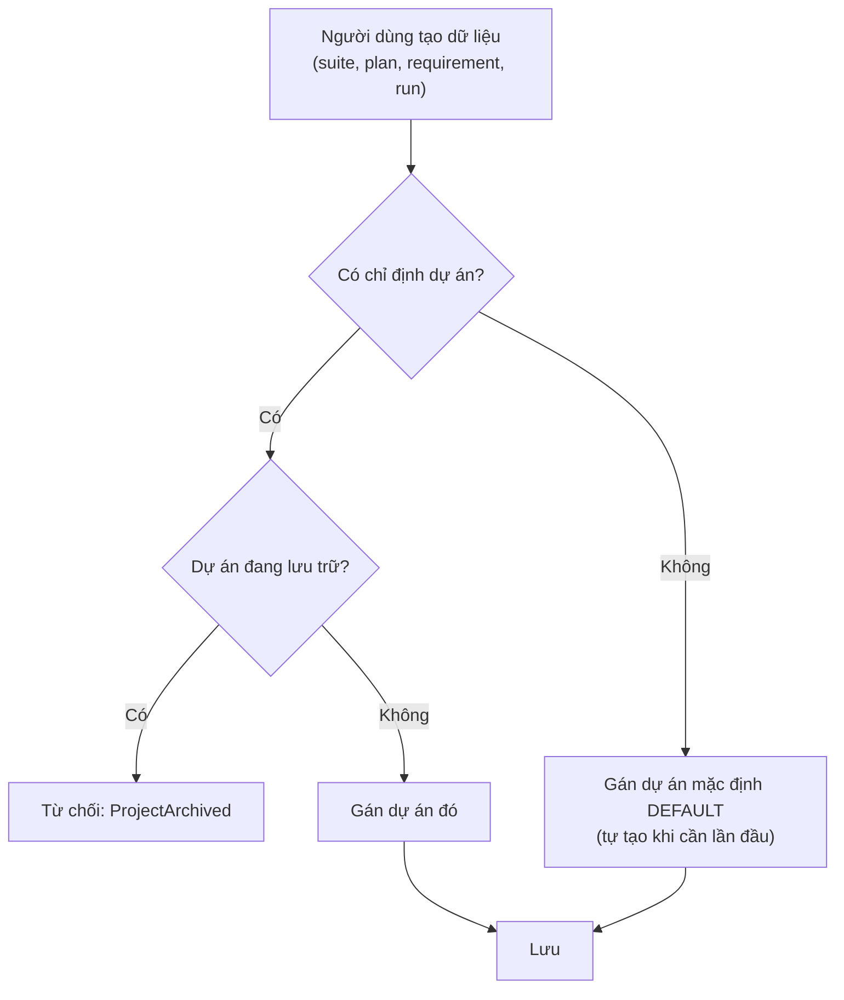
```mermaid
flowchart TD
    A["Người dùng tạo dữ liệu<br/>(suite, plan, requirement, run)"] --> B{"Có chỉ định dự án?"}
    B -- Có --> C{"Dự án đang lưu trữ?"}
    C -- Có --> X1["Từ chối: ProjectArchived"]
    C -- Không --> D["Gán dự án đó"]
    B -- Không --> E["Gán dự án mặc định DEFAULT<br/>(tự tạo khi cần lần đầu)"]
    D --> F["Lưu"]
    E --> F
```

**Mô tả:**
- Dự án là cấp cao nhất. Suite, plan, requirement, run và sign-off thuộc **đúng một** dự án; test case thuộc dự án thông qua suite.
- **Không trộn dự án** (lỗi `DifferentProject`): suite con cùng dự án với cha; không chuyển suite hay test case sang dự án khác; không đưa test case vào run của dự án khác; không liên kết test case với requirement của dự án khác; run của một plan thuộc dự án của plan; run không có plan lấy dự án của test case đầu tiên.
- **Lưu trữ:** dự án lưu trữ vẫn đọc được nhưng không thêm được gì. **Xóa** chỉ khi dự án không còn suite, plan, requirement, run.
- **Dữ liệu cũ:** lần đầu gọi danh sách dự án trên thư viện chưa có dự án, hệ thống tạo `DEFAULT` và gán toàn bộ dữ liệu cũ vào (một lần).
- **Dùng chung có chủ đích:** nhóm bước dùng chung, mã test case và mã requirement (nên đặt tiền tố như `EINV-`), Quality Gate, phân quyền.
- Giao diện: thanh chọn dự án ở đầu trang (nhớ lựa chọn lần sau), mọi danh sách, dashboard, RTM, xuất dữ liệu theo dự án đang chọn; dự án `DEFAULT` hiển thị chỉ tên.

### 5.2. Vòng đời test case và phiên bản

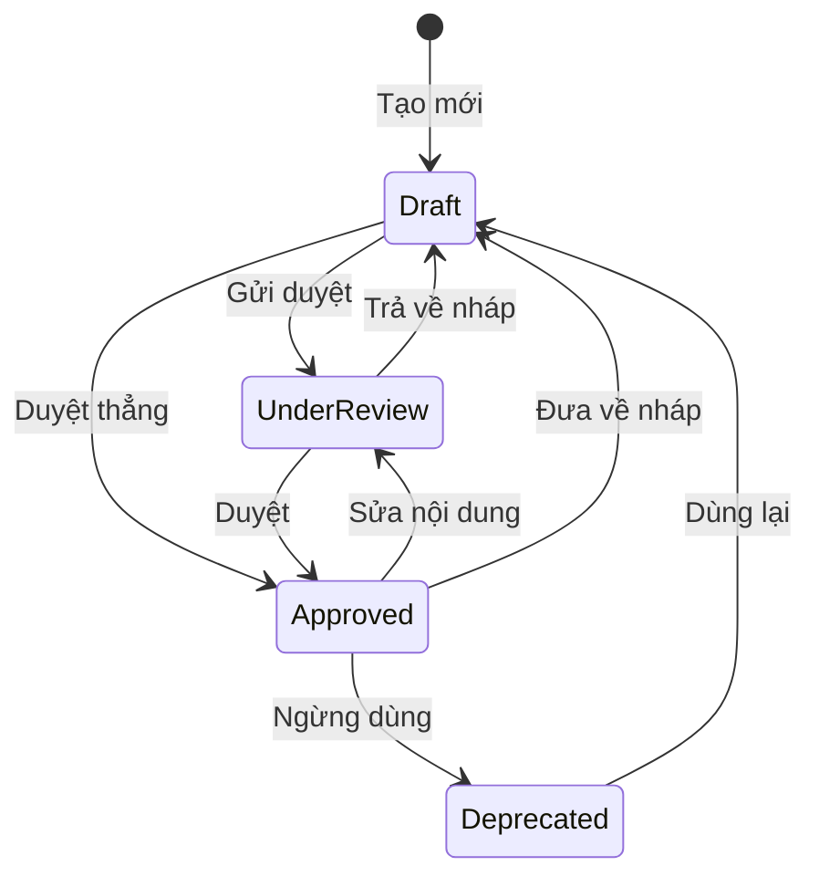
```mermaid
stateDiagram-v2
    [*] --> Draft: Tạo mới
    Draft --> UnderReview: Gửi duyệt
    Draft --> Approved: Duyệt thẳng
    UnderReview --> Draft: Trả về nháp
    UnderReview --> Approved: Duyệt
    Approved --> UnderReview: Sửa nội dung
    Approved --> Draft: Đưa về nháp
    Approved --> Deprecated: Ngừng dùng
    Deprecated --> Draft: Dùng lại
```

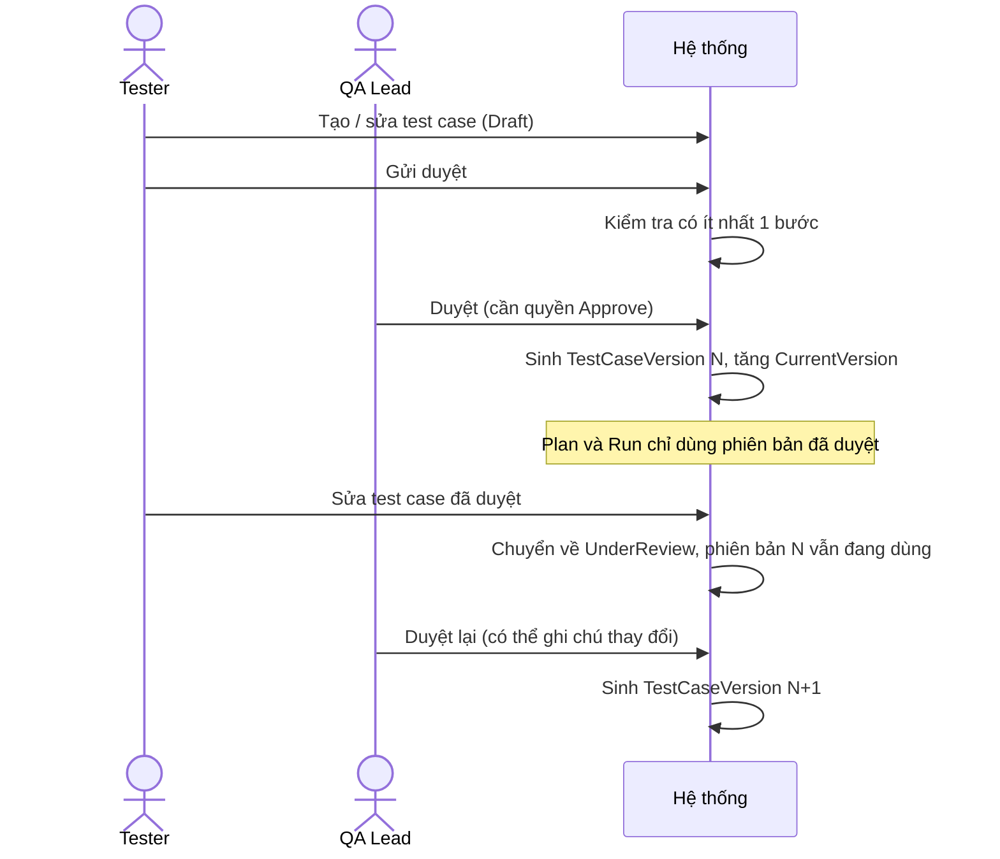
```mermaid
sequenceDiagram
    actor T as Tester
    actor L as QA Lead
    participant S as Hệ thống
    T->>S: Tạo / sửa test case (Draft)
    T->>S: Gửi duyệt
    S->>S: Kiểm tra có ít nhất 1 bước
    L->>S: Duyệt (cần quyền Approve)
    S->>S: Sinh TestCaseVersion N, tăng CurrentVersion
    Note over S: Plan và Run chỉ dùng phiên bản đã duyệt
    T->>S: Sửa test case đã duyệt
    S->>S: Chuyển về UnderReview, phiên bản N vẫn đang dùng
    L->>S: Duyệt lại (có thể ghi chú thay đổi)
    S->>S: Sinh TestCaseVersion N+1
```

**Mô tả:**
1. **Soạn mới:** trạng thái Draft. Cần ít nhất 1 bước trước khi gửi duyệt hoặc duyệt.
2. **Duyệt:** người có quyền `Approve`; hệ thống sinh `TestCaseVersion` bất biến chứa tiêu đề, tiền / hậu điều kiện và toàn bộ bước (`StepsJson`). Người duyệt được phép là tác giả.
3. **Sửa test case đã duyệt:** nội dung mới nằm ở bản nháp, test case **quay về UnderReview**; phiên bản đã duyệt trước đó vẫn là bản đang dùng nên plan và run cũ không bị đổi. Phiên bản mới chỉ sinh khi duyệt lại. Quy tắc này áp dụng cho sửa thông tin, sắp xếp lại bước, chèn hoặc làm mới nhóm bước dùng chung, cập nhật hàng loạt từ nhóm bước, và nhập ở chế độ cập nhật. Ghi chú thay đổi **không bắt buộc**.
4. **Thêm vào run:** chỉ test case Approved; run item gắn với phiên bản đã duyệt tại thời điểm thêm.
5. **Xóa:** xóa mềm, các phiên bản còn nên run cũ vẫn đọc được.
6. **Tag** là nhãn, không thuộc phiên bản: đổi tag không sinh phiên bản (tối đa 20 tag, mỗi tag tối đa 50 ký tự, không chứa dấu phẩy hay chấm phẩy, không phân biệt hoa thường).
7. **Cờ Flaky** do hệ thống đánh (xem 8.1).

### 5.3. Nhóm bước dùng chung (Shared Steps)

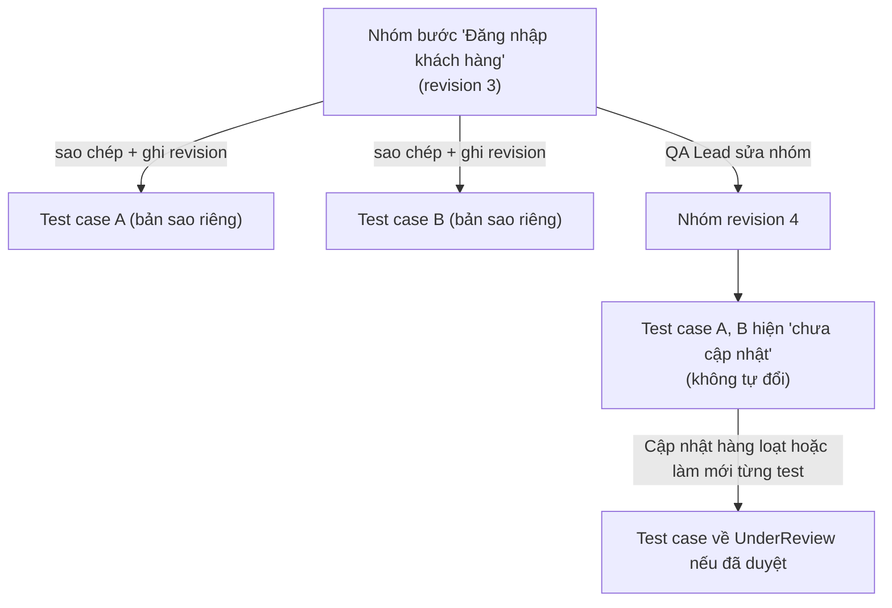
```mermaid
flowchart TD
    G["Nhóm bước 'Đăng nhập khách hàng'<br/>(revision 3)"] -->|"sao chép + ghi revision"| T1["Test case A (bản sao riêng)"]
    G -->|"sao chép + ghi revision"| T2["Test case B (bản sao riêng)"]
    G -->|"QA Lead sửa nhóm"| G2["Nhóm revision 4"]
    G2 --> W["Test case A, B hiện 'chưa cập nhật'<br/>(không tự đổi)"]
    W -->|"Cập nhật hàng loạt hoặc làm mới từng test"| R["Test case về UnderReview nếu đã duyệt"]
```

- Nhóm bước được viết một lần ở thư viện và **sao chép** vào nhiều test case; test case giữ bản sao của riêng nó cùng revision đã chép.
- Sửa nhóm **không** làm thay đổi test case, phiên bản hay run đã có. Test case đang giữ revision cũ được đánh dấu "chưa cập nhật"; cập nhật hàng loạt hoặc làm mới từng test case đưa chúng lên revision mới (test case đã duyệt quay về duyệt lại).
- Sửa một bước đã chép, hoặc gỡ liên kết, biến bước đó thành của riêng test case. Nhóm đang được dùng thì không xóa được.

### 5.4. Kế hoạch và thực thi

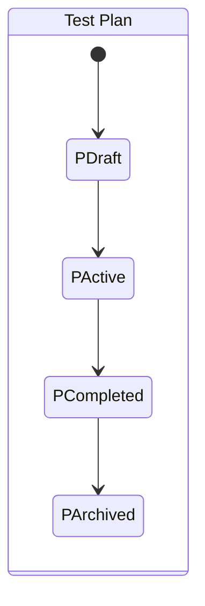
```mermaid
stateDiagram-v2
    direction LR
    state "Test Plan" as PL {
        [*] --> PDraft
        PDraft --> PActive
        PActive --> PCompleted
        PCompleted --> PArchived
    }
```

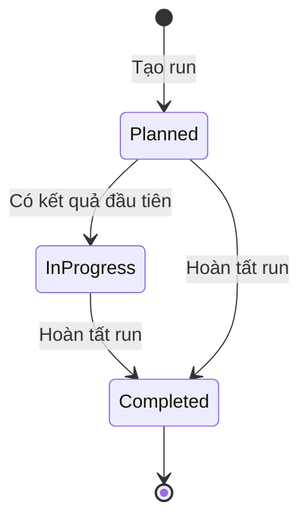
```mermaid
stateDiagram-v2
    [*] --> Planned: Tạo run
    Planned --> InProgress: Có kết quả đầu tiên
    InProgress --> Completed: Hoàn tất run
    Planned --> Completed: Hoàn tất run
    Completed --> [*]
```

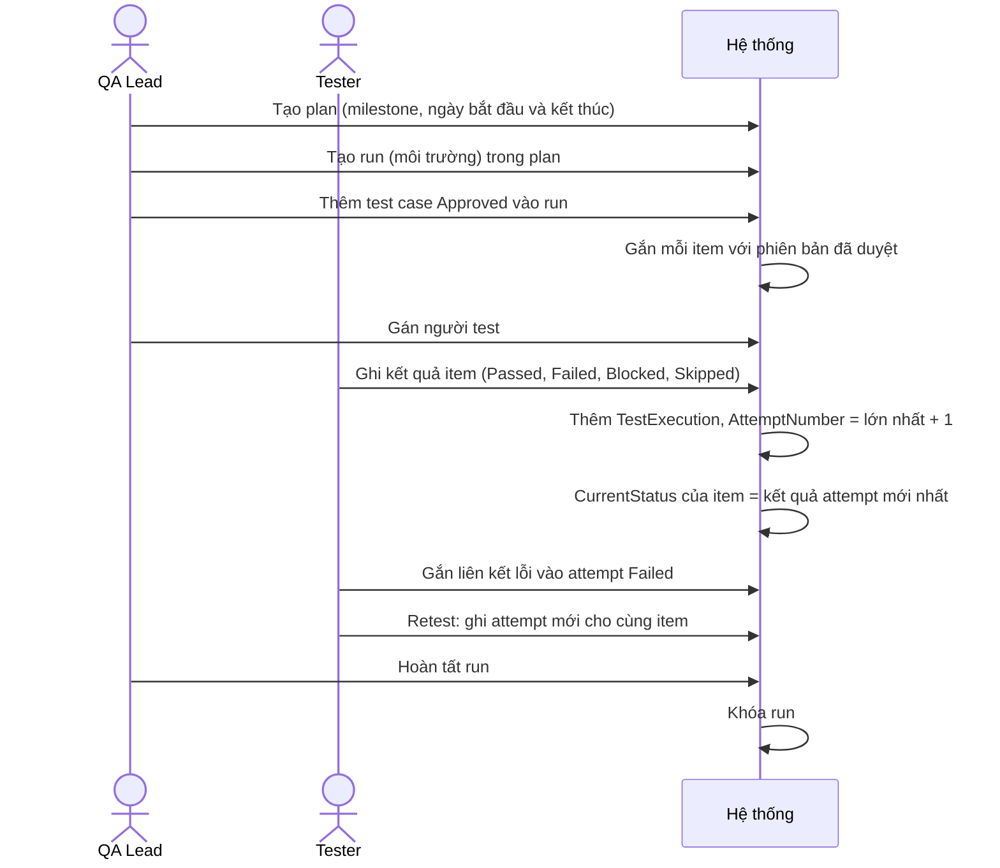
```mermaid
sequenceDiagram
    actor L as QA Lead
    actor T as Tester
    participant S as Hệ thống
    L->>S: Tạo plan (milestone, ngày bắt đầu và kết thúc)
    L->>S: Tạo run (môi trường) trong plan
    L->>S: Thêm test case Approved vào run
    S->>S: Gắn mỗi item với phiên bản đã duyệt
    L->>S: Gán người test
    T->>S: Ghi kết quả item (Passed, Failed, Blocked, Skipped)
    S->>S: Thêm TestExecution, AttemptNumber = lớn nhất + 1
    S->>S: CurrentStatus của item = kết quả attempt mới nhất
    T->>S: Gắn liên kết lỗi vào attempt Failed
    T->>S: Retest: ghi attempt mới cho cùng item
    L->>S: Hoàn tất run
    S->>S: Khóa run
```

**Mô tả:**
- Mỗi run item có **1..N lần chạy** (`TestExecution`). Lần chạy cũ giữ nguyên; trạng thái hiện tại của item là kết quả lần chạy mới nhất. Retest chính là ghi thêm một attempt.
- Mỗi attempt lưu kết quả thực tế, thời lượng, người chạy và thời điểm (audit ABP), đính kèm và liên kết lỗi.
- **Chạy hàng loạt** (batch) cho run hồi quy lớn.
- **Run** chuyển Planned → InProgress khi có kết quả đầu tiên → Completed. Run đã hoàn tất bị **khóa**: không ghi kết quả, không thêm hay bớt item.
- **Plan** có ngày bắt đầu và kết thúc (kiểm tra hợp lệ), có thể gắn milestone; plan còn run thì không xóa được; plan lưu trữ không thêm run.
- **Gán người test** theo từng item; host cung cấp danh sách người dùng qua `TCM_USER_DIRECTORY` (mặc định dùng tra cứu người dùng của ABP).
- **Giao diện danh sách run:** mặc định nhóm theo plan (mở / đóng từng nhóm, nhóm "Runs without a plan" cho run không thuộc plan, hiển thị số run, trạng thái, ngày), có chế độ danh sách phẳng với lọc theo từ khóa, plan, trạng thái, môi trường và phân trang. Mỗi run hiện tiến độ, số đạt, số không đạt.

### 5.5. Lỗi (Defect) và issue tracker

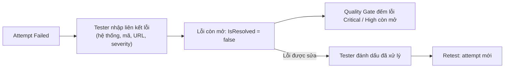
```mermaid
flowchart LR
    F["Attempt Failed"] --> L["Tester nhập liên kết lỗi<br/>(hệ thống, mã, URL, severity)"]
    L --> O["Lỗi còn mở: IsResolved = false"]
    O --> Q["Quality Gate đếm lỗi Critical / High còn mở"]
    O -->|"Lỗi được sửa"| R["Tester đánh dấu đã xử lý"]
    R --> RT["Retest: attempt mới"]
```

- Liên kết lỗi chỉ gắn được vào **attempt Failed**, không trùng trong cùng attempt; URL được kiểm tra hợp lệ.
- Thông tin: hệ thống (Jira, GitHub…), mã issue, URL, severity (Low / Medium / High / Critical), đã xử lý hay chưa.
- Quality Gate đếm **theo từng issue** (hệ thống + mã, không phân biệt hoa thường) còn liên kết chưa xử lý.
- Hiện tại người dùng **nhập mã và URL lỗi** thủ công; chưa gọi API Jira (xem mục 12).

### 5.6. Requirement và truy vết (RTM)

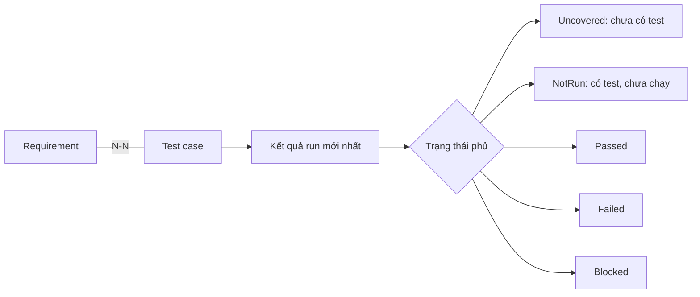
```mermaid
flowchart LR
    RQ["Requirement"] ---|"N-N"| TC["Test case"]
    TC --> RI["Kết quả run mới nhất"]
    RI --> ST{"Trạng thái phủ"}
    ST --> U["Uncovered: chưa có test"]
    ST --> N["NotRun: có test, chưa chạy"]
    ST --> P["Passed"]
    ST --> Fa["Failed"]
    ST --> B["Blocked"]
```

- Requirement có mã duy nhất, tiêu đề, mô tả, tiêu chí chấp nhận, ưu tiên, milestone tùy chọn.
- RTM phân biệt **được phủ** (có test case) với **đã đạt** (test case chạy Passed) và hiện lỗi đang chặn; lọc theo dự án.

### 5.7. Quality Gate và nghiệm thu

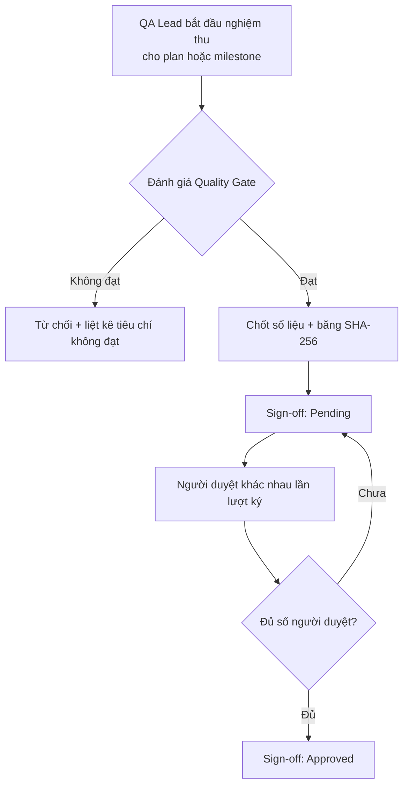
```mermaid
flowchart TD
    S["QA Lead bắt đầu nghiệm thu<br/>cho plan hoặc milestone"] --> E{"Đánh giá Quality Gate"}
    E -- "Không đạt" --> X["Từ chối + liệt kê tiêu chí không đạt"]
    E -- "Đạt" --> SN["Chốt số liệu + băng SHA-256"]
    SN --> PD["Sign-off: Pending"]
    PD --> AP["Người duyệt khác nhau lần lượt ký"]
    AP --> D{"Đủ số người duyệt?"}
    D -- Chưa --> PD
    D -- Đủ --> OK["Sign-off: Approved"]
```

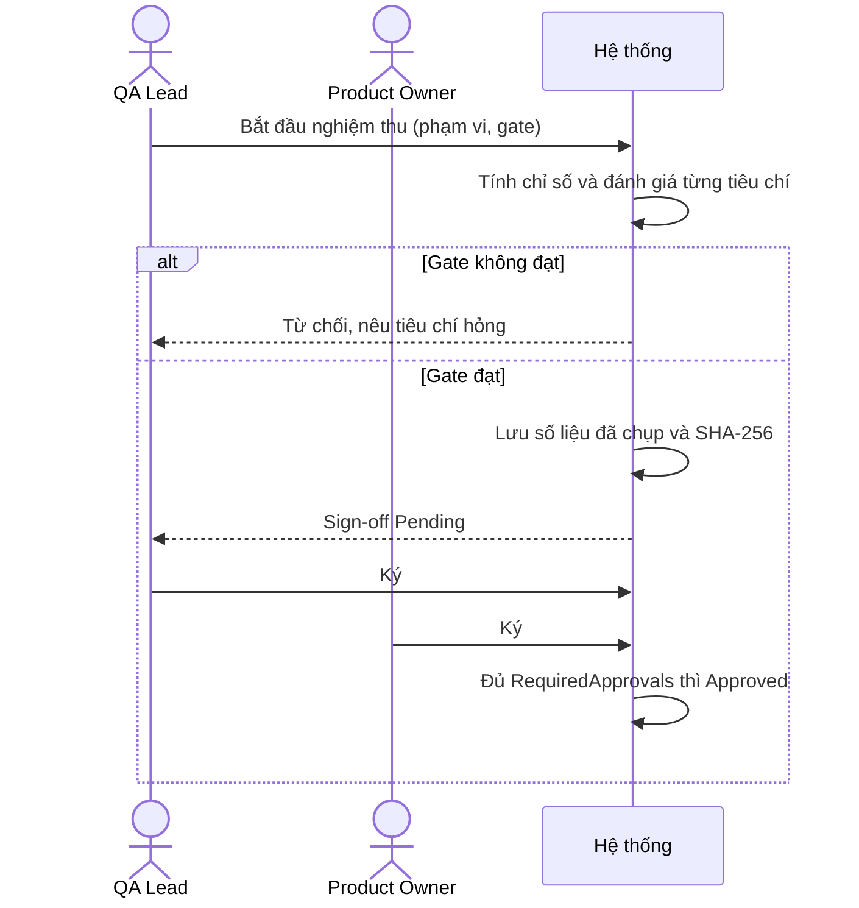
```mermaid
sequenceDiagram
    actor L as QA Lead
    actor P as Product Owner
    participant S as Hệ thống
    L->>S: Bắt đầu nghiệm thu (phạm vi, gate)
    S->>S: Tính chỉ số và đánh giá từng tiêu chí
    alt Gate không đạt
        S-->>L: Từ chối, nêu tiêu chí hỏng
    else Gate đạt
        S->>S: Lưu số liệu đã chụp và SHA-256
        S-->>L: Sign-off Pending
        L->>S: Ký
        P->>S: Ký
        S->>S: Đủ RequiredApprovals thì Approved
    end
```

**Tiêu chí của Quality Gate:**

| # | Tiêu chí | Điều kiện đạt |
| :--- | :--- | :--- |
| 1 | Tỷ lệ đạt (pass rate) | Passed ÷ (tổng item − Skipped) ≥ `MinPassRate` (mặc định 95), so sánh tỷ lệ chính xác |
| 2 | P1 đã chạy hết | Mọi item của test case ưu tiên `Urgent` đều có kết quả Passed hoặc Failed |
| 3 | Không còn lỗi Critical mở | Số issue Critical chưa xử lý = 0 |
| 4 | Không còn lỗi High mở | Số issue High chưa xử lý = 0 |

**Mô tả:**
- Quality Gate có tên, mô tả, `MinPassRate`, `RequiredApprovals` (mặc định 2, tối đa 10), có thể đặt mặc định. Có chế độ đánh giá thử (`quality-gates/evaluate`) hiển thị từng tiêu chí.
- **Không có cơ chế bỏ qua (override):** gate không đạt thì không nghiệm thu được.
- Sign-off gắn với **plan hoặc milestone**, trong phạm vi một dự án; chụp lại số liệu (`SummaryStatsJson`), tên và ngưỡng của gate lúc chốt, và `SnapshotHash` SHA-256; trạng thái Pending, Approved, Superseded.
- Mỗi người duyệt chỉ ký một lần; người ký phải là người dùng có id; hoàn tất khi đủ số người duyệt khác nhau.
- Băng SHA-256 phát hiện số liệu bị sửa; **không phải chữ ký số bất đối xứng**.
- Hoàn tất một run **không** bị gate chặn; gate áp dụng ở bước nghiệm thu.

### 5.8. Nhập và xuất dữ liệu

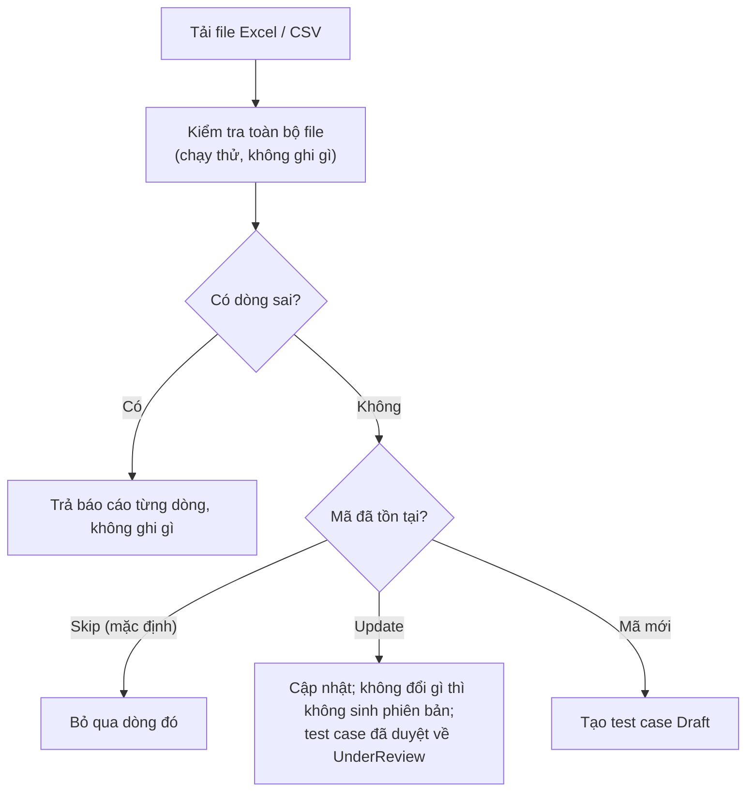
```mermaid
flowchart TD
    U["Tải file Excel / CSV"] --> V["Kiểm tra toàn bộ file<br/>(chạy thử, không ghi gì)"]
    V --> OK{"Có dòng sai?"}
    OK -- Có --> RP["Trả báo cáo từng dòng, không ghi gì"]
    OK -- Không --> M{"Mã đã tồn tại?"}
    M -- "Skip (mặc định)" --> SK["Bỏ qua dòng đó"]
    M -- "Update" --> UP["Cập nhật; không đổi gì thì không sinh phiên bản;<br/>test case đã duyệt về UnderReview"]
    M -- "Mã mới" --> CR["Tạo test case Draft"]
```

**Test case** (mỗi dòng một bước; các dòng cùng `Code` là một test case):
`Suite, Code, Title, Description, Preconditions, Postconditions, Priority, Severity, Kind, Layer, ExecutionType, AutomationId, Flaky, Status, Version, StepNo, Action, ExpectedResult, TestData` (và cột `Tags` cách nhau bằng dấu chấm phẩy).
- `Suite` là đường dẫn như `Payments/Cards`; suite chưa có sẽ được tạo nếu người nhập có quyền quản lý suite. `Status`, `Version`, `StepNo` chỉ để tham khảo khi nhập.
- Nhập vào dự án nào theo tham số `ProjectId`, bỏ trống thì vào dự án mặc định.
- **Tất cả hoặc không gì:** một dòng sai thì chặn cả file. `DryRun=true` trả báo cáo từng dòng (Created, Updated, Skipped, Invalid, thông báo theo ngôn ngữ) mà không ghi gì.
- Cột file không có thì giữ nguyên trường; ô trống trong cột có mặt thì xóa trường.

**Kết quả chạy:** xuất `Code, Title, Version, Attempt, Result, ActualResult, DurationSeconds, Defects, ExecutedAt, ExecutedBy` (mỗi attempt một dòng); nhập chỉ cần `Code` và `Result`, mỗi dòng thành một attempt mới.

**Giới hạn và bảo mật:** 5 MiB, 10.000 dòng, 50 MiB sau giải nén, 20.000 test case mỗi lần xuất (`TestCaseManagementTransferOptions`). CSV là UTF-8 có BOM, đọc được dấu phẩy, chấm phẩy, tab; ô có thể chạy như công thức Excel được thêm dấu nháy đơn khi xuất.
**Quyền:** xuất = quyền đọc; nhập test case = `TestCases.Create` (`Update` để cập nhật, `TestSuites.Manage` để tạo suite); nhập kết quả = `TestRuns.Execute`.

### 5.9. Nạp kết quả automation (CI/CD)

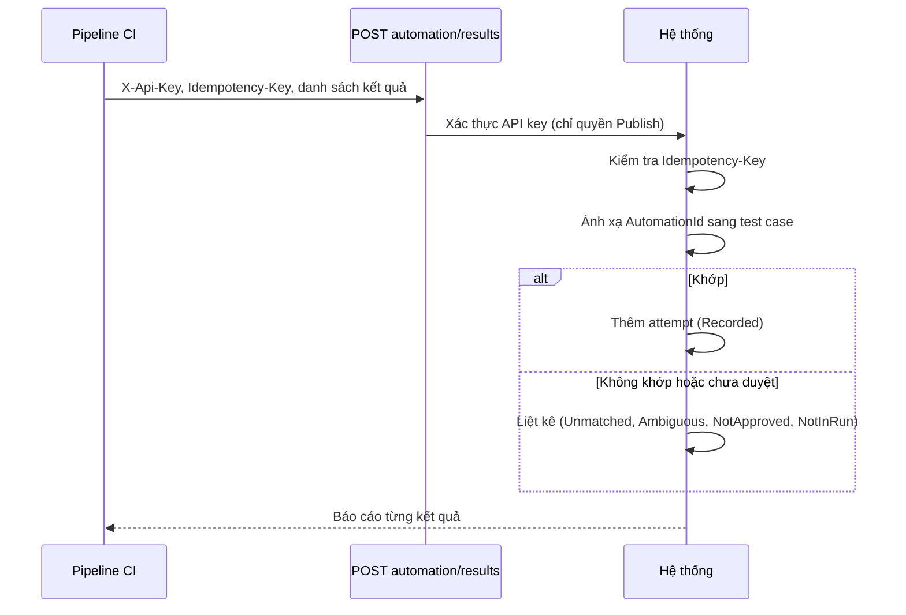
```mermaid
sequenceDiagram
    participant CI as Pipeline CI
    participant API as POST automation/results
    participant S as Hệ thống
    CI->>API: X-Api-Key, Idempotency-Key, danh sách kết quả
    API->>S: Xác thực API key (chỉ quyền Publish)
    S->>S: Kiểm tra Idempotency-Key
    S->>S: Ánh xạ AutomationId sang test case
    alt Khớp
        S->>S: Thêm attempt (Recorded)
    else Không khớp hoặc chưa duyệt
        S->>S: Liệt kê (Unmatched, Ambiguous, NotApproved, NotInRun)
    end
    S-->>CI: Báo cáo từng kết quả
```

- Test case liên kết với script tự động bằng **`AutomationId`** (duy nhất).
- Request truyền `run` (tạo run mới) hoặc `runId` (run đã có); tối đa 2000 kết quả mỗi lần; `Idempotency-Key` để gửi lại không ghi hai lần; `failOnUnmatched` từ chối cả request nếu có kết quả không khớp; `addMissingToRun` thêm test case đã duyệt còn thiếu; cùng test lặp trong một request tính là retry, test fail rồi pass bị đánh flaky; run không có plan lấy dự án của test case đầu tiên.
- **API key**: bí mật dạng `tcm_…` chỉ hiện một lần, chỉ lưu hash; key chỉ có quyền `AutomationResults.Publish`, không có người dùng hay vai trò.
- Phần **giao diện** (trang Automation, ô Automation ID, bộ lọc) tắt mặc định, bật bằng `{ provide: TCM_FEATURES, useValue: { automation: true } }`; endpoint phía server và xác thực API key vẫn nằm trong hệ thống. Nhận định dạng JSON.

### 5.10. Gợi ý bước bằng AI

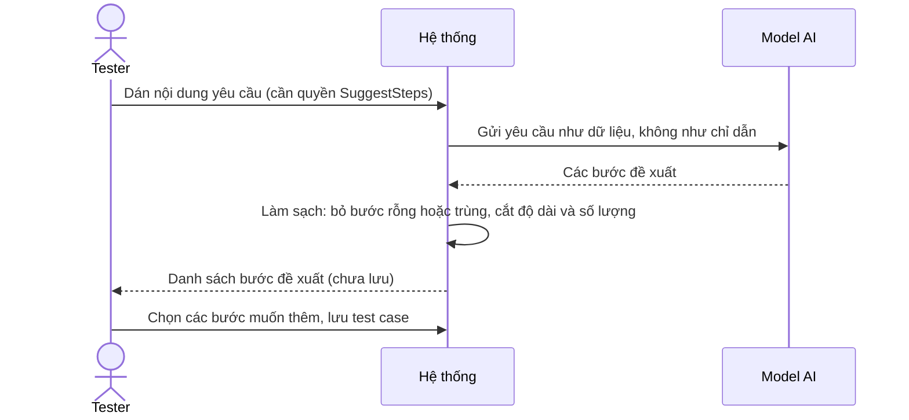
```mermaid
sequenceDiagram
    actor T as Tester
    participant S as Hệ thống
    participant M as Model AI
    T->>S: Dán nội dung yêu cầu (cần quyền SuggestSteps)
    S->>M: Gửi yêu cầu như dữ liệu, không như chỉ dẫn
    M-->>S: Các bước đề xuất
    S->>S: Làm sạch: bỏ bước rỗng hoặc trùng, cắt độ dài và số lượng
    S-->>T: Danh sách bước đề xuất (chưa lưu)
    T->>S: Chọn các bước muốn thêm, lưu test case
```

- Bật bằng cấu hình `TestCaseManagement:AiSuggestions` (`Endpoint` chat completions, `ApiKey`, `Model`…); không cấu hình thì tính năng tắt và nút không hiện.
- Chạy được với OpenAI hoặc model nội bộ (Ollama, vLLM, LM Studio) nên nội dung có thể không rời mạng công ty. Thay được bằng `IStepSuggestionProvider` riêng.
- Khóa AI không bao giờ được lưu, hiển thị, trả về, ghi log; audit của lời gọi không giữ nội dung yêu cầu. Chưa có hạn mức hay giới hạn tần suất.

---

## 6. DANH MỤC USE CASE

### 6.1. Sơ đồ Use Case

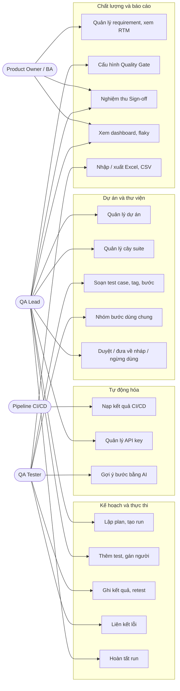
```mermaid
flowchart LR
    QL(["QA Lead"])
    QT(["QA Tester"])
    PO(["Product Owner / BA"])
    CI(["Pipeline CI/CD"])

    subgraph PRJ["Dự án và thư viện"]
        U1["Quản lý dự án"]
        U2["Quản lý cây suite"]
        U3["Soạn test case, tag, bước"]
        U4["Nhóm bước dùng chung"]
        U5["Duyệt / đưa về nháp / ngừng dùng"]
    end
    subgraph EXE["Kế hoạch và thực thi"]
        U6["Lập plan, tạo run"]
        U7["Thêm test, gán người"]
        U8["Ghi kết quả, retest"]
        U9["Liên kết lỗi"]
        U10["Hoàn tất run"]
    end
    subgraph QUA["Chất lượng và báo cáo"]
        U11["Quản lý requirement, xem RTM"]
        U12["Cấu hình Quality Gate"]
        U13["Nghiệm thu Sign-off"]
        U14["Xem dashboard, flaky"]
        U15["Nhập / xuất Excel, CSV"]
    end
    subgraph AUT["Tự động hóa"]
        U16["Nạp kết quả CI/CD"]
        U17["Quản lý API key"]
        U18["Gợi ý bước bằng AI"]
    end

    QL --> U1 & U2 & U5 & U6 & U7 & U10 & U12 & U13 & U14 & U17
    QT --> U3 & U4 & U8 & U9 & U15 & U18
    PO --> U11 & U13 & U14
    CI --> U16
```

### 6.2. Danh sách Use Case

| Mã | Use case | Actor | Mô tả |
| :--- | :--- | :--- | :--- |
| UC-01 | Quản lý dự án | QA Lead | Tạo (key không đổi), sửa tên và mô tả, lưu trữ, khôi phục, xóa khi trống |
| UC-02 | Chọn dự án đang làm việc | Mọi người | Chọn ở thanh đầu trang; mọi trang theo dự án đó |
| UC-03 | Quản lý cây suite | QA Lead, Tester | Tạo, đổi tên, di chuyển, xóa; chặn vòng lặp; xóa suite chỉ khi trống |
| UC-04 | Soạn test case | Tester | Mã, tiêu đề, mô tả, tiền và hậu điều kiện, ưu tiên, severity, loại, tầng, cách chạy, `AutomationId`, bước, tag |
| UC-05 | Gửi duyệt | Tester | Draft sang UnderReview |
| UC-06 | Duyệt / trả về nháp | QA Lead | Duyệt sinh phiên bản; trả về nháp để sửa |
| UC-07 | Ngừng dùng test case | QA Lead | Deprecated; không thêm vào run mới |
| UC-08 | Xem phiên bản | Tester, QA Lead | Xem danh sách và nội dung các phiên bản |
| UC-09 | Quản lý nhóm bước dùng chung | QA Lead, Tester | Tạo, sửa, xem nơi dùng, chèn vào test case, làm mới, cập nhật hàng loạt |
| UC-10 | Gắn tag và lọc | Tester | Tag không sinh phiên bản; lọc cùng lúc theo nhiều tag |
| UC-11 | Đính kèm file | Tester | Ảnh (dán từ clipboard), log, video cho test case hoặc attempt |
| UC-12 | Lập test plan | QA Lead | Tên, mô tả, milestone, ngày, trạng thái |
| UC-13 | Tạo test run | QA Lead | Trong plan hoặc đứng riêng; môi trường |
| UC-14 | Thêm test vào run, gán người | QA Lead | Chọn test case Approved; gán người test |
| UC-15 | Ghi kết quả | Tester | Đơn lẻ hoặc hàng loạt; kết quả thực tế, thời lượng |
| UC-16 | Retest | Tester | Ghi attempt mới cho cùng item |
| UC-17 | Liên kết lỗi | Tester | Gắn lỗi vào attempt Failed; đánh dấu đã xử lý |
| UC-18 | Hoàn tất run | QA Lead | Khóa run |
| UC-19 | Quản lý requirement, liên kết test case | BA, Tester | Requirement và liên kết N–N |
| UC-20 | Xem ma trận truy vết RTM | QA Lead, BA, PO | Độ phủ và trạng thái đạt |
| UC-21 | Quản lý Quality Gate | QA Lead | Ngưỡng, số người duyệt, đánh giá thử |
| UC-22 | Nghiệm thu (Sign-off) | QA Lead, PO | Đánh giá gate, chốt số liệu, nhiều người ký |
| UC-23 | Xem dashboard | QA Lead, PM, PO | Tiến độ, tốc độ, burn-down, mật độ lỗi |
| UC-24 | Phát hiện và đánh cờ flaky | QA Lead | Chấm điểm; ghi cờ Flaky vào thư viện |
| UC-25 | Nhập test case, kết quả | Tester | Excel / CSV, chạy thử trước |
| UC-26 | Xuất test case, kết quả | Tester | Excel / CSV theo bộ lọc |
| UC-27 | Nạp kết quả từ CI/CD | Pipeline | API key, `AutomationId`, idempotency |
| UC-28 | Quản lý API key | QA Lead | Tạo (bí mật hiện một lần), thu hồi |
| UC-29 | Gợi ý bước bằng AI | Tester | Đề xuất, xem, chọn thêm |

---

## 7. QUY TẮC NGHIỆP VỤ

### 7.1. Test case
| Mã | Quy tắc | Khi vi phạm |
| :--- | :--- | :--- |
| BR-TC-01 | Phải có ít nhất 1 bước mới được gửi duyệt hoặc duyệt | `TestCaseHasNoSteps` |
| BR-TC-02 | `Code` duy nhất trong toàn thư viện (kể cả giữa các dự án) | `DuplicateTestCaseCode` |
| BR-TC-03 | Chỉ chuyển trạng thái theo sơ đồ 5.2 | `InvalidTestCaseStatusTransition` |
| BR-TC-04 | Duyệt sinh phiên bản mới; sửa test case đã duyệt đưa về UnderReview, phiên bản cũ vẫn là bản đang dùng | |
| BR-TC-05 | Người duyệt được phép là tác giả; ghi chú thay đổi không bắt buộc | |
| BR-TC-06 | Chỉ test case Approved mới vào được run | `TestCaseNotApproved` |
| BR-TC-07 | `AutomationId` duy nhất | `DuplicateAutomationId` |
| BR-TC-08 | Tag: tối đa 20, mỗi tag tối đa 50 ký tự, không chứa `,` hay `;` | `InvalidTag`, `TooManyTags` |
| BR-TC-09 | Thứ tự bước phải hợp lệ khi sắp xếp lại | `InvalidStepOrder` |
| BR-TC-10 | Cây thư viện không chứa Sprint hay Milestone | |
| BR-TC-11 | Xóa test case là xóa mềm | |

### 7.2. Phiên bản
| Mã | Quy tắc |
| :--- | :--- |
| BR-VER-01 | `TestCaseVersion` bất biến: không có API sửa phiên bản |
| BR-VER-02 | Phiên bản chứa trọn nội dung và bước tại lúc duyệt; plan và run luôn trỏ phiên bản đã chốt |

### 7.3. Plan, Run, Execution
| Mã | Quy tắc | Khi vi phạm |
| :--- | :--- | :--- |
| BR-RUN-01 | Run item bắt buộc có `TestCaseVersionId` | |
| BR-RUN-02 | Run đã hoàn tất thì không ghi kết quả, không thêm hay bớt item | `TestRunAlreadyCompleted` |
| BR-RUN-03 | `AttemptNumber` = lớn nhất hiện có + 1; không sửa, không xóa attempt | |
| BR-RUN-04 | Trạng thái hiện tại của item là kết quả attempt cuối | |
| BR-RUN-05 | Một test case chỉ một lần trong một run | `TestCaseAlreadyInRun`, `DuplicateTestRunItem` |
| BR-RUN-06 | Plan còn run thì không xóa; plan lưu trữ không thêm run; ngày hợp lệ | `TestPlanHasRuns`, `TestPlanArchived`, `InvalidTestPlanDates` |
| BR-RUN-07 | Liên kết lỗi chỉ cho attempt Failed, không trùng; URL hợp lệ | `DefectRequiresFailedExecution`, `DuplicateDefectLink`, `InvalidDefectUrl` |
| BR-RUN-08 | Gate không đạt thì không nghiệm thu; không có override | `QualityGateNotPassed` |
| BR-RUN-09 | Sign-off phải có phạm vi hợp lệ và không rỗng; mỗi người ký một lần; người ký có id | `InvalidSignOffScope`, `SignOffScopeEmpty`, `DuplicateSignOffApproval`, `SignOffRequiresUser` |

### 7.4. Suite và Dự án
| Mã | Quy tắc | Khi vi phạm |
| :--- | :--- | :--- |
| BR-MOD-01 | Không tạo vòng lặp khi di chuyển suite | `CircularSuiteDependency` |
| BR-MOD-02 | Không xóa suite còn test case hoặc suite con | `SuiteNotEmpty` |
| BR-PRJ-01 | `Key` 2–10 ký tự chữ hoa hoặc số, bắt đầu bằng chữ, duy nhất, không đổi | `InvalidProjectKey`, `DuplicateProjectKey` |
| BR-PRJ-02 | Không trộn dự án giữa suite, test case, run, plan, requirement | `DifferentProject` |
| BR-PRJ-03 | Dự án lưu trữ không thêm được gì; chỉ xóa dự án khi trống | `ProjectArchived`, `ProjectNotEmpty` |

### 7.5. Đính kèm
| Mã | Quy tắc | Khi vi phạm |
| :--- | :--- | :--- |
| BR-ATT-01 | Chỉ cho phép: ảnh, PDF, văn bản và log, file nén, file Office, video ngắn; không SVG, không HTML | `AttachmentTypeNotAllowed` |
| BR-ATT-02 | Tối đa 25 MB mỗi file | `AttachmentTooLarge` |
| BR-ATT-03 | Tối đa 25 file cho mỗi chủ sở hữu (test case hoặc attempt) | `AttachmentTooMany` |
| BR-ATT-04 | Quyền của file theo quyền của thứ nó gắn vào; tải xuống luôn là attachment với content type cố định | |

Giới hạn cấu hình qua `TestCaseManagementAttachmentOptions`.

---

## 8. BÁO CÁO VÀ CHỈ SỐ

### 8.1. Chỉ số

| # | Chỉ số | Công thức | Nơi dùng |
| :--- | :--- | :--- | :--- |
| 1 | Pass rate | Passed ÷ (tổng item − Skipped), theo trạng thái hiện tại | Dashboard, Quality Gate |
| 2 | Tiến độ run | số item đã có kết quả ÷ tổng item, làm tròn 2 chữ số | Danh sách và chi tiết run |
| 3 | First-time pass rate | tỷ lệ item Passed ngay lần chạy đầu | Chi tiết run |
| 4 | Tốc độ thực thi | số lần chạy theo ngày; trung bình mỗi ngày và trung bình 7 ngày gần nhất | Dashboard |
| 5 | Burn-down | số item chưa chạy giảm theo ngày | Dashboard |
| 6 | Mật độ lỗi | số lỗi trên 100 test đã chạy; lỗi mở và đã xử lý; tỷ lệ test có lỗi | Dashboard |
| 7 | Điểm flaky | số lần kết quả đổi ÷ (số kết quả − 1), trên 20 kết quả Passed hoặc Failed gần nhất; từ 0,15 là Watch, từ 0,30 là Flaky | Dashboard, cờ trong thư viện |
| 8 | Độ phủ yêu cầu | requirement có ít nhất 1 test case so với tổng; kèm đã đạt | RTM |
| 9 | P1 executed | số item của test case Urgent đã có Passed hoặc Failed | Quality Gate |
| 10 | Lỗi mở theo severity | số issue còn liên kết chưa xử lý | Quality Gate |

Mọi chỉ số lọc được theo **dự án**; dashboard còn lọc theo plan và theo số ngày (`Days`). Ngưỡng và cửa sổ của flaky cấu hình qua `TestCaseManagementInsightsOptions`.

### 8.2. Màn hình và báo cáo

| Báo cáo | Nội dung |
| :--- | :--- |
| Dashboard | Tiến độ, tốc độ, burn-down, mật độ lỗi, flaky của một plan hoặc của mọi run |
| RTM | Requirement, test case liên kết, kết quả mới nhất, lỗi đang chặn |
| Chi tiết run | Danh sách item, người được gán, lịch sử attempt, lỗi |
| Quality Gate | Đánh giá từng tiêu chí |
| Sign-off | Kết quả nghiệm thu: phạm vi, số liệu đã chụp, người ký, băng SHA-256 |
| Xuất dữ liệu | Thư viện test và kết quả run dạng Excel hoặc CSV |

### 8.3. Nội dung biên bản nghiệm thu được chốt
Tên sign-off; phạm vi (plan hoặc milestone); tên và ngưỡng của Quality Gate tại thời điểm chốt; số liệu tổng hợp (`SummaryStatsJson`); `SnapshotHash` SHA-256; danh sách người ký (tên, vai trò, thời điểm, nhận xét).

---

## 9. YÊU CẦU PHI CHỨC NĂNG

| Nhóm | Nội dung |
| :--- | :--- |
| **Bảo mật** | Mọi application service yêu cầu quyền; API key chỉ có `AutomationResults.Publish`, chỉ lưu hash; khóa AI không lưu, không log; tải xuống đính kèm dùng content type cố định; không cho SVG và HTML; ô CSV có thể chạy như công thức được chặn bằng dấu nháy đơn |
| **Đa tenant** | Mọi thực thể có `TenantId` và dùng bộ lọc truy vấn toàn cục của ABP |
| **Audit** | Dùng audit của ABP (người tạo, người sửa, thời gian, xóa mềm); người ghi kết quả và người ký được lưu |
| **Toàn vẹn dữ liệu** | Phiên bản và attempt bất biến; nhập dữ liệu tất cả hoặc không gì; sign-off có băng SHA-256; khóa tuần tự cho nghiệm thu, gate mặc định, nạp kết quả trùng khóa idempotency (trong tiến trình; nhiều máy chủ cần distributed lock) |
| **Hiệu năng** | Danh sách test case phân trang, dưới 1 giây; dashboard và flaky đọc dữ liệu phạm vi vào bộ nhớ, khoảng 6 giây ở 100.000 run item trên MySQL |
| **Đa ngôn ngữ** | Tiếng Anh và tiếng Việt cho giao diện, thông báo lỗi nghiệp vụ và báo cáo nhập dữ liệu |
| **Khả năng chạy trên nhiều CSDL** | Đã chạy trên SQLite và MySQL 8.4 |
| **Khả năng mở rộng** | Thay nhà cung cấp AI bằng `IStepSuggestionProvider`; thay nguồn danh sách người dùng bằng `TCM_USER_DIRECTORY`; bật tắt phần automation ở giao diện bằng `TCM_FEATURES` |
| **Đóng gói** | `build/build.ps1` restore, build, test, pack `.nupkg` và `.snupkg` (Windows PowerShell 5.1 và PowerShell 7, .NET SDK 10) |

---

## 10. TÍCH HỢP VÀO ỨNG DỤNG ABP CỦA CÔNG TY

### 10.1. Phía máy chủ
1. Host dùng ABP từ 10.6.1 trở lên.
2. Tham chiếu 6 dự án (hoặc gói) và thêm từng module vào `[DependsOn]` đúng tầng.
3. Nhúng model vào DbContext của host (`[ReplaceDbContext]`, đủ `DbSet`, `builder.ConfigureTestCaseManagement()`), tạo migration, chạy migrator. Vai trò admin của template được cấp quyền của module khi seed.
4. Cần các `DbSet`: `Project`, `TestSuite`, `TestCase`, `SharedStepGroup`, `TestPlan`, `TestRun`, `Requirement`, `QualityGate`, `SignOffReport`, `ApiKey`, `AutomationPublication`, `Attachment` cùng các bảng con của module.
5. Nếu có pipeline: `AddTestCaseManagementApiKeyAuthentication()`.
6. Cấu hình provider BlobStoring cho file đính kèm.
7. Thêm `vi` vào `AbpLocalizationOptions.Languages` nếu cần tiếng Việt.

### 10.2. Phía Angular
1. Sao chép `angular/projects/test-case-management/` vào ứng dụng, thêm `paths` trong `tsconfig.json`.
2. `app.config.ts`: `provideTestCaseManagementForAbp()` và `provideTestCaseManagementMenu()`.
3. `app.routes.ts`: route `test-case-management` nạp `createTestCaseManagementRoutes`.

### 10.3. Đã chạy thử
Module đã được cắm vào một ứng dụng sinh từ template ABP (Angular, LeptonX, OpenIddict) và chạy trên trình duyệt, kể cả luồng nhiều dự án.

---

## 11. KIỂM THỬ VÀ CHẤT LƯỢNG

| Loại | Kết quả gần nhất |
| :--- | :--- |
| Domain test | Đạt |
| Application test | 395 test đạt |
| HttpApi test (gồm hợp đồng OpenAPI) | 82 test đạt |
| Angular test | 193 test đạt |
| Chạy trên SQLite | Đạt |
| Chạy trên MySQL 8.4 | Đạt ở đợt kiểm tra trước khi thêm phần Dự án; **chưa chạy lại** sau đó |
| Chạy thử trình duyệt trên ứng dụng ABP mẫu | Đã chạy các luồng chính, kể cả hai dự án |

Chưa thử trên ứng dụng thật của công ty, chưa thử với nhiều tenant thực, chưa thử trên Pomelo, MariaDB hay MySQL 5.7.

---

## 12. GIỚI HẠN, NGOÀI PHẠM VI VÀ HƯỚNG PHÁT TRIỂN

### 12.1. Giới hạn đã biết
- **Quyền chưa theo dự án:** ai đọc được test case thì đọc được ở mọi dự án. Mã test case và requirement duy nhất toàn thư viện; nhóm bước dùng chung và Quality Gate dùng chung.
- **Không có xóa Test Run**, chỉ hoàn tất; nhóm run theo plan hiển thị tối đa 100 run mỗi nhóm (có thông báo và chế độ danh sách để lọc).
- Chữ ký nghiệm thu là băng SHA-256, không phải chữ ký số.
- Khóa xử lý song song nằm trong tiến trình; chưa giới hạn tần suất endpoint nhận kết quả; bản ghi idempotency không được dọn; khóa idempotency tính theo tenant.
- Dashboard và flaky dùng giờ máy chủ và đọc dữ liệu phạm vi vào bộ nhớ.
- Xóa test case không xóa file đính kèm; pipeline chưa đính kèm file được; file được giữ trong bộ nhớ khi lưu.
- Tra cứu theo `AutomationId` chưa có chỉ mục riêng; mã test case so sánh theo quy tắc của cơ sở dữ liệu (phân biệt hoa thường trên SQLite và PostgreSQL).
- Cảnh báo bảo mật NU1903 của AutoMapper 14 đi kèm ABP 10.6.1 (bản AutoMapper mới hơn không tương thích nhị phân với ABP 10.6.1).
- Giao diện giữ bảng màu sáng riêng, không theo chế độ tối của host.

### 12.2. Ngoài phạm vi hiện tại

| Hạng mục | Tình trạng hiện tại |
| :--- | :--- |
| Tích hợp Jira (tạo bug từ lần chạy Fail, nhận webhook khi Resolved, tự chuyển item sang chờ retest) | Người dùng nhập mã và URL lỗi thủ công |
| Thông báo (trong ứng dụng, email, webhook ra ngoài), cấu hình thông báo | Chưa có |
| Cảnh báo "requirement đổi thì các test liên quan cần đối soát" | Người dùng tự đối soát qua RTM |
| Thực thể Milestone riêng | `MilestoneId` là tham chiếu tự do dùng làm phạm vi cho gate và sign-off |
| Mã test case tự sinh theo dự án | Người dùng nhập mã |
| Nhân bản test case | Chưa có |
| So sánh khác biệt giữa hai phiên bản | Xem từng phiên bản, chưa có so sánh |
| Timeline lịch sử thay đổi từ `EntityChange` | Có danh sách phiên bản và các attempt |
| Xuất biên bản nghiệm thu PDF hoặc Excel | Xem trong giao diện và API |
| Kết quả chạy theo từng bước | Kết quả ghi ở cấp attempt |
| Cập nhật dashboard realtime (SignalR) | Tải lại để cập nhật |
| Báo cáo xu hướng qua nhiều Sprint, báo cáo khối lượng theo tester | Chưa có |
| AI sinh trọn bộ test case, phát hiện test trùng bằng vector embedding, đề xuất test ưu tiên chạy | Chỉ có gợi ý bước |
| Nhận kết quả JUnit XML trực tiếp | Nhận JSON |
| Giao diện MVC / Razor, Blazor; gói npm cho thư viện Angular | Chỉ có Angular, chia sẻ dạng thư mục mã nguồn |

### 12.3. Đề xuất lộ trình

| Ưu tiên | Hạng mục | Lý do |
| :---: | :--- | :--- |
| Cao | Tích hợp Jira (cần xác định Jira Cloud hay Server, mức độ tích hợp) | Công ty đang dùng Jira; giảm nhập tay |
| Cao | Quyền theo dự án; mã test case tự tăng theo khóa dự án | Tách hẳn dữ liệu và trách nhiệm giữa các dự án |
| Cao | Chạy lại toàn bộ test trên MySQL và thử trên ứng dụng thật | Giảm rủi ro khi đưa vào sử dụng |
| Trung bình | Thông báo; luồng requirement đổi; xuất PDF biên bản; nhân bản test case; so sánh phiên bản | Tiện cho quy trình hằng ngày |
| Trung bình | Xóa hoặc lưu trữ run chưa có kết quả; xu hướng chất lượng qua nhiều Sprint | Dọn dẹp và báo cáo quản lý |
| Thấp | SignalR; mở rộng AI; MVC / Blazor; gói npm | Tùy nhu cầu |

---

## PHỤ LỤC A: THUẬT NGỮ

| Thuật ngữ | Tiếng Việt | Định nghĩa |
| :--- | :--- | :--- |
| Project | Dự án | Cấp cao nhất; chứa suite, plan, requirement, run, sign-off |
| Test Suite | Nhóm kịch bản | Nút của cây thư viện |
| Test Case | Kịch bản kiểm thử | Tập các bước, dữ liệu và kết quả mong đợi để kiểm tra một chức năng |
| Test Step | Bước kiểm thử | Một hành động kèm dữ liệu test và kết quả mong đợi |
| Shared Step Group | Nhóm bước dùng chung | Nhóm bước viết một lần, sao chép vào nhiều test case |
| TestCaseVersion | Phiên bản | Bản chụp bất biến của test case lúc duyệt |
| Test Plan | Kế hoạch kiểm thử | Kế hoạch cho một Release hoặc Sprint |
| Test Run | Đợt chạy | Một đợt thực thi có môi trường, thuộc plan hoặc đứng riêng |
| Run Item | Hạng mục trong đợt chạy | Một test case (đúng phiên bản) trong một run, có người được gán |
| Execution / Attempt | Lần thực thi | Một lần chạy của run item; item có thể có nhiều lần |
| Defect Link | Liên kết lỗi | Liên kết attempt Failed với lỗi ở hệ thống bên ngoài |
| Requirement | Yêu cầu | User Story hoặc đặc tả dùng để truy vết |
| RTM | Ma trận truy vết | Ánh xạ Requirement, Test Case, kết quả |
| Quality Gate | Cổng chất lượng | Bộ ngưỡng phải đạt trước khi nghiệm thu |
| Sign-off | Nghiệm thu | Bản chốt số liệu và chữ ký của nhiều người duyệt |
| Flaky | Test chập chờn | Test có kết quả đổi qua lại không ổn định |
| Automation ID | Mã ánh xạ tự động | Chuỗi liên kết test case với script tự động |
| Priority / Severity | Ưu tiên / Mức nghiêm trọng | Priority của test case; Severity của test case và của lỗi |
| Idempotency Key | Khóa chống ghi trùng | Gửi lại cùng khóa thì không ghi hai lần |
| API key | Khóa API | Chứng thực cho pipeline, chỉ có quyền nạp kết quả |
| Aggregate Root | Gốc tổng hợp (DDD) | Entity chính quản lý tính nhất quán của nhóm entity liên quan |
| Reusable Module | Module tái sử dụng | Module ABP cắm vào nhiều ứng dụng không cần sửa mã nguồn |

---

## PHỤ LỤC B: DANH SÁCH API

Mọi route bắt đầu bằng `api/test-case-management/`. Hầu hết các endpoint đọc nhận tham số tùy chọn `ProjectId`; bỏ trống là mọi dự án.

| Route | Chức năng |
| :--- | :--- |
| `projects` | Liệt kê (có thể kèm dự án đã lưu trữ), xem, tạo, sửa, lưu trữ, khôi phục, xóa khi trống |
| `suites` | Cây suite, tạo, sửa, di chuyển, xóa |
| `test-cases` | Danh sách (lọc theo từ khóa, suite, trạng thái, ưu tiên, severity, loại, tầng, cách chạy, tag, có `AutomationId`), chi tiết, tạo, sửa, sắp xếp bước, đổi trạng thái, phiên bản, lỗi liên quan |
| `test-cases/{id}/tags`, `test-cases/tags` | Thay tag của test case; liệt kê tag đang dùng kèm số lượng |
| `test-cases/export`, `test-cases/import` | Xuất và nhập test case |
| `test-cases/{id}/shared-steps` | Chèn nhóm bước, làm mới, gỡ liên kết |
| `shared-step-groups` | Thư viện nhóm bước, nơi dùng, cập nhật hàng loạt |
| `plans` | Quản lý plan và trạng thái |
| `runs` | Quản lý run (lọc theo plan, trạng thái, môi trường, từ khóa, run không có plan), item, gán người, ghi kết quả đơn và hàng loạt, hoàn tất |
| `runs/{runId}/results/export`, `.../import` | Xuất và nhập kết quả run |
| `executions/{executionId}/defects` | Liên kết lỗi: thêm, liệt kê, sửa, xóa |
| `requirements`, `rtm` | Requirement và ma trận truy vết |
| `quality-gates` | Quản lý gate, `evaluate` (đánh giá thử) |
| `sign-off` | Bắt đầu nghiệm thu, ký, xem báo cáo |
| `dashboard`, `flaky-tests` | Chỉ số; chấm điểm flaky và `apply` để đánh cờ |
| `attachments` | Tải lên (multipart), liệt kê, tải xuống, xóa |
| `api-keys` | Liệt kê, tạo, thu hồi |
| `automation/results` | Pipeline nạp kết quả |
| `step-suggestions` | Trạng thái cấu hình AI; gợi ý bước |

---

## PHỤ LỤC C: MÃ LỖI NGHIỆP VỤ

Tiền tố `TestCaseManagement:`. Thông báo hiển thị theo ngôn ngữ của người dùng (en, vi).

| Nhóm | Mã lỗi |
| :--- | :--- |
| Dự án | `ProjectNotFound`, `ProjectArchived`, `InvalidProjectKey`, `DuplicateProjectKey`, `ProjectNotEmpty`, `DifferentProject` |
| Suite | `SuiteNotFound`, `SuiteNotEmpty`, `CircularSuiteDependency` |
| Test case | `DuplicateTestCaseCode`, `InvalidTestCaseStatusTransition`, `TestCaseHasNoSteps`, `TestCaseNotApproved`, `InvalidStepOrder`, `InvalidTag`, `TooManyTags`, `DuplicateAutomationId` |
| Nhóm bước dùng chung | `DuplicateSharedStepGroupName`, `SharedStepGroupHasNoSteps`, `SharedStepGroupTooLarge`, `SharedStepGroupInUse`, `SharedStepsNotLinked`, `SharedStepGroupAlreadyUsed` |
| Plan và run | `TestPlanNotFound`, `InvalidTestPlanStatusTransition`, `InvalidTestPlanDates`, `TestPlanHasRuns`, `TestPlanArchived`, `TestRunAlreadyCompleted`, `TestCaseAlreadyInRun`, `TestRunItemNotFound`, `DuplicateTestRunItem`, `InvalidExecutionStatus` |
| Lỗi (defect) | `DefectRequiresFailedExecution`, `DuplicateDefectLink`, `InvalidDefectUrl` |
| Requirement | `DuplicateRequirementCode` |
| Chất lượng và nghiệm thu | `QualityGateNotPassed`, `DuplicateQualityGateName`, `InvalidSignOffScope`, `SignOffScopeEmpty`, `SignOffRequiresUser`, `SignOffNotPending`, `DuplicateSignOffApproval` |
| Automation | `AutomationTooManyResults`, `IdempotencyKeyReused`, `AutomationPublishInProgress`, `InvalidApiKeyExpiry`, `InvalidAutomationRun`, `OperationInProgress` |
| AI | `StepSuggestionNotConfigured`, `StepSuggestionFailed`, `StepSuggestionNoUsableSteps` |
| Đính kèm | `AttachmentEmpty`, `AttachmentTooLarge`, `AttachmentTypeNotAllowed`, `AttachmentTooMany`, `AttachmentOwnerNotFound`, `AttachmentFileMissing` |
| Xuất dữ liệu | `ExportTooLarge` |
