# TÀI LIỆU PHÂN TÍCH NGHIỆP VỤ & THIẾT KẾ MODULE QUẢN LÝ TEST CASE (TCM)
### Chuẩn Kiến Trúc ABP Framework (.NET / C#) Reusable Module

---

## 1. BỐI CẢNH DỰ ÁN, ĐỘNG LỰC TỰ XÂY DỰNG & ĐỊNH HƯỚNG PHẠM VI (MVP)

### 1.1. Thực trạng & Điểm đau (Pain Points) thực tế của đội ngũ
Trong các dự án phần mềm doanh nghiệp, quy trình QA thường gặp các vấn đề thực tế:
- **Quản lý bằng Excel/Google Sheets phân mảnh:** Mỗi đợt release lại nhân bản 1 sheet mới. Khi kịch bản gốc thay đổi, các sheet cũ không được cập nhật; ngược lại, kịch bản mới mất dấu lịch sử kiểm thử quá khứ.
- **Trôi vết lịch sử chạy lỗi (Retest overwrite):** Tester chạy lần 1 bị Fail $\rightarrow$ Dev sửa $\rightarrow$ Tester chạy lần 2 Pass và sửa trạng thái từ Fail sang Pass. Toàn bộ bằng chứng và lịch sử của lần Fail đầu tiên bị xóa sổ, không đo lường được tỷ lệ lỗi tái hiện.
- **Lệch pha phiên bản kiểm thử:** Khi kịch bản được chỉnh sửa giữa chừng, các đợt test cũ đang chạy bị đổi nội dung bước test theo, dẫn đến biên bản nghiệm thu (Sign-off) bị sai lệch dữ liệu gốc.
- **Mù mờ tiến độ kiểm thử:** PM/PO không nắm được hôm nay đã chạy bao nhiêu case, còn nghẽn (Block) ở đâu để kịp thời điều phối.

### 1.2. Tại sao tự xây dựng Module trên ABP thay vì dùng SaaS (TestRail, Zephyr, Qase)?
1. **Chủ quyền dữ liệu & Yêu cầu On-Premise/Private Cloud:** Nhiều dự án ngân hàng, tài chính, cơ quan nhà nước cấm đẩy thông tin kiến trúc, kịch bản nghiệp vụ và bug lên các SaaS Cloud của bên thứ ba.
2. **Tối ưu chi phí bản quyền lâu dài:** Chi phí TestRail (~$37/user/tháng) hoặc Zephyr cho team 30–50 người tiêu tốn hàng chục nghìn USD mỗi năm. Việc đóng gói thành 1 module ABP dùng chung cho toàn bộ hệ sinh thái của công ty giúp tiết kiệm 100% chi phí này.
3. **Tích hợp sâu vào hệ sinh thái ABP nội bộ:** Dùng chung hệ thống phân quyền (Permission), Single Sign-On (SSO), Audit Logging, và quy trình phê duyệt sẵn có của doanh nghiệp.
4. **Khả năng tùy biến linh hoạt:** Tự do tích hợp luồng webhook nội bộ, server automation test riêng, hoặc kết nối hệ thống Task nội bộ mà không phụ thuộc API bên ngoài.

### 1.3. Phân kỳ phạm vi rõ ràng (MVP Scoping)

| Giai đoạn | Mục tiêu cốt lõi | Phạm vi chức năng cụ thể |
| :--- | :--- | :--- |
| **Giai đoạn 1<br>(MVP Cốt lõi)** | Đủ để đội ngũ QA thay thế hoàn toàn Excel trong 1 dự án cụ thể. | - Cây thư viện Module $\rightarrow$ Test Case (không gán Sprint vào cây thư viện).<br>- Soạn thảo Test Case (Priority, Kind, Layer, Tags, Steps).<br>- Vòng đời phê duyệt: Draft $\rightarrow$ In Review $\rightarrow$ Approved / Rejected.<br>- Snapshot phiên bản (TestCaseVersion) khi chạy test.<br>- Tạo Test Plan / Test Run gắn Milestone/Sprint.<br>- Ghi nhận kết quả theo nhiều lần chạy (TestExecution History: Run 1 Fail, Run 2 Pass).<br>- Báo cáo tiến độ Pass/Fail thời gian thực. |
| **Giai đoạn 2<br>(Tích hợp & Báo cáo)** | Mở rộng cho nhiều dự án & tự động hóa. | - Nhập/xuất dữ liệu Excel/CSV tương thích mẫu cũ.<br>- Liên kết Bug Defect hai chiều sang Jira/GitHub/Redmine.<br>- Báo cáo Ma trận truy vết yêu cầu (RTM).<br>- Realtime sync đợt test bằng SignalR. |
| **Giai đoạn 3<br>(Nâng cao & Automation)** | Hợp nhất tự động hóa & AI. | - REST API nạp kết quả tự động từ Playwright/Cypress/JUnit XML qua `AutomationId`.<br>- Tích hợp AI hỗ trợ sinh kịch bản từ User Story và phát hiện test trùng lặp. |

---

## 2. CÁC ĐỐI TƯỢNG NGHIỆP VỤ & PHÂN QUYỀN (ACTORS & PERMISSIONS)

### 2.1. Ma trận trách nhiệm RACI chuẩn hóa
```
R: Responsible (Thực hiện) | A: Accountable (Chịu trách nhiệm chính)
C: Consulted (Tham vấn)    | I: Informed (Nhận thông tin)
```

| Hoạt động nghiệp vụ | QA Lead / Manager | QA Tester | Developer | Product Owner / BA |
| :--- | :---: | :---: | :---: | :---: |
| 1. Thiết kế & Soạn thảo Test Case | A | R | C | C |
| 2. Thẩm định & Duyệt (Approve/Reject) | A / R | I | I | C |
| 3. Lập Test Plan & Test Run (gắn Sprint) | A / R | I | I | I |
| 4. Phân công & Thực thi Test Run | A | R | I | I |
| 5. Đóng Test Run & Ký nghiệm thu | A / R | C | I | A |

### 2.2. Danh mục Quyền hạn (ABP Permissions) độc lập của Module
Module tự đăng ký nhóm quyền riêng biệt `TestCaseManagement`:
- `TestCaseManagement.Projects`: `.Manage`
- `TestCaseManagement.TestCases`: `.Create`, `.Edit`, `.Delete`, `.Approve` *(Phê duyệt hoặc Từ chối kịch bản)*
- `TestCaseManagement.TestPlans`: `.Create`, `.Edit`, `.Delete`
- `TestCaseManagement.TestRuns`: `.Create`, `.Execute` *(Chạy test & log kết quả)*, `.Close`
- `TestCaseManagement.Reports`: `.View`, `.Export`

---

## 3. THIẾT KẾ QUY TRÌNH NGHIỆP VỤ CHUẨN XÁC

### 3.1. Phân tách rành mạch: Kho Thư Viện vs. Đợt Chạy Thực Thi

> [!IMPORTANT]
> **Quy tắc thiết kế cốt lõi:**
> - **Cây Thư Viện Test Case (Test Repository):** Đại diện cho **Tài sản tri thức tính năng** của sản phẩm theo thời gian. Cấu trúc cây: `Dự án ➔ Phân hệ (Module) ➔ Nhóm chức năng (Suite) ➔ Test Case`. Tuyệt đối **KHÔNG** đưa Sprint/Milestone vào cây thư viện, vì kịch bản phải được tái sử dụng liên tục qua nhiều Sprint, nhiều bản Release và các vòng Regression.
> - **Kế hoạch & Đợt Chạy (Test Plan / Test Run):** Là **Ngữ cảnh thực thi** theo thời gian. Sprint, Milestone, Môi trường kiểm thử (Staging, Prod), Build Version chỉ thuộc về `TestPlan` và `TestRun`.

### 3.2. Vòng đời Test Case & Cơ chế Đóng băng Phiên bản (TestCaseVersion)

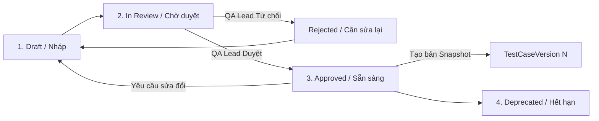

1. **Khi soạn thảo mới:** Test Case có trạng thái `Draft`.
2. **Gửi duyệt:** Chuyển sang `InReview`. Chỉ người có quyền `TestCaseManagement.TestCases.Approve` mới được phê duyệt.
3. **Phê duyệt hoặc Từ chối:** 
   - Nếu `Approved`: Hệ thống lưu `ReviewerUserId`, `ReviewedAt` và tự động sinh bản chụp bất biến **`TestCaseVersion`** (đánh số v1, v2,...).
   - Nếu `Rejected`: Ghi nhận lý do từ chối `ReviewComments` để Tester sửa lại.
4. **Khi thêm vào Test Run:** Hệ thống sẽ gắn `TestRunItem` với `TestCaseVersion` mới nhất đã được phê duyệt. Nếu sau này kịch bản gốc bị sửa đổi ở `Draft`, kết quả của Test Run cũ vẫn **bảo toàn nguyên vẹn 100% nội dung các bước của phiên bản lúc chạy**.

### 3.3. Quy trình Thực thi Không Ghi Đè (Multi-Attempt Execution History)

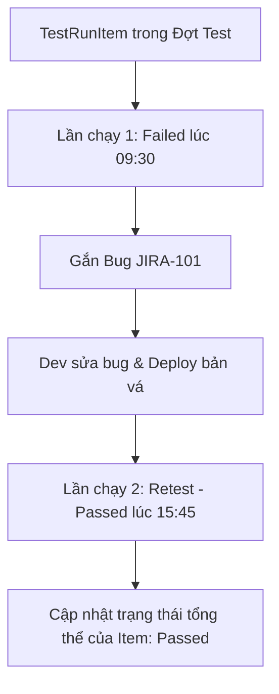

- Một `TestRunItem` sở hữu danh sách 1..N lần thực thi (`TestExecution`).
- **Lần chạy 1 (Failed):** Lưu tester, thời gian, kết quả thực tế, ảnh đính kèm và link Bug.
- **Lần chạy 2 (Retest - Passed):** Lưu tester retest, thời gian, kết luận pass.
- Nhờ vậy, lịch sử chất lượng được bảo toàn trọn vẹn: Quản lý biết case này từng bị Fail bao nhiêu lần trước khi Pass, phục vụ tính toán chỉ số ổn định (Flaky rate, Defect resolution quality).

---

### 3.4. Luồng Quản Lý Yêu Cầu Thay Đổi & Phân Tích Tác Động (Requirement Change / Impact Analysis)

Khi đặc tả phần mềm (SRS / User Story) thay đổi giữa chừng trong Sprint, hệ thống tự động cảnh báo các kịch bản kiểm thử bị ảnh hưởng để ngăn chặn việc kiểm thử theo yêu cầu cũ.

```mermaid
flowchart TD
    ReqUpdate[PO / BA cập nhật User Story / SRS] --> Trigger[Hệ thống kích hoạt quét liên kết Requirement ⟷ TestCase]
    Trigger --> MarkOutdated[Đổi trạng thái liên kết sang 'Needs Review' / 'Outdated']
    MarkOutdated --> NotifyQA[Bắn thông báo tới QA Lead & Tác giả Test Case]
    NotifyQA --> ImpactReview{QA thẩm định mức độ ảnh hưởng}
    ImpactReview -- Kịch bản không đổi --> KeepApproved[Xác nhận giữ nguyên phiên bản hiện tại]
    ImpactReview -- Cần sửa đổi --> CreateDraft[Tạo bản nháp mới từ phiên bản hiện tại (Draft)]
    CreateDraft --> UpdateSteps[Sửa đổi tiền điều kiện, các bước, kết quả mong đợi]
    UpdateSteps --> SubmitReview[Gửi phê duyệt lại ➔ Sinh TestCaseVersion mới]
```

- **Quy tắc nghiệp vụ:** Khi User Story thay đổi, trạng thái liên kết `TestCaseRequirement.Status` chuyển thành `NeedsReview`. Test Case gốc không bị tự động sửa, nhưng Dashboard của QA Lead sẽ hiện cảnh báo *"Có 5 Test Case cần đối soát lại do yêu cầu thay đổi"*.
- **Tạo Version mới:** Sau khi Tester cập nhật xong các bước, QA Lead duyệt (Approved) $\rightarrow$ sinh ra `TestCaseVersion` mới (ví dụ từ v1 lên v2). Các Test Run mới sẽ dùng v2, các Test Run cũ của Sprint trước vẫn an toàn với v1.

---

### 3.5. Luồng Vòng Đời Lỗi & Đồng Bộ Hai Chiều Với Issue Tracker (Two-Way Defect Lifecycle Sync)

Hệ thống kết nối trực tiếp với Jira, GitHub Issues hoặc Redmine theo cơ chế đồng bộ trạng thái 2 chiều:

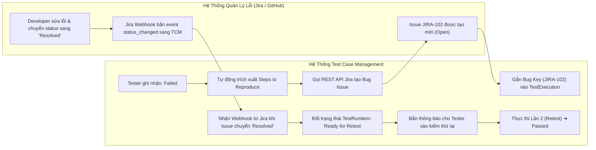

- **Tự động điền mô tả lỗi (Auto-fill Defect):** Khi Tester bấm `Failed`, form tạo bug tự động sao chép Preconditions, các bước thực hiện đến bước bị fail và kết quả thực tế vào trường Description của Jira issue.
- **Tự động hóa luồng Retest:** Tester không cần theo dõi Jira thủ công. Khi Developer giải quyết xong lỗi trên Jira (chuyển sang `Resolved`), webhook của Jira bắn về ABP Module, tự động chuyển `TestRunItem` sang trạng thái `Ready for Retest` và gửi thông báo nhắc nhở Tester.

---

### 3.6. Luồng Tự Động Hóa Thu Thập Kết Quả Kiểm Thử Từ CI/CD (Automation Ingestion)

Quy trình hợp nhất kết quả kiểm thử tự động (Playwright, Cypress, Selenium, Postman) vào cùng một đợt chạy với kiểm thử thủ công:

```mermaid
flowchart TD
    GitPush[Developer / QA push code lên GitHub / GitLab] --> CIPipeline[CI/CD Pipeline chạy Test Suite tự động]
    CIPipeline --> GenReport[Sinh file báo cáo JUnit XML / JSON chứa Test Method Name]
    GenReport --> CallTcmApi[CLI / Webhook gọi API: POST /api/tcm/test-runs/{id}/ingest-results]
    
    subgraph TCM_Backend["ABP TCM Backend Processing"]
        ParseReport[Background Worker phân tích file XML/JSON]
        MatchAutoId{Khớp AutomationId với TestCase trong Run?}
        MatchAutoId -- Có khớp --> CreateAutoExec[Tạo bản ghi TestExecution: ExecutionSource = CI_Pipeline]
        MatchAutoId -- Không khớp --> LogUnmapped[Lưu vào danh sách Unmapped Tests để QA đối chiếu sau]
        CreateAutoExec --> UpdateRunProgress[Tự động cập nhật Pass Rate trên Dashboard của Test Run]
    end
    
    CallTcmApi --> ParseReport
```

- **Ánh xạ qua `AutomationId`:** Mỗi bài test tự động có mã định danh (ví dụ `Namespace.ClassName.MethodName`). Khi CI/CD đẩy kết quả lên API `/api/tcm/test-runs/{id}/ingest-results`, hệ thống tự động tìm Test Case tương ứng để tạo một lượt `TestExecution` mới với `ExecutionSource = CI_Pipeline`.
- **Hỗ trợ Test Run lai (Hybrid Test Run):** Trong cùng 1 Test Run của Release, các module API đã có Automation thì CI/CD tự nạp kết quả, các module UI phức tạp thì Manual Tester bấm tay. Quản lý xem được bức tranh chất lượng tổng thể 100% trên cùng một báo cáo.

---

### 3.7. Luồng Tiêu Chí Nghiệm Thu & Khóa Đợt Test (Quality Gate & Sign-Off Lockdown)

Đảm bảo chỉ đóng đợt kiểm thử khi đạt chuẩn kỹ thuật và đóng băng dữ liệu để phục vụ kiểm toán nghiệm thu:

```mermaid
flowchart TD
    AllTested[100% TestRunItem đã hoàn tất thực thi] --> CheckGate{Kiểm tra Tiêu chuẩn Chất lượng (Quality Gate)}
    
    CheckGate -- "P1 Pass < 100% HOẶC còn Bug Blocker mở" --> GateFail[CẢNH BÁO: Không đạt tiêu chuẩn Release (No-Go)]
    GateFail --> ActionPlan[Tạo danh sách các điểm nghẽn gửi họp khẩn với PO/Dev]
    
    CheckGate -- "100% P1 Pass & Pass Rate >= 95% & Không còn Blocker" --> GatePass[ĐẠT CHUẨN (Go for Release)]
    GatePass --> LockRun[QA Lead thực hiện 'Close / Archive Test Run']
    LockRun --> FreezeData[ĐÓNG BĂNG DỮ LIỆU: Khóa quyền chỉnh sửa toàn bộ kết quả của Run]
    FreezeData --> GenSignOff[Xuất Biên bản Nghiệm thu Kiểm thử (PDF / Excel Sign-off Report)]
    GenSignOff --> PO_Sign[Product Owner & QA Lead ký duyệt bàn giao]
```

- **Cấu hình Quality Gate tùy biến:** Mỗi dự án có thể cấu hình ngưỡng release (ví dụ: Release Prod yêu cầu 100% P1 Pass, 0 Blocker/Critical bug; Release Sprint Dev chỉ cần 90% Pass).
- **Khóa dữ liệu bất biến (Lockdown):** Khi bấm `Close / Archive Test Run`, trạng thái của Run chuyển thành `Completed` / `Archived`. Quyền `Execute` trên Run này bị vô hiệu hóa đối với mọi tài khoản, bảo toàn số liệu cho các đợt kiểm toán sau này.

---

## 4. MÔ HÌNH DỮ LIỆU THỰC THỂ CHUẨN HÓA (DOMAIN DATA MODEL / ERD)

Dưới đây là sơ đồ thực thể chính xác, đã khắc phục toàn bộ các lỗi thiết kế trước đây:

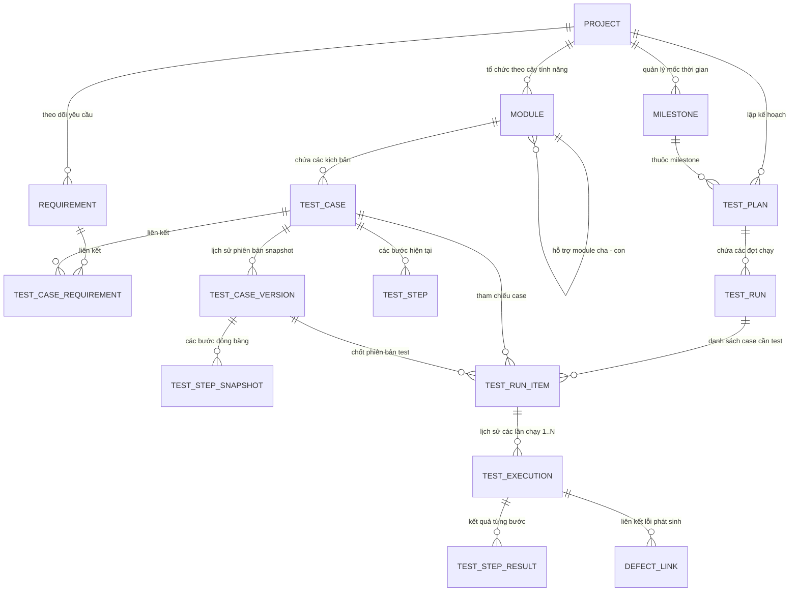

> [!NOTE]
> **Quy tắc quan hệ với Người dùng (Decoupled User Identity):**
> Trong kiến trúc ABP Reusable Module, không tồn tại Foreign Key cứng tới bảng `AppUser` của Host. Thay vào đó, các thực thể lưu trường `Guid? CreatorId`, `Guid? AssignedToUserId`, `Guid? ReviewerUserId`, `Guid? ExecutedByUserId`. Thông tin người dùng được truy xuất động qua `ICurrentUser` và `IExternalUserLookupServiceProvider`.

---

### 4.1. Chi tiết các trường dữ liệu thực thể chuẩn hóa

#### (1) `TestCase` (Aggregate Root)
- `Id`: `Guid`
- `ProjectId`: `Guid`
- `ModuleId`: `Guid` (Cây phân cấp tính năng, không chứa Milestone)
- `Code`: `string` (Mã kịch bản tự tăng, ví dụ: `TC-AUTH-001`)
- `Title`: `string`
- `Description`: `string?`
- `Preconditions`: `string?`
- `Postconditions`: `string?`
- **Tách bạch đa chiều thuộc tính:**
  - `Priority`: `enum` (`Critical_P1`, `High_P2`, `Medium_P3`, `Low_P4`) — *Không đặt Severity ở đây!*
  - `Kind`: `enum` (`Functional`, `NonFunctional`, `Security`, `Performance`, `Usability`)
  - `Layer`: `enum` (`UI`, `API`, `Integration`, `Database`)
  - `Tags`: `string` (Lưu tag phân tách dấu phẩy hoặc JSON, ví dụ: `#smoke, #regression, #boundary`)
- **Tích hợp Automation:**
  - `IsAutomated`: `bool`
  - `AutomationId`: `string?` (Khóa ánh xạ script, ví dụ: `Acme.Tests.Auth.LoginTests.Should_Login_Successfully`)
- **Quy trình Phê duyệt:**
  - `ReviewStatus`: `enum` (`Draft`, `InReview`, `Approved`, `Rejected`, `Deprecated`)
  - `ReviewerUserId`: `Guid?`
  - `ReviewedAt`: `DateTime?`
  - `ReviewComments`: `string?`
- `ActiveVersionNumber`: `int` (Phiên bản phê duyệt đang hoạt động)

#### (2) `TestCaseVersion` (Bản chụp đóng băng phiên bản)
- `Id`: `Guid`
- `TestCaseId`: `Guid`
- `VersionNumber`: `int` (1, 2, 3...)
- `Title`, `Preconditions`, `Postconditions`, `Priority`, `Kind`, `Layer`, `Tags`: Dữ liệu tại thời điểm duyệt.
- `StepsJson`: `string` (Snapshot toàn bộ các bước gồm StepNumber, Action, TestData, ExpectedResult)
- `ApprovedByUserId`: `Guid?`
- `ApprovedAt`: `DateTime`

#### (3) `TestPlan` & `TestRun` (Ngữ cảnh thực thi)
- `TestPlan`: Thuộc `ProjectId`, liên kết `MilestoneId?`. Đại diện cho kế hoạch lớn (Release 2.0).
- `TestRun`: Thuộc `TestPlanId`. Có `Name`, `Environment` (Dev/Staging/Production), `ExecutionType` (Manual / Automated / Mixed), `Status` (`Active`, `Completed`, `Archived`).

#### (4) `TestRunItem` (Hạng mục kiểm thử trong đợt chạy)
- `Id`: `Guid`
- `TestRunId`: `Guid`
- `TestCaseId`: `Guid`
- `TestCaseVersionId`: `Guid` (Bắt buộc link phiên bản đã đóng băng)
- `AssignedToUserId`: `Guid?`
- `CurrentStatus`: `enum` (`Untested`, `Passed`, `Failed`, `Blocked`, `Skipped`, `Retest`)
- `LatestExecutedAt`: `DateTime?`

#### (5) `TestExecution` (Lịch sử các lần chạy - 1 Item có 1..N lần chạy)
- `Id`: `Guid`
- `TestRunItemId`: `Guid`
- `AttemptNumber`: `int` (Lần chạy 1, 2, 3...)
- `Status`: `enum` (`Passed`, `Failed`, `Blocked`, `Skipped`)
- `ExecutedByUserId`: `Guid?`
- `ExecutedAt`: `DateTime`
- `DurationSeconds`: `int`
- `ExecutionSource`: `enum` (`Manual`, `AutomatedJob`, `CI_Pipeline`)
- `ActualResult`: `string?`
- `Comment`: `string?`
- `EnvironmentDetails`: `string?` (OS, Browser, App Build version)

#### (6) `DefectLink` (Liên kết lỗi phát sinh)
- `Id`: `Guid`
- `TestExecutionId`: `Guid` (Gắn chính xác vào lần chạy phát hiện lỗi)
- `ExternalSystem`: `string` ("Jira", "GitHub", "Redmine")
- `DefectKey`: `string` (vd: `BUG-102`)
- `DefectUrl`: `string`
- `Severity`: `enum` (`Blocker`, `Critical`, `Major`, `Minor`, `Trivial`) — *Severity chỉ nằm ở Lỗi!*
- `DefectStatus`: `string` ("Open", "In Progress", "Resolved", "Closed")

#### (7) `TestStepResult` (Kết quả từng bước trong lần thực thi)
- `Id`: `Guid`
- `TestExecutionId`: `Guid` (Thuộc lần thực thi cụ thể nào)
- `StepNumber`: `int` (Số thứ tự bước, ánh xạ với TestStepSnapshot)
- `Action`: `string` (Nội dung hành động — sao chép từ snapshot để đảm bảo bất biến)
- `ExpectedResult`: `string` (Kết quả mong đợi — sao chép từ snapshot)
- `ActualResult`: `string?` (Kết quả thực tế Tester ghi nhận)
- `Status`: `enum` (`Passed`, `Failed`, `Blocked`, `Skipped`)
- `ScreenshotUrl`: `string?` (URL ảnh chụp màn hình tại bước bị lỗi)
- `Comment`: `string?`

#### (8) `Project` (Aggregate Root — Dự án kiểm thử)
- `Id`: `Guid`
- `Name`: `string` (Tên dự án, ví dụ: "Hệ thống Ngân hàng Lõi")
- `Code`: `string` (Mã viết tắt dùng làm prefix cho TestCase Code, ví dụ: `BANK`. Unique, max 10 ký tự)
- `Description`: `string?`
- `Status`: `enum` (`Active`, `Archived`)
- `DefaultQualityGateConfig`: `string?` (JSON config cho Quality Gate mặc định, ví dụ: `{"minPassRatePercent": 95, "requireAllP1Pass": true, "maxOpenBlockers": 0}`)
- *Kế thừa:* `FullAuditedAggregateRoot<Guid>` (ABP tự quản lý CreationTime, CreatorId, LastModificationTime, DeletionTime, IsDeleted)

#### (9) `Module` (Nút cây thư viện phân cấp — Tree Node)
- `Id`: `Guid`
- `ProjectId`: `Guid`
- `ParentModuleId`: `Guid?` (Null = nút gốc. Hỗ trợ cây phân cấp N cấp)
- `Name`: `string` (Tên module/suite, ví dụ: "Quản lý Tài khoản")
- `Description`: `string?`
- `OrderIndex`: `int` (Thứ tự hiển thị trong cùng cấp, mặc định 0)
- *Kế thừa:* `FullAuditedEntity<Guid>`

#### (10) `Milestone` (Mốc thời gian của dự án)
- `Id`: `Guid`
- `ProjectId`: `Guid`
- `Name`: `string` (Ví dụ: "Sprint 14", "Release v2.1", "UAT Phase 2")
- `StartDate`: `DateTime?`
- `DueDate`: `DateTime?`
- `Description`: `string?`
- `Status`: `enum` (`Planned`, `Active`, `Completed`, `Cancelled`)
- *Kế thừa:* `FullAuditedEntity<Guid>`

#### (11) `Requirement` (Yêu cầu phần mềm / User Story)
- `Id`: `Guid`
- `ProjectId`: `Guid`
- `ExternalId`: `string?` (Mã yêu cầu trên hệ thống bên ngoài, ví dụ: `JIRA-STORY-1234`)
- `ExternalUrl`: `string?` (Link tới Jira/Confluence/Azure DevOps)
- `Title`: `string`
- `Description`: `string?`
- `Source`: `enum` (`Internal`, `Jira`, `AzureDevOps`, `Confluence`, `Notion`)
- `Status`: `enum` (`Active`, `Changed`, `Deprecated`)
- *Kế thừa:* `FullAuditedEntity<Guid>`

#### (12) `TestCaseRequirement` (Bảng liên kết N-N giữa TestCase và Requirement)
- `Id`: `Guid`
- `TestCaseId`: `Guid`
- `RequirementId`: `Guid`
- `LinkStatus`: `enum` (`Active`, `NeedsReview`, `Outdated`) — Tự động chuyển `NeedsReview` khi Requirement thay đổi
- `LinkedAt`: `DateTime`
- `LinkedByUserId`: `Guid?`

#### (13) `Attachment` (File đính kèm đa mục đích)
- `Id`: `Guid`
- `EntityType`: `enum` (`TestCase`, `TestExecution`, `DefectLink`, `TestStep`) — Loại đối tượng cha
- `EntityId`: `Guid` (ID của đối tượng cha)
- `FileName`: `string` (Tên file gốc, ví dụ: `screenshot_login_fail.png`)
- `StoragePath`: `string` (Đường dẫn lưu trữ trên Storage, ví dụ: S3 key hoặc local path)
- `FileSize`: `long` (Dung lượng tính bằng bytes)
- `ContentType`: `string` (MIME type, ví dụ: `image/png`, `video/webm`, `application/pdf`)
- `UploadedByUserId`: `Guid?`
- `UploadedAt`: `DateTime`

#### (14) `TestStep` (Các bước thực hiện hiện tại của TestCase)
- `Id`: `Guid`
- `TestCaseId`: `Guid`
- `StepNumber`: `int` (Thứ tự bước: 1, 2, 3...)
- `Action`: `string` (Mô tả hành động cần thực hiện)
- `TestData`: `string?` (Dữ liệu test đầu vào, ví dụ: "Username = admin, Password = 123456")
- `ExpectedResult`: `string` (Kết quả mong đợi)

---

## 5. DANH MỤC USE CASE CHI TIẾT (USE CASE CATALOG)

Danh sách Use Case đầy đủ để đội Dev biết chính xác cần triển khai bao nhiêu API endpoint và trang UI:

### 5.1. Nhóm Quản lý Dự án & Cây thư viện

| Mã UC | Tên Use Case | Actor chính | Mô tả nghiệp vụ | Pha MVP |
| :--- | :--- | :--- | :--- | :---: |
| UC-01 | Tạo / Sửa / Xóa Dự án (Project) | QA Lead | Khởi tạo dự án mới với mã Code dùng làm prefix. Chỉ Archive (xóa mềm), không xóa cứng khi đã có TestCase. | 1 |
| UC-02 | Quản lý cây phân cấp Module / Suite | QA Lead, Tester | Tạo, đổi tên, di chuyển (drag-drop), xóa nút cây. Hỗ trợ N cấp lồng nhau. Xóa nút cha tự di chuyển con lên 1 cấp. | 1 |
| UC-03 | Quản lý Milestone (Mốc thời gian) | QA Lead | Tạo Sprint/Release milestone gắn với Project. Dùng để gắn vào TestPlan. | 1 |

### 5.2. Nhóm Soạn thảo & Phê duyệt Test Case

| Mã UC | Tên Use Case | Actor chính | Mô tả nghiệp vụ | Pha MVP |
| :--- | :--- | :--- | :--- | :---: |
| UC-04 | Soạn thảo Test Case | Tester | Tạo mới hoặc chỉnh sửa TC bao gồm: Title, Description, Preconditions, Postconditions, Priority, Kind, Layer, Tags, và danh sách Steps. Trạng thái mặc định: Draft. | 1 |
| UC-05 | Nhân bản Test Case (Clone) | Tester | Sao chép một TC thành bản Draft mới, kế thừa toàn bộ nội dung và Steps. Dùng khi tạo TC tương tự. | 1 |
| UC-06 | Gửi duyệt Test Case (Submit for Review) | Tester | Chuyển trạng thái từ Draft → InReview. Hệ thống gửi notification tới QA Lead. | 1 |
| UC-07 | Phê duyệt / Từ chối Test Case | QA Lead | Duyệt (Approved): Hệ thống tự sinh TestCaseVersion snapshot. Từ chối (Rejected): Bắt buộc nhập ReviewComments, TC quay lại Draft. | 1 |
| UC-08 | Deprecate Test Case | QA Lead | Đánh dấu TC hết hạn sử dụng. TC vẫn hiển thị trong cây (greyed out) nhưng không thể thêm vào TestRun mới. | 1 |
| UC-09 | Xem lịch sử phiên bản (Version History) | Tester, QA Lead | Xem danh sách tất cả TestCaseVersion, so sánh diff giữa 2 phiên bản (hiển thị thay đổi Steps, Preconditions...). | 1 |

### 5.3. Nhóm Lập kế hoạch & Thực thi Test

| Mã UC | Tên Use Case | Actor chính | Mô tả nghiệp vụ | Pha MVP |
| :--- | :--- | :--- | :--- | :---: |
| UC-10 | Tạo Test Plan | QA Lead | Tạo kế hoạch test cho 1 Release/Sprint. Gắn Milestone, mô tả phạm vi và mục tiêu. | 1 |
| UC-11 | Tạo Test Run trong Test Plan | QA Lead | Tạo đợt chạy cụ thể (ví dụ: "Smoke Test Staging", "Full Regression Prod"). Chọn Environment, ExecutionType. | 1 |
| UC-12 | Thêm Test Case vào Test Run | QA Lead, Tester | Chọn TC từ cây thư viện (filter theo Module, Priority, Tags). Hệ thống tự động gắn TestCaseVersion mới nhất đã Approved. | 1 |
| UC-13 | Phân công Tester cho TestRunItem | QA Lead | Gán assignee cho từng item hoặc gán hàng loạt (bulk assign). | 1 |
| UC-14 | Thực thi test & Ghi nhận kết quả | Tester | Mở giao diện thực thi, xem từng bước (từ TestCaseVersion snapshot), ghi nhận kết quả theo bước (Pass/Fail/Block/Skip), nhập ActualResult, đính kèm ảnh chụp. Tạo bản ghi TestExecution mới (không ghi đè). | 1 |
| UC-15 | Retest (Chạy lại sau khi sửa lỗi) | Tester | Tạo lần chạy mới (AttemptNumber +1) cho cùng TestRunItem. Lần chạy cũ giữ nguyên. | 1 |
| UC-16 | Đóng / Archive Test Run & Quality Gate | QA Lead | Kiểm tra Quality Gate → Đóng Run → Khóa dữ liệu bất biến. Nếu không đạt Gate, hiện cảnh báo No-Go. | 1 |

### 5.4. Nhóm Quản lý Lỗi & Tích hợp

| Mã UC | Tên Use Case | Actor chính | Mô tả nghiệp vụ | Pha MVP |
| :--- | :--- | :--- | :--- | :---: |
| UC-17 | Gắn liên kết Bug khi Failed | Tester | Khi ghi nhận Failed, tự động trích xuất Steps-to-Reproduce điền sẵn form tạo bug. Gắn DefectLink vào TestExecution. | 1 |
| UC-18 | Đồng bộ trạng thái Bug 2 chiều (Webhook) | Hệ thống | Nhận webhook từ Jira/GitHub khi bug Resolved → Tự động chuyển TestRunItem sang ReadyForRetest → Notify Tester. | 2 |
| UC-19 | Liên kết Requirement ↔ TestCase (RTM) | Tester, BA | Gắn 1 TC với 1+ Requirement. Hiển thị Ma trận truy vết (Requirement Traceability Matrix). | 2 |
| UC-20 | Cảnh báo Impact khi Requirement thay đổi | Hệ thống | Khi Requirement status chuyển Changed → Đổi LinkStatus các TC liên quan sang NeedsReview → Notify QA Lead. | 2 |

### 5.5. Nhóm Báo cáo & Xuất dữ liệu

| Mã UC | Tên Use Case | Actor chính | Mô tả nghiệp vụ | Pha MVP |
| :--- | :--- | :--- | :--- | :---: |
| UC-21 | Xem Dashboard thời gian thực | QA Lead, PM, PO | Xem tổng quan Pass/Fail/Block/Skip rate, Burndown chart, Defect density theo Module. | 1 |
| UC-22 | Xuất Biên bản Nghiệm thu (Sign-Off Report) | QA Lead | Xuất PDF/Excel gồm: thông tin Run, danh sách TC với kết quả, danh sách Bug, chữ ký QA Lead + PO. | 1 |
| UC-23 | Import Test Case từ Excel | Tester | Upload file Excel theo template chuẩn. Hệ thống validate → tạo TC Draft hàng loạt. Báo lỗi từng dòng nếu invalid. | 2 |
| UC-24 | Export Test Case ra Excel / CSV | Tester | Xuất danh sách TC (có filter) ra file Excel/CSV tương thích template import. | 2 |

### 5.6. Nhóm Tự động hóa (Automation)

| Mã UC | Tên Use Case | Actor chính | Mô tả nghiệp vụ | Pha MVP |
| :--- | :--- | :--- | :--- | :---: |
| UC-25 | Nạp kết quả Automation từ CI/CD | Hệ thống (API) | REST API `POST /api/tcm/test-runs/{id}/ingest-results` nhận JUnit XML/JSON, ánh xạ AutomationId → TestCase, sinh TestExecution với ExecutionSource = CI_Pipeline. | 3 |
| UC-26 | AI sinh kịch bản từ User Story | Tester | Nhập User Story / Acceptance Criteria → AI Semantic Kernel sinh danh sách TC Draft bao gồm Happy Path, Negative Path, Edge Case. | 3 |
| UC-27 | AI phát hiện TC trùng lặp | Hệ thống | Vector Embedding so sánh ngữ nghĩa giữa các TC → Cảnh báo danh sách TC có nội dung tương tự > 85%. | 3 |

---

## 6. QUY TẮC NGHIỆP VỤ CHUẨN HÓA (BUSINESS RULES CATALOG)

Tập hợp toàn bộ quy tắc nghiệp vụ bắt buộc, đảm bảo hệ thống hoạt động đúng logic và nhất quán:

### 6.1. Quy tắc về Test Case

| Mã | Quy tắc | Hành động hệ thống khi vi phạm |
| :--- | :--- | :--- |
| BR-TC-01 | Test Case phải có ít nhất 1 bước (TestStep). | Không cho phép Submit for Review nếu Steps rỗng. Hiện validation error. |
| BR-TC-02 | Mã `Code` của Test Case phải tự sinh theo format `{ProjectCode}-{AutoIncrement}` (ví dụ: `BANK-001`). | Hệ thống tự tăng, không cho người dùng nhập tay. |
| BR-TC-03 | Mã `Code` phải unique trong cùng Project. | Trả về lỗi BusinessException nếu trùng. |
| BR-TC-04 | Test Case ở trạng thái `InReview` **không được** chỉnh sửa nội dung. | Disable nút Save/Edit trên UI. API trả 403. |
| BR-TC-05 | Test Case ở trạng thái `Approved` chỉ được chuyển về `Draft` (để sửa) hoặc `Deprecated`. Không được xóa. | Ẩn nút Delete. API trả BusinessException. |
| BR-TC-06 | Chỉ Test Case có trạng thái `Approved` mới được thêm vào Test Run. | Khi thêm vào Run, lọc ra chỉ những TC Approved. Nếu gọi API với TC Draft → trả lỗi. |
| BR-TC-07 | Khi Approved, hệ thống **tự động** sinh TestCaseVersion mới (v1, v2,...) và tăng `ActiveVersionNumber`. | Logic trong Domain Service `TestCaseManager.ApproveAsync()`. |
| BR-TC-08 | `Severity` **KHÔNG** tồn tại trong TestCase. Severity chỉ thuộc `DefectLink`. | Không có field Severity trên TestCase entity. |
| BR-TC-09 | Cây thư viện TestCase **KHÔNG** chứa Sprint/Milestone. | Module entity không có trường MilestoneId. |

### 6.2. Quy tắc về TestCaseVersion (Bất biến)

| Mã | Quy tắc | Hành động hệ thống khi vi phạm |
| :--- | :--- | :--- |
| BR-VER-01 | TestCaseVersion là bản chụp bất biến (Immutable Snapshot). Sau khi tạo, **không ai** được sửa đổi. | Không expose API Update cho TestCaseVersion. Entity không có setter public. |
| BR-VER-02 | Mỗi TestCaseVersion phải chứa đầy đủ snapshot dữ liệu: Title, Preconditions, Postconditions, Priority, Kind, Layer, Tags, và toàn bộ Steps (StepsJson). | Validate khi tạo, throw exception nếu thiếu. |

### 6.3. Quy tắc về Test Plan / Test Run / Execution

| Mã | Quy tắc | Hành động hệ thống khi vi phạm |
| :--- | :--- | :--- |
| BR-RUN-01 | TestRunItem **bắt buộc** phải link tới `TestCaseVersionId`. Không được null. | Foreign key NOT NULL. Khi thêm TC vào Run, auto-fill version mới nhất Approved. |
| BR-RUN-02 | Khi Test Run ở trạng thái `Completed` hoặc `Archived`, **KHÔNG** cho phép: tạo TestExecution mới, sửa kết quả, thêm/xóa TestRunItem. | Kiểm tra Run.Status trước mọi thao tác Execute. API trả 403 "Run is locked". |
| BR-RUN-03 | Mỗi lần thực thi (TestExecution) có `AttemptNumber` tự tăng (1, 2, 3...). Không xóa lần chạy cũ. | AttemptNumber = MAX(existing) + 1. Không expose API Delete cho TestExecution. |
| BR-RUN-04 | `CurrentStatus` của TestRunItem phải phản ánh kết quả lần chạy cuối cùng (`LatestExecution.Status`). | Sau khi tạo TestExecution mới, Domain Event trigger cập nhật TestRunItem.CurrentStatus. |
| BR-RUN-05 | Quality Gate: Chỉ được Close/Archive TestRun khi đạt ngưỡng cấu hình (mặc định: 100% P1 Pass, 0 Blocker, ≥95% tổng Pass Rate). | Khi QA Lead bấm Close → kiểm tra Gate → nếu fail → hiện cảnh báo No-Go (vẫn cho phép Close nếu xác nhận override kèm lý do). |
| BR-RUN-06 | Milestone chỉ thuộc TestPlan, **KHÔNG** thuộc cây thư viện TestCase. | TestPlan.MilestoneId có giá trị; Module entity không có MilestoneId. |

### 6.4. Quy tắc về Module cây thư viện

| Mã | Quy tắc | Hành động hệ thống khi vi phạm |
| :--- | :--- | :--- |
| BR-MOD-01 | Cây phân cấp Module hỗ trợ tối đa **5 cấp** lồng nhau (configurable). | Validate depth khi tạo/di chuyển node. Trả lỗi nếu vượt quá max depth. |
| BR-MOD-02 | Không được xóa Module nếu còn chứa TestCase hoặc Module con. | Kiểm tra HasChildren / HasTestCases trước khi xóa. Trả lỗi nếu không rỗng. |
| BR-MOD-03 | Tên Module phải unique trong cùng cấp (cùng ParentModuleId). | Database unique index trên (ProjectId, ParentModuleId, Name). |

### 6.5. Quy tắc về Attachment (File đính kèm)

| Mã | Quy tắc | Hành động hệ thống khi vi phạm |
| :--- | :--- | :--- |
| BR-ATT-01 | Cho phép các loại file: `image/*`, `video/webm`, `video/mp4`, `application/pdf`, `text/plain`, `text/csv`, `.har`, `.log`. | Validate ContentType khi upload. Trả 400 nếu loại file không hợp lệ. |
| BR-ATT-02 | Giới hạn dung lượng mỗi file: **10 MB** (configurable qua appsettings). | Kiểm tra FileSize trước khi lưu. Trả 413 Payload Too Large. |
| BR-ATT-03 | Mỗi TestExecution tối đa **20 attachments**. Mỗi TestCase tối đa **10 attachments**. | Đếm số lượng hiện có trước khi thêm mới. |

---

## 7. ĐẶC TẢ BÁO CÁO, KPIs & DASHBOARD (REPORTS & METRICS SPECIFICATION)

### 7.1. Danh sách KPIs (Key Performance Indicators) cốt lõi

| # | KPI | Công thức tính | Ý nghĩa | Hiển thị trên |
| :--- | :--- | :--- | :--- | :--- |
| 1 | **Pass Rate (%)** | `(Σ Passed Items / Σ Total Items) × 100` | Tỷ lệ kiểm thử thành công tổng thể | Dashboard chính, Run Detail |
| 2 | **Fail Rate (%)** | `(Σ Failed Items / Σ Total Items) × 100` | Tỷ lệ thất bại | Dashboard chính |
| 3 | **Block Rate (%)** | `(Σ Blocked Items / Σ Total Items) × 100` | Tỷ lệ bị nghẽn (cần Dev hỗ trợ) | Dashboard chính |
| 4 | **Untested Rate (%)** | `(Σ Untested Items / Σ Total Items) × 100` | Phần trăm chưa chạy | Dashboard chính |
| 5 | **Defect Density** | `Σ DefectLinks / Σ TestRunItems` | Mật độ lỗi trên mỗi test case | Module Breakdown |
| 6 | **Flaky Rate (%)** | `(Σ Items có ≥2 lần chạy với kết quả khác nhau / Σ Items) × 100` | Độ bất ổn định của chức năng | Report nâng cao |
| 7 | **Test Execution Velocity** | `Σ Executions completed / Số ngày hoạt động` | Tốc độ chạy test (cases/ngày) | Run Overview |
| 8 | **Requirement Coverage (%)** | `(Σ Requirements có ≥1 TC linked / Σ Total Requirements) × 100` | Tỷ lệ yêu cầu được phủ bởi TC | RTM Report |
| 9 | **Retest Rate (%)** | `(Σ Items có AttemptNumber ≥ 2 / Σ Total Items) × 100` | Tỷ lệ phải chạy lại | Quality Report |
| 10 | **Average Resolution Time** | `AVG(TestExecution[Attempt N].ExecutedAt - TestExecution[Attempt 1].ExecutedAt)` per item Failed→Passed | Thời gian trung bình từ phát hiện lỗi đến Retest Pass | Management Report |

### 7.2. Danh sách Báo cáo cần xây dựng

| # | Tên báo cáo | Mô tả | Định dạng | Pha MVP |
| :--- | :--- | :--- | :--- | :---: |
| RPT-01 | **Dashboard tổng quan TestRun** | Doughnut chart Pass/Fail/Block/Skip, danh sách items chưa hoàn tất, tiến độ theo Tester | Web Realtime (SignalR) | 1 |
| RPT-02 | **Burndown Chart Test Run** | Biểu đồ số case Untested giảm dần theo ngày. Đường lý tưởng vs thực tế | Web Chart | 1 |
| RPT-03 | **Biên bản Nghiệm thu (Sign-Off Report)** | Thông tin Run, tóm tắt kết quả, danh sách TC chi tiết, Bug list, chữ ký QA Lead + PO | PDF / Excel Export | 1 |
| RPT-04 | **Test Case Breakdown theo Module** | Bảng thống kê số TC theo trạng thái (Draft/Approved/Deprecated) cho mỗi Module trong cây | Web Table | 1 |
| RPT-05 | **Defect Density theo Module** | Heat map mật độ lỗi theo từng phân hệ chức năng | Web Heatmap | 2 |
| RPT-06 | **Ma trận Truy vết Yêu cầu (RTM)** | Bảng mapping: Requirement → Test Cases → Execution Results | Web Table + Excel Export | 2 |
| RPT-07 | **Trend Analysis (Xu hướng chất lượng)** | Line chart Pass Rate qua nhiều Sprint/Milestone liên tiếp | Web Chart | 2 |
| RPT-08 | **Tester Workload Report** | Số case đã gán, đã chạy, còn pending theo từng Tester | Web Table | 2 |

### 7.3. Cấu trúc dữ liệu Biên bản Nghiệm thu (Sign-Off Report Template)

```
BIÊN BẢN NGHIỆM THU KIỂM THỬ
═══════════════════════════════
1. THÔNG TIN TỔNG QUÁT
   - Tên Test Run:          {TestRun.Name}
   - Thuộc Test Plan:       {TestPlan.Name}
   - Milestone:             {Milestone.Name}
   - Môi trường:            {TestRun.Environment}
   - Ngày bắt đầu:         {TestRun.StartDate}
   - Ngày kết thúc:        {TestRun.CompletedAt}

2. TỔNG HỢP KẾT QUẢ
   ┌──────────┬───────┬─────────┐
   │ Trạng thái│ Số lượng│ Tỷ lệ  │
   ├──────────┼───────┼─────────┤
   │ Passed   │  {n}  │  {n%}   │
   │ Failed   │  {n}  │  {n%}   │
   │ Blocked  │  {n}  │  {n%}   │
   │ Skipped  │  {n}  │  {n%}   │
   └──────────┴───────┴─────────┘
   Quality Gate: {PASSED / FAILED}

3. CHI TIẾT KẾT QUẢ THEO MODULE
   (Bảng breakdown Pass/Fail theo từng Module trong cây)

4. DANH SÁCH LỖI PHÁT SINH
   (DefectLink: Key, Severity, Status, URL)

5. CHỮ KÝ PHÊ DUYỆT
   QA Lead: _______________  Ngày: ___/___/___
   Product Owner: _________  Ngày: ___/___/___
```

---

## 8. HỆ THỐNG THÔNG BÁO & CẢNH BÁO (NOTIFICATION STRATEGY)

### 8.1. Các kênh thông báo được hỗ trợ

| Kênh | Mô tả | Công nghệ ABP | Pha MVP |
| :--- | :--- | :--- | :---: |
| **In-App Notification** | Thông báo realtime trong ứng dụng, bell icon + dropdown | ABP `INotificationPublisher` + SignalR Hub | 1 |
| **Email** | Email digest khi có sự kiện quan trọng | ABP `IEmailSender` + Background Worker | 2 |
| **Webhook Outgoing** | Bắn payload JSON tới URL cấu hình (Slack, Teams, Custom) | HttpClient + Polly retry | 2 |

### 8.2. Ma trận sự kiện & người nhận thông báo

| # | Sự kiện (Domain Event) | Người nhận | Kênh | Pha |
| :--- | :--- | :--- | :--- | :---: |
| NTF-01 | Test Case được gửi duyệt (Draft → InReview) | QA Lead (ReviewerUserId hoặc tất cả QA Lead của Project) | In-App | 1 |
| NTF-02 | Test Case bị từ chối (InReview → Rejected) | Tester tác giả (CreatorId) | In-App + Email | 1 |
| NTF-03 | Test Case được duyệt (Approved) + Version mới | Tester tác giả | In-App | 1 |
| NTF-04 | Được phân công TestRunItem mới | Tester (AssignedToUserId) | In-App | 1 |
| NTF-05 | Bug trên Jira chuyển Resolved (Webhook incoming) | Tester ghi nhận Failed ban đầu | In-App + Email | 2 |
| NTF-06 | Requirement thay đổi → TC cần đối soát | QA Lead + Tester tác giả TC | In-App + Email | 2 |
| NTF-07 | Test Run sắp hết deadline (T-2 ngày) mà còn Untested | Tất cả Tester có item Untested trong Run | In-App + Email | 2 |
| NTF-08 | Quality Gate thất bại khi cố đóng Run | PM, PO, QA Lead | In-App + Email | 1 |
| NTF-09 | Test Run được đóng thành công (Completed/Archived) | Tất cả thành viên tham gia Run | In-App | 1 |

### 8.3. Cấu hình người dùng (User Notification Preferences)
- Mỗi User có thể bật/tắt từng loại thông báo (NTF-01 đến NTF-09).
- Chọn kênh ưu tiên: chỉ In-App, hoặc In-App + Email.
- Cấu hình lưu theo `UserNotificationPreference` (JSON hoặc bảng riêng).

---

## 9. QUẢN LÝ FILE ĐÍNH KÈM (ATTACHMENT MANAGEMENT)

### 9.1. Chiến lược lưu trữ (Storage Strategy)

| Kịch bản triển khai | Storage Provider | Cấu hình ABP |
| :--- | :--- | :--- |
| **On-Premise** | Local File System hoặc MinIO (S3-compatible) | `IBlobContainer<TcmAttachmentContainer>` |
| **Cloud (Azure)** | Azure Blob Storage | ABP `Volo.Abp.BlobStoring.Azure` package |
| **Cloud (AWS)** | Amazon S3 | ABP `Volo.Abp.BlobStoring.Aws` package |

### 9.2. Cấu trúc lưu trữ file
```
/tcm-attachments/
├── {TenantId}/
│   ├── test-cases/{TestCaseId}/
│   │   └── {Guid}_{OriginalFileName}
│   ├── test-executions/{TestExecutionId}/
│   │   └── {Guid}_{OriginalFileName}
│   └── defect-links/{DefectLinkId}/
│       └── {Guid}_{OriginalFileName}
```

### 9.3. Quy tắc upload
- Xem chi tiết tại Business Rules: BR-ATT-01, BR-ATT-02, BR-ATT-03 (Phần 6.5).
- **Xóa file:** Khi xóa mềm entity cha (TestCase bị Deprecated, TestRun bị Archive), file vật lý **không xóa** ngay. Background Worker dọn dẹp file của entity đã soft-delete quá 90 ngày.

---

## 10. LỊCH SỬ THAO TÁC & KIỂM TOÁN (AUDIT TRAIL)

### 10.1. Chiến lược Audit Logging

ABP Framework cung cấp sẵn cơ chế `IAuditingStore` tự động ghi log mọi request. Module TCM bổ sung audit chi tiết hơn cho các hành động nghiệp vụ quan trọng:

| Hành động | Dữ liệu Audit ghi nhận | Retention |
| :--- | :--- | :--- |
| Tạo / Sửa / Xóa Test Case | Full entity change set (old value → new value) | Vĩnh viễn |
| Phê duyệt / Từ chối Test Case | ReviewerUserId, ReviewedAt, ReviewComments, VersionNumber sinh ra | Vĩnh viễn |
| Tạo TestExecution (chạy test) | ExecutedByUserId, ExecutedAt, Status, AttemptNumber | Vĩnh viễn |
| Close / Archive Test Run | UserId thực hiện, thời gian, Quality Gate result | Vĩnh viễn |
| Thay đổi phân công TestRunItem | Old AssignedToUserId → New AssignedToUserId | 1 năm |
| Upload / Xóa Attachment | FileName, FileSize, UserId | 1 năm |

### 10.2. Xem lịch sử thay đổi (Change History Timeline)
- Mỗi Test Case có tab **"Lịch sử"** hiển thị timeline các thay đổi:
  - `10:30 - Nguyễn Văn A tạo Test Case (Draft)`
  - `11:00 - Nguyễn Văn A sửa tiêu đề: "Login thành công" → "Login thành công với 2FA"`
  - `14:00 - Nguyễn Văn A gửi duyệt (Draft → InReview)`
  - `15:30 - Trần Thị B duyệt (Approved) → Sinh v1`
- Sử dụng ABP `EntityChange` API để lấy dữ liệu diff.

---

## 11. IMPORT / EXPORT CHI TIẾT (DATA INTERCHANGE SPECIFICATION)

### 11.1. Import Test Case từ Excel

#### Template Excel chuẩn

| Cột | Header | Bắt buộc | Kiểu | Ghi chú |
| :--- | :--- | :---: | :--- | :--- |
| A | `Module Path` | ✅ | string | Đường dẫn cây, phân tách bằng `/`. Ví dụ: `Auth/Login` |
| B | `Title` | ✅ | string | Tiêu đề Test Case |
| C | `Description` | | string | Mô tả |
| D | `Preconditions` | | string | Tiền điều kiện |
| E | `Priority` | ✅ | enum | `P1`, `P2`, `P3`, `P4` |
| F | `Kind` | | enum | `Functional`, `NonFunctional`, `Security`, `Performance`, `Usability` |
| G | `Layer` | | enum | `UI`, `API`, `Integration`, `Database` |
| H | `Tags` | | string | Phân tách dấu phẩy: `#smoke, #regression` |
| I | `Step 1 - Action` | ✅ | string | Hành động bước 1 |
| J | `Step 1 - Expected` | ✅ | string | Kết quả mong đợi bước 1 |
| K | `Step 1 - Test Data` | | string | Dữ liệu test bước 1 |
| L-... | `Step N - Action/Expected/Data` | | string | Lặp lại cho các bước tiếp theo |

#### Quy trình Import
1. User upload file Excel → Background Worker parse file.
2. Validate từng dòng: kiểm tra Module Path tồn tại, enum hợp lệ, Title không rỗng, ít nhất 1 Step.
3. Kết quả: Tạo TC Draft cho các dòng hợp lệ. Trả về file Excel kết quả với cột `Status` (Success/Error) và `Error Message`.
4. Hỗ trợ tối đa **500 dòng** mỗi lần import.

### 11.2. Export Test Case

| Format | Nội dung | Pha |
| :--- | :--- | :---: |
| **Excel (.xlsx)** | Danh sách TC với filter (theo Module, Priority, Tags, ReviewStatus). Tương thích template Import. | 2 |
| **CSV** | Dạng phẳng, mỗi Step = 1 dòng hoặc gộp Steps thành JSON trong 1 ô | 2 |
| **PDF (Sign-Off Report)** | Biên bản nghiệm thu Test Run (xem RPT-03 ở phần 7.2) | 1 |

---

## 12. ĐÁNH GIÁ SO SÁNH THỊ TRƯỜNG & LỢI THẾ CẠNH TRANH (MARKET BENCHMARK)

### 12.1. Bảng so sánh tính năng chi tiết

| Tiêu chí | TestRail | Xray / Zephyr | Qase.io | **Module ABP (Tự xây)** |
| :--- | :--- | :--- | :--- | :--- |
| **Mô hình** | SaaS / On-premise | Jira Plugin | Cloud SaaS | **On-Premise Module** |
| **Chi phí** | ~$37/user/tháng | Theo bậc Jira | Từ $20/user/tháng | **Miễn phí trọn đời** |
| **Chủ quyền dữ liệu** | Hạn chế (Cloud) | Phụ thuộc Jira | Cloud quốc tế | **100% nội bộ** |
| **Tích hợp hệ sinh thái nội bộ** | API mở, cần custom | Gắn chặt Jira | API mở | **Native ABP (SSO, Permissions, Audit)** |
| **Multi-Tenancy** | Có (Enterprise) | Theo Jira | Có | **ABP built-in** |
| **Version Snapshot** | Có | Hạn chế | Có | **Có (TestCaseVersion)** |
| **Multi-attempt Execution** | Có | Hạn chế | Có | **Có (TestExecution 1..N)** |
| **Automation Ingestion (CI/CD)** | Có | Có | Rất tốt | **REST API + AutomationId** |
| **Tùy biến nghiệp vụ** | Hạn chế | Rất hạn chế | Hạn chế | **Tùy biến 100% mã nguồn** |
| **Giao diện** | Cũ, chậm | UI Jira | Hiện đại, mượt | **Cần tự xây (đầu tư UX)** |
| **Điểm yếu chính** | Giá đắt, UI cũ | Làm chậm Jira, phân quyền rối | Dữ liệu trên cloud, giá cao | **Cần đầu tư công sức phát triển ban đầu** |

### 12.2. Phân tích SWOT cho giải pháp tự xây

| **Strengths (Điểm mạnh)** | **Weaknesses (Điểm yếu)** |
| :--- | :--- |
| - Chủ quyền dữ liệu 100% | - Cần đội ngũ Dev .NET có kinh nghiệm ABP |
| - Miễn phí bản quyền trọn đời | - Thời gian phát triển MVP: ~2-3 tháng |
| - Tích hợp native hệ sinh thái ABP | - Cần đầu tư thiết kế UX/UI chuyên nghiệp |
| - Tùy biến linh hoạt theo quy trình nội bộ | - Thiếu community/plugin ecosystem |

| **Opportunities (Cơ hội)** | **Threats (Rủi ro)** |
| :--- | :--- |
| - Đóng gói NuGet Package bán/chia sẻ community | - Scope creep nếu không kiểm soát Roadmap |
| - Tích hợp AI (Semantic Kernel) tạo lợi thế khác biệt | - Cạnh tranh với SaaS cải tiến liên tục |
| - Mở rộng thành Microservice TCM độc lập | - Rủi ro kỹ thuật nếu thiết kế Domain sai từ đầu |

---

## 13. XU HƯỚNG TRÍ TUỆ NHÂN TẠO (AI) TRONG QUẢN LÝ KIỂM THỬ

### 13.1. Tự động sinh kịch bản từ User Story (AI Test Generation)
- **Input:** User Story + Acceptance Criteria dạng text.
- **Engine:** Microsoft Semantic Kernel tích hợp trong ABP AppService.
- **Output:** Danh sách Test Case Draft bao gồm:
  - Happy Path (luồng thành công chính)
  - Negative Path (luồng thất bại do input sai)
  - Edge/Boundary Cases (trường hợp biên: giá trị min, max, null, unicode, SQL injection)
- **Quy trình:** AI sinh Draft → Tester review & chỉnh sửa → Submit for Approval bình thường.

### 13.2. Quét phát hiện kịch bản trùng lặp (Duplicate Detection)
- **Kỹ thuật:** Vector Embedding (OpenAI Embedding API hoặc local ONNX model) để biểu diễn ngữ nghĩa mỗi TC.
- **So sánh:** Cosine Similarity giữa vector TC mới và toàn bộ TC hiện có trong Project.
- **Ngưỡng:** Nếu similarity > 85% → Cảnh báo "Test Case này có thể trùng lặp với TC-AUTH-005".
- **Thời điểm chạy:** Khi Tester bấm Save Draft hoặc Submit for Review.

### 13.3. Đề xuất Test Case ưu tiên chạy (Smart Test Selection)
- Dựa trên lịch sử Fail/Flaky rate, thay đổi code (Git diff), và mức độ risk của Module → AI đề xuất danh sách TC nên chạy trong đợt Regression tiếp theo.
- Giảm thời gian chạy Regression từ 100% xuống ~30-40% mà vẫn phủ các vùng rủi ro cao nhất.

---

## 14. THIẾT KẾ KỸ THUẬT ABP FRAMEWORK REUSABLE MODULE

### 14.1. Hai Mô hình Triển khai CSDL (Deployment Topologies)
Module hỗ trợ linh hoạt 2 kịch bản tùy theo quy mô của Host App:
1. **Chung CSDL với Host App (Monolith / Shared DB):** Bảng của Module nằm cùng DB với Host App nhưng có tiền tố riêng `Tcm*` (vd: `TcmTestCases`, `TcmTestRuns`) và Schema độc lập (vd: `tcm.TcmTestCases`), cấu hình qua `builder.ConfigureTestCaseManagement()`.
2. **CSDL Riêng Biệt (Dedicated Database):** Nhờ cơ chế `[ConnectionStringName("TestCaseManagement")]` của ABP, Module có thể cấu hình chuỗi kết nối riêng để ghi dữ liệu sang một Database tách biệt hoàn toàn mà không làm phình to DB chính của Host App.

---

### 14.2. Danh sách Đầy Đủ các DbSet trong Module DbContext

Một DbContext hoàn chỉnh cho Module TCM cần quản lý đầy đủ **15 bảng** thực thể (đã bổ sung Attachment):

```csharp
namespace Acme.TestCaseManagement.EntityFrameworkCore
{
    public interface ITestCaseManagementDbContext : IEfCoreDbContext
    {
        DbSet<Project> Projects { get; set; }
        DbSet<Module> Modules { get; set; }
        DbSet<Milestone> Milestones { get; set; }
        DbSet<Requirement> Requirements { get; set; }
        DbSet<TestCaseRequirement> TestCaseRequirements { get; set; }
        
        DbSet<TestCase> TestCases { get; set; }
        DbSet<TestStep> TestSteps { get; set; }
        DbSet<TestCaseVersion> TestCaseVersions { get; set; }
        
        DbSet<TestPlan> TestPlans { get; set; }
        DbSet<TestRun> TestRuns { get; set; }
        DbSet<TestRunItem> TestRunItems { get; set; }
        DbSet<TestExecution> TestExecutions { get; set; }
        DbSet<TestStepResult> TestStepResults { get; set; }
        DbSet<DefectLink> DefectLinks { get; set; }
        
        DbSet<Attachment> Attachments { get; set; }
    }
}
```

---

### 14.3. Hướng Dẫn Kỹ Thuật Tích Hợp Vào Host App (Chính xác & Thực tế)

Tích hợp một ABP Module vào Host App đòi hỏi cấu hình đúng chuẩn DI và DbContext của ABP:

#### Bước 1: Khai báo phụ thuộc Module
```csharp
[DependsOn(
    typeof(TestCaseManagementApplicationModule),
    typeof(TestCaseManagementEntityFrameworkCoreModule),
    typeof(TestCaseManagementHttpApiModule)
)]
public class MyHostAppModule : AbpModule
{
    // ABP tự động nạp Services, API Controllers, Permissions và Localization
}
```

#### Bước 2: Kế thừa Interface & Cấu hình `[ReplaceDbContext]` trên HostDbContext
Để Entity Framework Core của Host App quản lý được các thực thể của Module, Host App cần:
1. Cho `MyHostAppDbContext` hiện thực interface `ITestCaseManagementDbContext`.
2. Khai báo thuộc tính `[ReplaceDbContext(typeof(ITestCaseManagementDbContext))]` để ABP Container thay thế interface bằng DbContext của Host.
3. Gọi `builder.ConfigureTestCaseManagement()` trong `OnModelCreating`.

```csharp
using Acme.TestCaseManagement.EntityFrameworkCore;
using Volo.Abp.Data;
using Volo.Abp.EntityFrameworkCore;

[ReplaceDbContext(typeof(ITestCaseManagementDbContext))]
[ConnectionStringName("Default")] // Hoặc "TestCaseManagement" nếu muốn tách CSDL riêng
public class MyHostAppDbContext : AbpDbContext<MyHostAppDbContext>, ITestCaseManagementDbContext
{
    // Các DbSet của Host App...

    // 15 DbSet của Module TestCaseManagement:
    public DbSet<Project> Projects { get; set; }
    public DbSet<Module> Modules { get; set; }
    public DbSet<Milestone> Milestones { get; set; }
    public DbSet<Requirement> Requirements { get; set; }
    public DbSet<TestCaseRequirement> TestCaseRequirements { get; set; }
    public DbSet<TestCase> TestCases { get; set; }
    public DbSet<TestStep> TestSteps { get; set; }
    public DbSet<TestCaseVersion> TestCaseVersions { get; set; }
    public DbSet<TestPlan> TestPlans { get; set; }
    public DbSet<TestRun> TestRuns { get; set; }
    public DbSet<TestRunItem> TestRunItems { get; set; }
    public DbSet<TestExecution> TestExecutions { get; set; }
    public DbSet<TestStepResult> TestStepResults { get; set; }
    public DbSet<DefectLink> DefectLinks { get; set; }
    public DbSet<Attachment> Attachments { get; set; }

    public MyHostAppDbContext(DbContextOptions<MyHostAppDbContext> options) : base(options) { }

    protected override void OnModelCreating(ModelBuilder builder)
    {
        base.OnModelCreating(builder);
        
        // Cấu hình bảng cho Module TestCaseManagement:
        builder.ConfigureTestCaseManagement(options =>
        {
            options.TablePrefix = "Tcm"; // Tiền tố bảng (ví dụ: TcmTestCases)
            options.Schema = null;       // Tuỳ biến schema nếu dùng PostgreSQL/SQL Server
        });
    }
}
```

#### Bước 3: Tạo và áp dụng Migration
```bash
dotnet ef migrations add Added_TestCaseManagement_Module --context MyHostAppDbContext
dotnet ef database update --context MyHostAppDbContext
```

---

### 14.4. Chiến lược Phân chia Gói Giao diện UI (UI Packages)
Không thể dùng một gói Web chung cho mọi công nghệ frontend. Module được tách bạch rõ ràng:
- **`Acme.Tcm.HttpApi`**: Chứa toàn bộ API Controllers RESTful (`/api/tcm/...`). Cung cấp Swagger OpenAPI để bất kỳ Frontend nào cũng có thể gọi.
- **`Acme.Tcm.Web`**: Dành riêng cho Host App sử dụng **ASP.NET Core MVC / Razor Pages**. Chứa Page Models, ViewComponents và `TestCaseManagementMenuContributor`.
- **`Acme.Tcm.Blazor`**: Dành riêng cho Host App sử dụng **Blazor Server / Blazor WASM**.
- **`@acme/test-case-management` (NPM Package)**: Dành riêng cho Host App sử dụng **Angular** hoặc **React SPA**, cung cấp sẵn Components, Routing và Service Proxies sinh từ Swagger.

---

### 14.5. Cấu Trúc Solution Hoàn Chỉnh

```text
Acme.TestCaseManagement/
├── src/
│   ├── Acme.Tcm.Domain.Shared/
│   │   ├── Enums/ (TestCasePriority, TestKind, TestLayer, ReviewStatus, ExecutionStatus, DefectSeverity, AttachmentEntityType)
│   │   ├── Localization/Resources/ (vi.json, en.json)
│   │   └── TestCaseManagementErrorCodes.cs
│   ├── Acme.Tcm.Domain/
│   │   ├── Projects/ (Project, Module, Milestone)
│   │   ├── Requirements/ (Requirement, TestCaseRequirement)
│   │   ├── TestCases/ (TestCase, TestStep, TestCaseVersion, TestStepSnapshot)
│   │   ├── TestPlans/ (TestPlan, TestRun, TestRunItem, TestExecution, TestStepResult, DefectLink)
│   │   ├── Attachments/ (Attachment)
│   │   └── TestCaseManagementDbProperties.cs
│   ├── Acme.Tcm.Application.Contracts/
│   │   ├── Projects/ (IProjectAppService, ProjectDto, CreateUpdateProjectDto)
│   │   ├── TestCases/ (ITestCaseAppService, TestCaseDto, CreateUpdateTestCaseDto, ApproveTestCaseDto)
│   │   ├── TestRuns/ (ITestRunAppService, TestRunDto, ExecuteTestRunItemDto)
│   │   ├── Reports/ (IReportAppService, DashboardDto, SignOffReportDto)
│   │   └── Permissions/ (TestCaseManagementPermissions, TestCaseManagementPermissionDefinitionProvider)
│   ├── Acme.Tcm.Application/
│   │   ├── Projects/ProjectAppService.cs
│   │   ├── TestCases/TestCaseAppService.cs
│   │   ├── TestRuns/TestRunAppService.cs
│   │   ├── Reports/ReportAppService.cs
│   │   ├── Import/TestCaseImportAppService.cs
│   │   └── TestCaseManagementApplicationAutoMapperProfile.cs
│   ├── Acme.Tcm.EntityFrameworkCore/
│   │   ├── ITestCaseManagementDbContext.cs
│   │   ├── TestCaseManagementDbContextModelCreatingExtensions.cs
│   │   └── Repositories/
│   ├── Acme.Tcm.HttpApi/
│   │   └── Controllers/ (ProjectController, TestCaseController, TestRunController, ReportController, ImportExportController)
│   ├── Acme.Tcm.HttpApi.Client/ (C# Client Proxies cho viễn cảnh Microservices)
│   └── Acme.Tcm.Web/ (MVC / Razor Pages UI Module)
├── test/
│   ├── Acme.Tcm.Domain.Tests/
│   ├── Acme.Tcm.Application.Tests/
│   └── Acme.Tcm.HttpApi.Tests/
```

---

## PHỤ LỤC A: BẢNG THUẬT NGỮ (GLOSSARY)

| Thuật ngữ | Tiếng Việt | Định nghĩa |
| :--- | :--- | :--- |
| **Test Case (TC)** | Kịch bản kiểm thử | Tập hợp các bước thực hiện kèm dữ liệu test và kết quả mong đợi, dùng để kiểm tra 1 tính năng cụ thể. |
| **Test Step** | Bước kiểm thử | Một hành động đơn lẻ trong kịch bản, gồm Action, Test Data, Expected Result. |
| **Test Suite / Module** | Nhóm kịch bản / Phân hệ | Nút trong cây thư viện, dùng để nhóm các TC theo tính năng hoặc phân hệ phần mềm. |
| **Test Plan** | Kế hoạch kiểm thử | Kế hoạch tổng thể cho 1 Release hoặc Sprint, gắn Milestone, mô tả phạm vi. |
| **Test Run** | Đợt chạy kiểm thử | Một đợt thực thi cụ thể thuộc Test Plan, với Environment và danh sách TC cần chạy. |
| **Test Run Item** | Hạng mục kiểm thử trong đợt chạy | Một TC cụ thể nằm trong 1 Test Run, gắn với phiên bản (TestCaseVersion) và tester được phân công. |
| **Test Execution** | Lần thực thi | Một lần chạy cụ thể của một TestRunItem. Một item có thể có nhiều lần chạy (Attempt 1, 2, 3...). |
| **TestCaseVersion** | Phiên bản kịch bản (Snapshot) | Bản chụp bất biến (immutable) toàn bộ nội dung TC tại thời điểm được duyệt. Đảm bảo kết quả test không bị ảnh hưởng khi TC gốc thay đổi. |
| **Milestone** | Mốc thời gian | Sprint, Release hoặc giai đoạn dự án. Thuộc Project, gắn vào TestPlan (KHÔNG nằm trong cây thư viện TC). |
| **Requirement** | Yêu cầu phần mềm | User Story hoặc đặc tả yêu cầu, dùng để truy vết liên kết giữa yêu cầu và TC (RTM). |
| **RTM** | Ma trận truy vết yêu cầu | Requirement Traceability Matrix — Bảng ánh xạ Requirement ↔ Test Case ↔ Execution Result. |
| **Quality Gate** | Cổng chất lượng | Bộ ngưỡng tiêu chuẩn (Pass Rate ≥ 95%, 0 Blocker...) phải đạt trước khi đóng Test Run. |
| **Sign-Off Report** | Biên bản nghiệm thu | Tài liệu chính thức xác nhận kết quả kiểm thử, có chữ ký QA Lead và PO. |
| **Flaky Test** | Test bất ổn | TC cho kết quả không nhất quán (lúc Pass lúc Fail) với cùng điều kiện. |
| **Defect Link** | Liên kết lỗi | Bản ghi liên kết giữa một lần chạy test (TestExecution) với bug trên hệ thống quản lý lỗi (Jira, GitHub...). |
| **Severity** | Mức độ nghiêm trọng (của lỗi) | Thuộc tính của Bug/Defect (Blocker → Trivial). KHÔNG thuộc Test Case. |
| **Priority** | Mức độ ưu tiên (của TC) | Thứ tự ưu tiên chạy test (P1 Critical → P4 Low). Thuộc Test Case. |
| **Kind** | Loại kiểm thử | Phân loại TC: Functional, NonFunctional, Security, Performance, Usability. |
| **Layer** | Tầng kiểm thử | Phạm vi kỹ thuật: UI, API, Integration, Database. |
| **Automation ID** | Mã ánh xạ tự động | Chuỗi định danh (ví dụ: `Namespace.Class.Method`) dùng để ánh xạ kết quả CI/CD với TC trong hệ thống. |
| **ABP Module** | Module ABP | Gói phần mềm độc lập theo chuẩn ABP Framework, có thể cắm (plug) vào bất kỳ ứng dụng ABP nào. |
| **Aggregate Root** | Gốc tổng hợp (DDD) | Entity chính trong Domain-Driven Design, quản lý tính nhất quán của một nhóm entity liên quan. |
| **Reusable Module** | Module tái sử dụng | Module được thiết kế để dùng chung cho nhiều ứng dụng (Host App) khác nhau mà không cần sửa mã nguồn. |

---

## PHỤ LỤC B: SƠ ĐỒ PHÂN TẦNG CHỨC NĂNG (FUNCTIONAL DECOMPOSITION DIAGRAM)

> [!NOTE]
> **Chú thích cấu trúc sơ đồ:**
> - **Tầng 1 (Gốc):** Hệ thống TCM tổng thể
> - **Tầng 2:** 9 nhóm chức năng chính (nhánh màu xanh đậm)
> - **Tầng 3:** Các chức năng con trong mỗi nhóm (nhánh màu tím)
> - **Tầng 4:** Hành động cụ thể / Chi tiết nghiệp vụ (nút lá màu tím đậm)

### B.1. Sơ đồ tổng thể (Top-Level Decomposition)

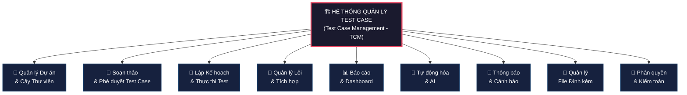

---

### B.2. Quản lý Dự án & Cây Thư viện

```mermaid
graph TD
    F1["📁 QUẢN LÝ DỰ ÁN & CÂY THƯ VIỆN"]

    F1 --> F1_1["🏢 Quản lý Dự án<br/>(Project)"]
    F1 --> F1_2["🌳 Quản lý Cây Module<br/>(Test Repository)"]
    F1 --> F1_3["🏁 Quản lý Milestone"]

    F1_1 --> F1_1a["Tạo dự án mới<br/>(Name, Code, Config)"]
    F1_1 --> F1_1b["Sửa thông tin dự án"]
    F1_1 --> F1_1c["Archive dự án<br/>(Xóa mềm)"]
    F1_1 --> F1_1d["Cấu hình Quality Gate<br/>mặc định"]

    F1_2 --> F1_2a["Tạo nút Module / Suite"]
    F1_2 --> F1_2b["Đổi tên nút"]
    F1_2 --> F1_2c["Di chuyển nút<br/>(Drag-Drop)"]
    F1_2 --> F1_2d["Xóa nút<br/>(con di chuyển lên 1 cấp)"]
    F1_2 --> F1_2e["Hỗ trợ N cấp lồng nhau<br/>(tối đa 5 cấp)"]

    F1_3 --> F1_3a["Tạo Sprint / Release<br/>milestone"]
    F1_3 --> F1_3b["Gắn Milestone<br/>vào Test Plan"]
    F1_3 --> F1_3c["Quản lý trạng thái<br/>(Planned → Active → Completed)"]

    style F1 fill:#1a1a2e,stroke:#e94560,stroke-width:3px,color:#fff
    style F1_1 fill:#0f3460,stroke:#533483,stroke-width:2px,color:#fff
    style F1_2 fill:#0f3460,stroke:#533483,stroke-width:2px,color:#fff
    style F1_3 fill:#0f3460,stroke:#533483,stroke-width:2px,color:#fff
    style F1_1a fill:#533483,stroke:#e94560,color:#fff
    style F1_1b fill:#533483,stroke:#e94560,color:#fff
    style F1_1c fill:#533483,stroke:#e94560,color:#fff
    style F1_1d fill:#533483,stroke:#e94560,color:#fff
    style F1_2a fill:#533483,stroke:#e94560,color:#fff
    style F1_2b fill:#533483,stroke:#e94560,color:#fff
    style F1_2c fill:#533483,stroke:#e94560,color:#fff
    style F1_2d fill:#533483,stroke:#e94560,color:#fff
    style F1_2e fill:#533483,stroke:#e94560,color:#fff
    style F1_3a fill:#533483,stroke:#e94560,color:#fff
    style F1_3b fill:#533483,stroke:#e94560,color:#fff
    style F1_3c fill:#533483,stroke:#e94560,color:#fff
```

---

### B.3. Soạn thảo & Phê duyệt Test Case

```mermaid
graph TD
    F2["📝 SOẠN THẢO & PHÊ DUYỆT TEST CASE"]

    F2 --> F2_1["✏️ Soạn thảo<br/>Test Case"]
    F2 --> F2_2["✅ Phê duyệt<br/>& Từ chối"]
    F2 --> F2_3["📸 Quản lý<br/>Phiên bản"]
    F2 --> F2_4["📋 Nhân bản<br/>(Clone)"]

    F2_1 --> F2_1a["Nhập Title, Description,<br/>Preconditions, Postconditions"]
    F2_1 --> F2_1b["Chọn Priority<br/>(P1 → P4)"]
    F2_1 --> F2_1c["Chọn Kind<br/>(Functional, Security,...)"]
    F2_1 --> F2_1d["Chọn Layer<br/>(UI, API, Integration, DB)"]
    F2_1 --> F2_1e["Gắn Tags<br/>(smoke, regression,...)"]
    F2_1 --> F2_1f["Soạn danh sách Steps<br/>(Action, TestData, Expected)"]
    F2_1 --> F2_1g["Gắn AutomationId<br/>(nếu có script tự động)"]

    F2_2 --> F2_2a["Gửi duyệt<br/>(Draft → InReview)"]
    F2_2 --> F2_2b["QA Lead Duyệt<br/>(→ Approved + Sinh Version)"]
    F2_2 --> F2_2c["QA Lead Từ chối<br/>(→ Rejected + Lý do)"]
    F2_2 --> F2_2d["Đánh dấu Deprecated<br/>(Hết hạn sử dụng)"]

    F2_3 --> F2_3a["Tự động sinh<br/>TestCaseVersion Snapshot"]
    F2_3 --> F2_3b["Xem lịch sử<br/>Version (v1, v2, v3...)"]
    F2_3 --> F2_3c["So sánh Diff<br/>giữa 2 phiên bản"]

    F2_4 --> F2_4a["Sao chép TC → Draft mới<br/>(kế thừa toàn bộ Steps)"]

    style F2 fill:#1a1a2e,stroke:#e94560,stroke-width:3px,color:#fff
    style F2_1 fill:#0f3460,stroke:#533483,stroke-width:2px,color:#fff
    style F2_2 fill:#0f3460,stroke:#533483,stroke-width:2px,color:#fff
    style F2_3 fill:#0f3460,stroke:#533483,stroke-width:2px,color:#fff
    style F2_4 fill:#0f3460,stroke:#533483,stroke-width:2px,color:#fff
    style F2_1a fill:#533483,stroke:#e94560,color:#fff
    style F2_1b fill:#533483,stroke:#e94560,color:#fff
    style F2_1c fill:#533483,stroke:#e94560,color:#fff
    style F2_1d fill:#533483,stroke:#e94560,color:#fff
    style F2_1e fill:#533483,stroke:#e94560,color:#fff
    style F2_1f fill:#533483,stroke:#e94560,color:#fff
    style F2_1g fill:#533483,stroke:#e94560,color:#fff
    style F2_2a fill:#533483,stroke:#e94560,color:#fff
    style F2_2b fill:#533483,stroke:#e94560,color:#fff
    style F2_2c fill:#533483,stroke:#e94560,color:#fff
    style F2_2d fill:#533483,stroke:#e94560,color:#fff
    style F2_3a fill:#533483,stroke:#e94560,color:#fff
    style F2_3b fill:#533483,stroke:#e94560,color:#fff
    style F2_3c fill:#533483,stroke:#e94560,color:#fff
    style F2_4a fill:#533483,stroke:#e94560,color:#fff
```

---

### B.4. Lập Kế hoạch & Thực thi Test

```mermaid
graph TD
    F3["🚀 LẬP KẾ HOẠCH & THỰC THI TEST"]

    F3 --> F3_1["📋 Lập Test Plan"]
    F3 --> F3_2["▶️ Tạo & Quản lý<br/>Test Run"]
    F3 --> F3_3["🎯 Thực thi<br/>& Ghi kết quả"]
    F3 --> F3_4["🔒 Đóng & Nghiệm thu<br/>(Quality Gate)"]

    F3_1 --> F3_1a["Tạo Plan cho<br/>Release / Sprint"]
    F3_1 --> F3_1b["Gắn Milestone"]
    F3_1 --> F3_1c["Mô tả phạm vi<br/>& mục tiêu"]

    F3_2 --> F3_2a["Tạo đợt chạy<br/>(Smoke, Regression,...)"]
    F3_2 --> F3_2b["Chọn Environment<br/>(Dev / Staging / Prod)"]
    F3_2 --> F3_2c["Chọn ExecutionType<br/>(Manual / Automated / Mixed)"]
    F3_2 --> F3_2d["Thêm Test Case<br/>vào Run (từ cây thư viện)"]
    F3_2 --> F3_2e["Phân công Tester<br/>(đơn lẻ / hàng loạt)"]

    F3_3 --> F3_3a["Mở giao diện thực thi<br/>(xem Steps từ Snapshot)"]
    F3_3 --> F3_3b["Ghi nhận kết quả<br/>từng bước (Pass/Fail/Block/Skip)"]
    F3_3 --> F3_3c["Nhập ActualResult,<br/>đính kèm ảnh chụp"]
    F3_3 --> F3_3d["Tạo lần chạy mới<br/>(Retest - AttemptNumber +1)"]
    F3_3 --> F3_3e["Bảo toàn lịch sử<br/>mọi lần chạy (1..N)"]

    F3_4 --> F3_4a["Kiểm tra Quality Gate<br/>(P1 Pass, Blocker, Pass Rate)"]
    F3_4 --> F3_4b["Cảnh báo No-Go<br/>nếu không đạt ngưỡng"]
    F3_4 --> F3_4c["Close / Archive Run<br/>(khóa dữ liệu bất biến)"]
    F3_4 --> F3_4d["Xuất Biên bản<br/>Nghiệm thu (Sign-Off)"]
    F3_4 --> F3_4e["PO & QA Lead<br/>ký duyệt bàn giao"]

    style F3 fill:#1a1a2e,stroke:#e94560,stroke-width:3px,color:#fff
    style F3_1 fill:#0f3460,stroke:#533483,stroke-width:2px,color:#fff
    style F3_2 fill:#0f3460,stroke:#533483,stroke-width:2px,color:#fff
    style F3_3 fill:#0f3460,stroke:#533483,stroke-width:2px,color:#fff
    style F3_4 fill:#0f3460,stroke:#533483,stroke-width:2px,color:#fff
    style F3_1a fill:#533483,stroke:#e94560,color:#fff
    style F3_1b fill:#533483,stroke:#e94560,color:#fff
    style F3_1c fill:#533483,stroke:#e94560,color:#fff
    style F3_2a fill:#533483,stroke:#e94560,color:#fff
    style F3_2b fill:#533483,stroke:#e94560,color:#fff
    style F3_2c fill:#533483,stroke:#e94560,color:#fff
    style F3_2d fill:#533483,stroke:#e94560,color:#fff
    style F3_2e fill:#533483,stroke:#e94560,color:#fff
    style F3_3a fill:#533483,stroke:#e94560,color:#fff
    style F3_3b fill:#533483,stroke:#e94560,color:#fff
    style F3_3c fill:#533483,stroke:#e94560,color:#fff
    style F3_3d fill:#533483,stroke:#e94560,color:#fff
    style F3_3e fill:#533483,stroke:#e94560,color:#fff
    style F3_4a fill:#533483,stroke:#e94560,color:#fff
    style F3_4b fill:#533483,stroke:#e94560,color:#fff
    style F3_4c fill:#533483,stroke:#e94560,color:#fff
    style F3_4d fill:#533483,stroke:#e94560,color:#fff
    style F3_4e fill:#533483,stroke:#e94560,color:#fff
```

---

### B.5. Quản lý Lỗi & Tích hợp

```mermaid
graph TD
    F4["🐛 QUẢN LÝ LỖI & TÍCH HỢP"]

    F4 --> F4_1["🔗 Gắn liên kết Bug<br/>(DefectLink)"]
    F4 --> F4_2["🔄 Đồng bộ 2 chiều<br/>Issue Tracker"]
    F4 --> F4_3["🗺️ Truy vết Yêu cầu<br/>(RTM)"]
    F4 --> F4_4["⚠️ Phân tích Tác động<br/>(Impact Analysis)"]

    F4_1 --> F4_1a["Tự động trích xuất<br/>Steps-to-Reproduce"]
    F4_1 --> F4_1b["Tạo Bug trên Jira/GitHub<br/>qua REST API"]
    F4_1 --> F4_1c["Gắn DefectKey<br/>vào TestExecution"]
    F4_1 --> F4_1d["Ghi nhận Severity<br/>(Blocker → Trivial)"]

    F4_2 --> F4_2a["Nhận Webhook<br/>từ Jira khi Resolved"]
    F4_2 --> F4_2b["Tự động chuyển Item<br/>sang Ready for Retest"]
    F4_2 --> F4_2c["Thông báo Tester<br/>kiểm thử lại"]

    F4_3 --> F4_3a["Liên kết TC ↔ Requirement<br/>(N-N)"]
    F4_3 --> F4_3b["Hiển thị Ma trận RTM"]
    F4_3 --> F4_3c["Tính Requirement<br/>Coverage %"]

    F4_4 --> F4_4a["Quét khi Requirement<br/>thay đổi"]
    F4_4 --> F4_4b["Đổi LinkStatus<br/>→ NeedsReview"]
    F4_4 --> F4_4c["Cảnh báo QA Lead<br/>đối soát lại TC"]

    style F4 fill:#1a1a2e,stroke:#e94560,stroke-width:3px,color:#fff
    style F4_1 fill:#0f3460,stroke:#533483,stroke-width:2px,color:#fff
    style F4_2 fill:#0f3460,stroke:#533483,stroke-width:2px,color:#fff
    style F4_3 fill:#0f3460,stroke:#533483,stroke-width:2px,color:#fff
    style F4_4 fill:#0f3460,stroke:#533483,stroke-width:2px,color:#fff
    style F4_1a fill:#533483,stroke:#e94560,color:#fff
    style F4_1b fill:#533483,stroke:#e94560,color:#fff
    style F4_1c fill:#533483,stroke:#e94560,color:#fff
    style F4_1d fill:#533483,stroke:#e94560,color:#fff
    style F4_2a fill:#533483,stroke:#e94560,color:#fff
    style F4_2b fill:#533483,stroke:#e94560,color:#fff
    style F4_2c fill:#533483,stroke:#e94560,color:#fff
    style F4_3a fill:#533483,stroke:#e94560,color:#fff
    style F4_3b fill:#533483,stroke:#e94560,color:#fff
    style F4_3c fill:#533483,stroke:#e94560,color:#fff
    style F4_4a fill:#533483,stroke:#e94560,color:#fff
    style F4_4b fill:#533483,stroke:#e94560,color:#fff
    style F4_4c fill:#533483,stroke:#e94560,color:#fff
```

---

### B.6. Báo cáo & Dashboard

```mermaid
graph TD
    F5["📊 BÁO CÁO & DASHBOARD"]

    F5 --> F5_1["📈 Dashboard<br/>Thời gian thực"]
    F5 --> F5_2["📉 Biểu đồ<br/>& Phân tích"]
    F5 --> F5_3["📄 Xuất báo cáo"]
    F5 --> F5_4["📐 KPIs<br/>Chất lượng"]

    F5_1 --> F5_1a["Doughnut Chart<br/>Pass/Fail/Block/Skip"]
    F5_1 --> F5_1b["Tiến độ theo Tester"]
    F5_1 --> F5_1c["Danh sách items<br/>chưa hoàn tất"]
    F5_1 --> F5_1d["Realtime cập nhật<br/>qua SignalR"]

    F5_2 --> F5_2a["Burndown Chart<br/>(Untested giảm theo ngày)"]
    F5_2 --> F5_2b["Defect Density<br/>Heatmap theo Module"]
    F5_2 --> F5_2c["Trend Analysis<br/>(Pass Rate qua Sprint)"]
    F5_2 --> F5_2d["Tester Workload<br/>Report"]

    F5_3 --> F5_3a["Biên bản Nghiệm thu<br/>(PDF / Excel)"]
    F5_3 --> F5_3b["TC Breakdown<br/>theo Module"]
    F5_3 --> F5_3c["Ma trận RTM<br/>(Excel Export)"]

    F5_4 --> F5_4a["Pass Rate / Fail Rate"]
    F5_4 --> F5_4b["Block Rate / Untested Rate"]
    F5_4 --> F5_4c["Flaky Rate"]
    F5_4 --> F5_4d["Defect Density"]
    F5_4 --> F5_4e["Retest Rate"]
    F5_4 --> F5_4f["Avg Resolution Time"]
    F5_4 --> F5_4g["Test Execution Velocity"]

    style F5 fill:#1a1a2e,stroke:#e94560,stroke-width:3px,color:#fff
    style F5_1 fill:#0f3460,stroke:#533483,stroke-width:2px,color:#fff
    style F5_2 fill:#0f3460,stroke:#533483,stroke-width:2px,color:#fff
    style F5_3 fill:#0f3460,stroke:#533483,stroke-width:2px,color:#fff
    style F5_4 fill:#0f3460,stroke:#533483,stroke-width:2px,color:#fff
    style F5_1a fill:#533483,stroke:#e94560,color:#fff
    style F5_1b fill:#533483,stroke:#e94560,color:#fff
    style F5_1c fill:#533483,stroke:#e94560,color:#fff
    style F5_1d fill:#533483,stroke:#e94560,color:#fff
    style F5_2a fill:#533483,stroke:#e94560,color:#fff
    style F5_2b fill:#533483,stroke:#e94560,color:#fff
    style F5_2c fill:#533483,stroke:#e94560,color:#fff
    style F5_2d fill:#533483,stroke:#e94560,color:#fff
    style F5_3a fill:#533483,stroke:#e94560,color:#fff
    style F5_3b fill:#533483,stroke:#e94560,color:#fff
    style F5_3c fill:#533483,stroke:#e94560,color:#fff
    style F5_4a fill:#533483,stroke:#e94560,color:#fff
    style F5_4b fill:#533483,stroke:#e94560,color:#fff
    style F5_4c fill:#533483,stroke:#e94560,color:#fff
    style F5_4d fill:#533483,stroke:#e94560,color:#fff
    style F5_4e fill:#533483,stroke:#e94560,color:#fff
    style F5_4f fill:#533483,stroke:#e94560,color:#fff
    style F5_4g fill:#533483,stroke:#e94560,color:#fff
```

---

### B.7. Tự động hóa & AI

```mermaid
graph TD
    F6["🤖 TỰ ĐỘNG HÓA & AI"]

    F6 --> F6_1["⚙️ CI/CD<br/>Ingestion"]
    F6 --> F6_2["🧠 AI Sinh<br/>Test Case"]
    F6 --> F6_3["🔍 AI Phát hiện<br/>TC Trùng lặp"]
    F6 --> F6_4["🎯 AI Đề xuất<br/>TC Ưu tiên"]

    F6_1 --> F6_1a["REST API nhận<br/>JUnit XML / JSON"]
    F6_1 --> F6_1b["Ánh xạ AutomationId<br/>→ Test Case"]
    F6_1 --> F6_1c["Tạo TestExecution<br/>(Source = CI_Pipeline)"]
    F6_1 --> F6_1d["Log Unmapped Tests<br/>để QA đối chiếu"]
    F6_1 --> F6_1e["Hybrid Test Run<br/>(Manual + Automated)"]

    F6_2 --> F6_2a["Input: User Story<br/>+ Acceptance Criteria"]
    F6_2 --> F6_2b["Semantic Kernel<br/>sinh Draft TC"]
    F6_2 --> F6_2c["Happy Path,<br/>Negative Path, Edge Case"]

    F6_3 --> F6_3a["Vector Embedding<br/>ngữ nghĩa TC"]
    F6_3 --> F6_3b["Cosine Similarity<br/>so sánh"]
    F6_3 --> F6_3c["Cảnh báo nếu<br/>trùng > 85%"]

    F6_4 --> F6_4a["Phân tích Fail/Flaky<br/>history"]
    F6_4 --> F6_4b["Xem xét Git Diff<br/>thay đổi code"]
    F6_4 --> F6_4c["Đề xuất danh sách TC<br/>chạy Regression"]

    style F6 fill:#1a1a2e,stroke:#e94560,stroke-width:3px,color:#fff
    style F6_1 fill:#0f3460,stroke:#533483,stroke-width:2px,color:#fff
    style F6_2 fill:#0f3460,stroke:#533483,stroke-width:2px,color:#fff
    style F6_3 fill:#0f3460,stroke:#533483,stroke-width:2px,color:#fff
    style F6_4 fill:#0f3460,stroke:#533483,stroke-width:2px,color:#fff
    style F6_1a fill:#533483,stroke:#e94560,color:#fff
    style F6_1b fill:#533483,stroke:#e94560,color:#fff
    style F6_1c fill:#533483,stroke:#e94560,color:#fff
    style F6_1d fill:#533483,stroke:#e94560,color:#fff
    style F6_1e fill:#533483,stroke:#e94560,color:#fff
    style F6_2a fill:#533483,stroke:#e94560,color:#fff
    style F6_2b fill:#533483,stroke:#e94560,color:#fff
    style F6_2c fill:#533483,stroke:#e94560,color:#fff
    style F6_3a fill:#533483,stroke:#e94560,color:#fff
    style F6_3b fill:#533483,stroke:#e94560,color:#fff
    style F6_3c fill:#533483,stroke:#e94560,color:#fff
    style F6_4a fill:#533483,stroke:#e94560,color:#fff
    style F6_4b fill:#533483,stroke:#e94560,color:#fff
    style F6_4c fill:#533483,stroke:#e94560,color:#fff
```

---

### B.8. Thông báo & Cảnh báo

```mermaid
graph TD
    F7["🔔 THÔNG BÁO & CẢNH BÁO"]

    F7 --> F7_1["📱 In-App<br/>Notification"]
    F7 --> F7_2["📧 Email<br/>Notification"]
    F7 --> F7_3["🌐 Webhook<br/>Outgoing"]
    F7 --> F7_4["⚙️ Cấu hình<br/>Người dùng"]

    F7_1 --> F7_1a["TC gửi duyệt → QA Lead"]
    F7_1 --> F7_1b["TC bị từ chối → Tester"]
    F7_1 --> F7_1c["TC được duyệt → Tester"]
    F7_1 --> F7_1d["Phân công TestRunItem mới"]
    F7_1 --> F7_1e["Quality Gate thất bại"]
    F7_1 --> F7_1f["Test Run đóng thành công"]

    F7_2 --> F7_2a["Bug Resolved → Retest"]
    F7_2 --> F7_2b["Requirement thay đổi<br/>→ Đối soát TC"]
    F7_2 --> F7_2c["Deadline sắp hết<br/>(T-2 ngày)"]

    F7_3 --> F7_3a["Bắn payload JSON<br/>tới Slack / Teams"]
    F7_3 --> F7_3b["Retry tự động<br/>với Polly"]

    F7_4 --> F7_4a["Bật / Tắt từng loại<br/>thông báo"]
    F7_4 --> F7_4b["Chọn kênh ưu tiên<br/>(In-App / Email)"]

    style F7 fill:#1a1a2e,stroke:#e94560,stroke-width:3px,color:#fff
    style F7_1 fill:#0f3460,stroke:#533483,stroke-width:2px,color:#fff
    style F7_2 fill:#0f3460,stroke:#533483,stroke-width:2px,color:#fff
    style F7_3 fill:#0f3460,stroke:#533483,stroke-width:2px,color:#fff
    style F7_4 fill:#0f3460,stroke:#533483,stroke-width:2px,color:#fff
    style F7_1a fill:#533483,stroke:#e94560,color:#fff
    style F7_1b fill:#533483,stroke:#e94560,color:#fff
    style F7_1c fill:#533483,stroke:#e94560,color:#fff
    style F7_1d fill:#533483,stroke:#e94560,color:#fff
    style F7_1e fill:#533483,stroke:#e94560,color:#fff
    style F7_1f fill:#533483,stroke:#e94560,color:#fff
    style F7_2a fill:#533483,stroke:#e94560,color:#fff
    style F7_2b fill:#533483,stroke:#e94560,color:#fff
    style F7_2c fill:#533483,stroke:#e94560,color:#fff
    style F7_3a fill:#533483,stroke:#e94560,color:#fff
    style F7_3b fill:#533483,stroke:#e94560,color:#fff
    style F7_4a fill:#533483,stroke:#e94560,color:#fff
    style F7_4b fill:#533483,stroke:#e94560,color:#fff
```

---

### B.9. Quản lý File Đính kèm

```mermaid
graph TD
    F8["📎 QUẢN LÝ FILE ĐÍNH KÈM"]

    F8 --> F8_1["📤 Upload File"]
    F8 --> F8_2["📥 Download /<br/>Xem File"]
    F8 --> F8_3["🗑️ Xóa File"]
    F8 --> F8_4["💾 Storage<br/>Provider"]

    F8_1 --> F8_1a["Validate loại file<br/>(image, video, pdf,...)"]
    F8_1 --> F8_1b["Kiểm tra dung lượng<br/>(tối đa 10MB)"]
    F8_1 --> F8_1c["Kiểm tra số lượng<br/>(20/Execution, 10/TC)"]
    F8_1 --> F8_1d["Gắn vào entity cha<br/>(TC, Execution, Defect, Step)"]

    F8_2 --> F8_2a["Xem ảnh chụp<br/>màn hình inline"]
    F8_2 --> F8_2b["Download file<br/>đính kèm"]

    F8_3 --> F8_3a["Xóa mềm<br/>(theo entity cha)"]
    F8_3 --> F8_3b["Background Worker<br/>dọn file > 90 ngày"]

    F8_4 --> F8_4a["Local / MinIO<br/>(On-Premise)"]
    F8_4 --> F8_4b["Azure Blob Storage"]
    F8_4 --> F8_4c["Amazon S3"]

    style F8 fill:#1a1a2e,stroke:#e94560,stroke-width:3px,color:#fff
    style F8_1 fill:#0f3460,stroke:#533483,stroke-width:2px,color:#fff
    style F8_2 fill:#0f3460,stroke:#533483,stroke-width:2px,color:#fff
    style F8_3 fill:#0f3460,stroke:#533483,stroke-width:2px,color:#fff
    style F8_4 fill:#0f3460,stroke:#533483,stroke-width:2px,color:#fff
    style F8_1a fill:#533483,stroke:#e94560,color:#fff
    style F8_1b fill:#533483,stroke:#e94560,color:#fff
    style F8_1c fill:#533483,stroke:#e94560,color:#fff
    style F8_1d fill:#533483,stroke:#e94560,color:#fff
    style F8_2a fill:#533483,stroke:#e94560,color:#fff
    style F8_2b fill:#533483,stroke:#e94560,color:#fff
    style F8_3a fill:#533483,stroke:#e94560,color:#fff
    style F8_3b fill:#533483,stroke:#e94560,color:#fff
    style F8_4a fill:#533483,stroke:#e94560,color:#fff
    style F8_4b fill:#533483,stroke:#e94560,color:#fff
    style F8_4c fill:#533483,stroke:#e94560,color:#fff
```

---

### B.10. Phân quyền & Kiểm toán

```mermaid
graph TD
    F9["🔐 PHÂN QUYỀN & KIỂM TOÁN"]

    F9 --> F9_1["🛡️ Hệ thống<br/>Phân quyền"]
    F9 --> F9_2["📜 Audit Trail<br/>(Kiểm toán)"]
    F9 --> F9_3["📥 Import /<br/>Export Dữ liệu"]

    F9_1 --> F9_1a["Projects.Manage"]
    F9_1 --> F9_1b["TestCases: Create,<br/>Edit, Delete, Approve"]
    F9_1 --> F9_1c["TestPlans: Create,<br/>Edit, Delete"]
    F9_1 --> F9_1d["TestRuns: Create,<br/>Execute, Close"]
    F9_1 --> F9_1e["Reports: View, Export"]

    F9_2 --> F9_2a["Log tạo / sửa / xóa TC<br/>(old → new value)"]
    F9_2 --> F9_2b["Log phê duyệt /<br/>từ chối TC"]
    F9_2 --> F9_2c["Log thực thi test"]
    F9_2 --> F9_2d["Log Close / Archive Run"]
    F9_2 --> F9_2e["Tab Lịch sử<br/>thay đổi Timeline"]

    F9_3 --> F9_3a["Import TC từ Excel<br/>(template chuẩn, max 500 dòng)"]
    F9_3 --> F9_3b["Export TC ra<br/>Excel / CSV"]
    F9_3 --> F9_3c["Validate từng dòng<br/>& báo lỗi chi tiết"]

    style F9 fill:#1a1a2e,stroke:#e94560,stroke-width:3px,color:#fff
    style F9_1 fill:#0f3460,stroke:#533483,stroke-width:2px,color:#fff
    style F9_2 fill:#0f3460,stroke:#533483,stroke-width:2px,color:#fff
    style F9_3 fill:#0f3460,stroke:#533483,stroke-width:2px,color:#fff
    style F9_1a fill:#533483,stroke:#e94560,color:#fff
    style F9_1b fill:#533483,stroke:#e94560,color:#fff
    style F9_1c fill:#533483,stroke:#e94560,color:#fff
    style F9_1d fill:#533483,stroke:#e94560,color:#fff
    style F9_1e fill:#533483,stroke:#e94560,color:#fff
    style F9_2a fill:#533483,stroke:#e94560,color:#fff
    style F9_2b fill:#533483,stroke:#e94560,color:#fff
    style F9_2c fill:#533483,stroke:#e94560,color:#fff
    style F9_2d fill:#533483,stroke:#e94560,color:#fff
    style F9_2e fill:#533483,stroke:#e94560,color:#fff
    style F9_3a fill:#533483,stroke:#e94560,color:#fff
    style F9_3b fill:#533483,stroke:#e94560,color:#fff
    style F9_3c fill:#533483,stroke:#e94560,color:#fff
```

---

### B.11. Bảng tổng hợp: Chức năng chính → Chức năng con → Use Case

| # | Chức năng chính | Chức năng con | Use Case liên quan | Pha MVP |
| :---: | :--- | :--- | :--- | :---: |
| **1** | 📁 Quản lý Dự án & Cây Thư viện | Quản lý Project | UC-01 | 1 |
| | | Quản lý cây Module / Suite | UC-02 | 1 |
| | | Quản lý Milestone | UC-03 | 1 |
| **2** | 📝 Soạn thảo & Phê duyệt TC | Soạn thảo Test Case | UC-04 | 1 |
| | | Nhân bản (Clone) | UC-05 | 1 |
| | | Gửi duyệt (Submit) | UC-06 | 1 |
| | | Phê duyệt / Từ chối | UC-07 | 1 |
| | | Deprecate TC | UC-08 | 1 |
| | | Xem lịch sử Version | UC-09 | 1 |
| **3** | 🚀 Lập KH & Thực thi Test | Tạo Test Plan | UC-10 | 1 |
| | | Tạo Test Run | UC-11 | 1 |
| | | Thêm TC vào Run | UC-12 | 1 |
| | | Phân công Tester | UC-13 | 1 |
| | | Thực thi & Ghi kết quả | UC-14 | 1 |
| | | Retest | UC-15 | 1 |
| | | Đóng Run & Quality Gate | UC-16 | 1 |
| **4** | 🐛 Quản lý Lỗi & Tích hợp | Gắn Bug khi Failed | UC-17 | 1 |
| | | Đồng bộ Bug 2 chiều | UC-18 | 2 |
| | | Liên kết Requirement (RTM) | UC-19 | 2 |
| | | Impact Analysis | UC-20 | 2 |
| **5** | 📊 Báo cáo & Dashboard | Dashboard thời gian thực | UC-21 | 1 |
| | | Biên bản Nghiệm thu | UC-22 | 1 |
| | | Import TC từ Excel | UC-23 | 2 |
| | | Export TC ra Excel/CSV | UC-24 | 2 |
| **6** | 🤖 Tự động hóa & AI | CI/CD Ingestion | UC-25 | 3 |
| | | AI sinh TC từ User Story | UC-26 | 3 |
| | | AI phát hiện TC trùng lặp | UC-27 | 3 |
| **7** | 🔔 Thông báo & Cảnh báo | In-App Notification | NTF-01→09 | 1-2 |
| | | Email Notification | NTF-02,05,06,07 | 2 |
| | | Webhook Outgoing | — | 2 |
| **8** | 📎 File Đính kèm | Upload / Download / Xóa | BR-ATT-01→03 | 1 |
| | | Storage Provider | — | 1 |
| **9** | 🔐 Phân quyền & Kiểm toán | ABP Permissions | — | 1 |
| | | Audit Trail | — | 1 |
| | | Import / Export | UC-23, UC-24 | 2 |
