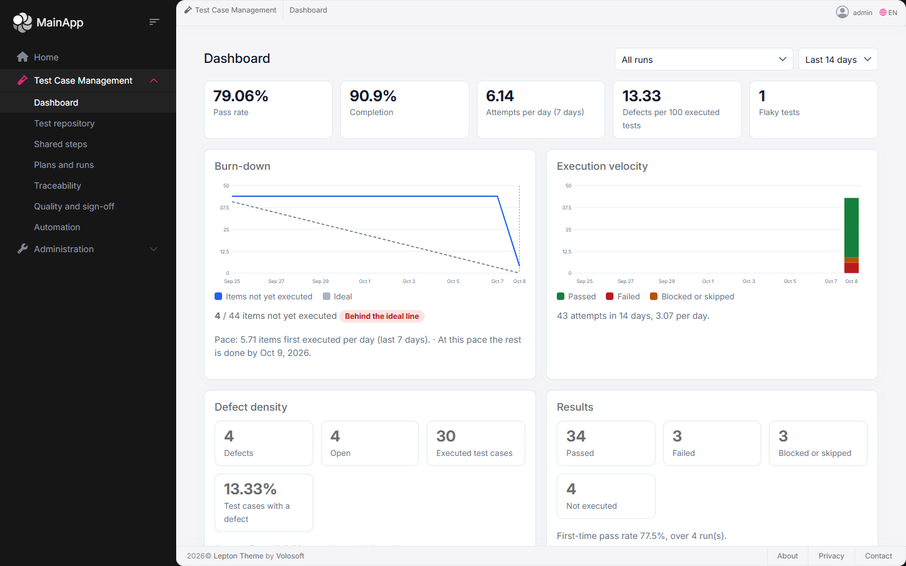
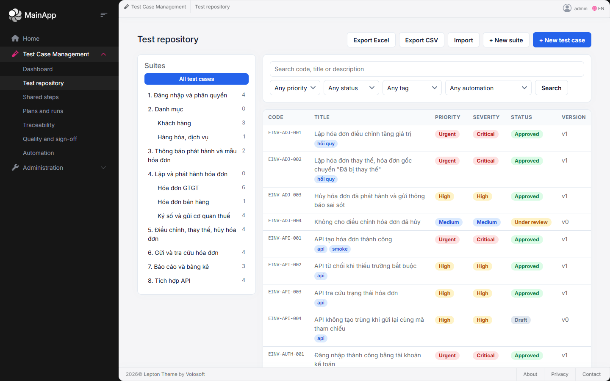
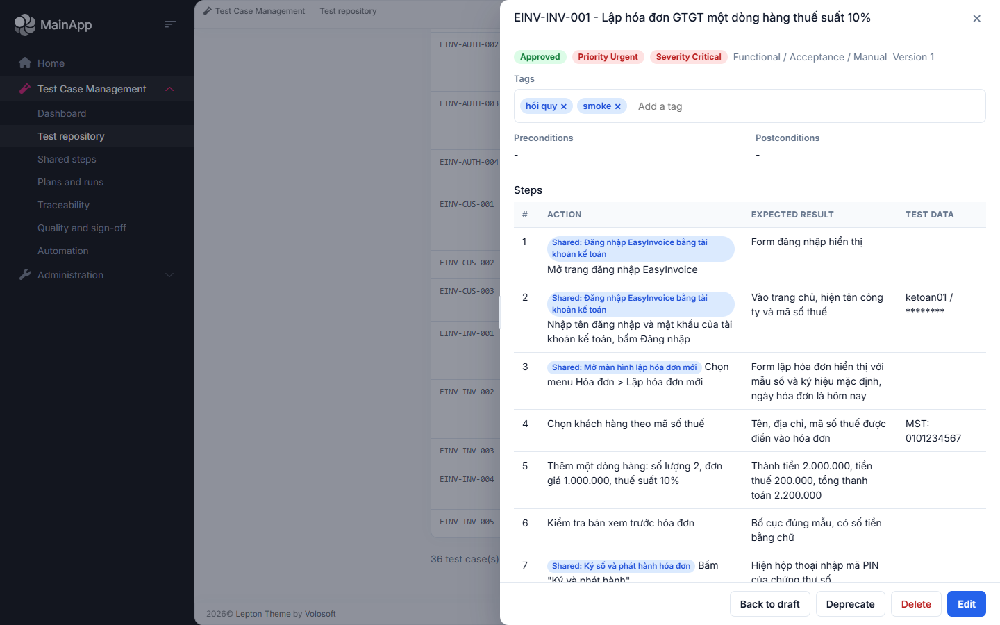
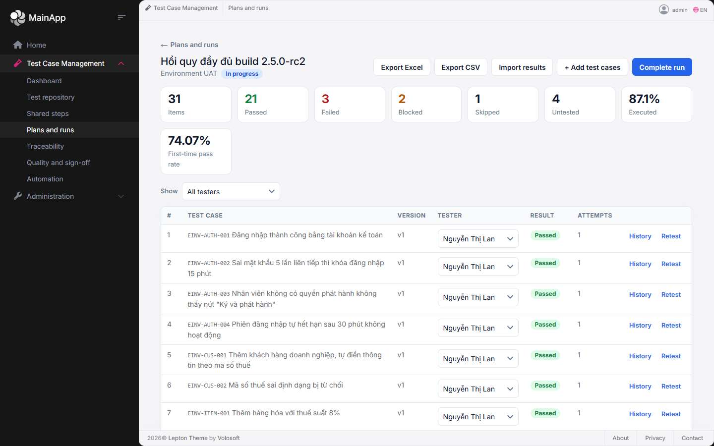
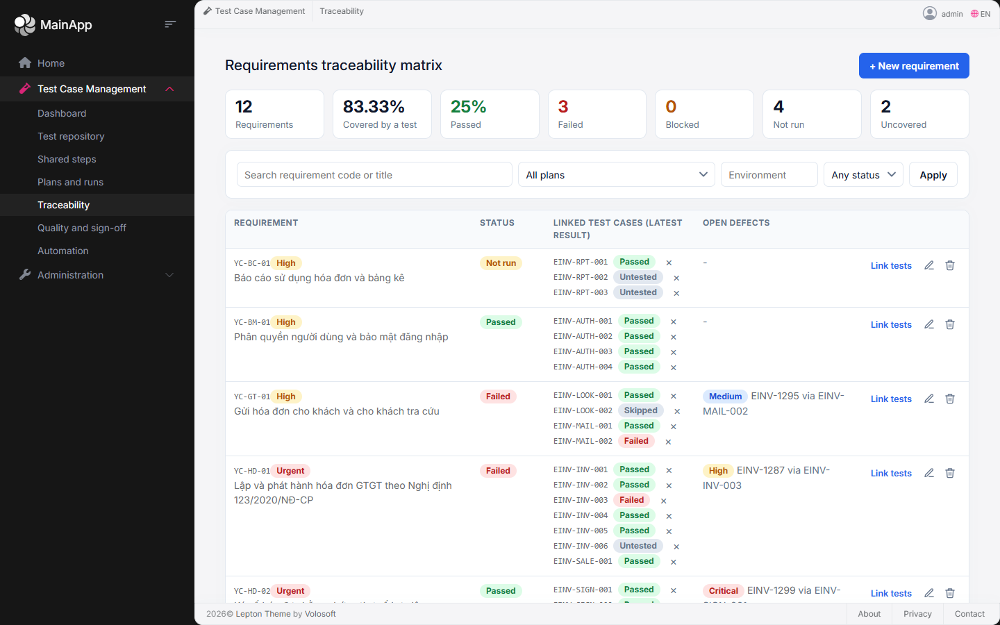
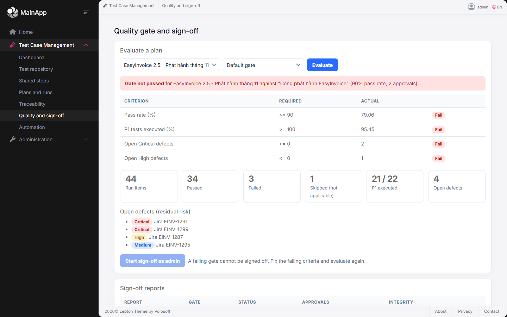
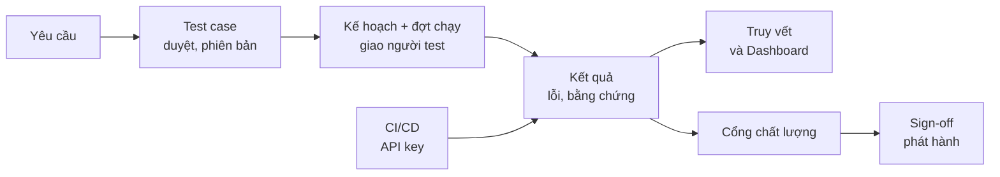

<div align="center">

# Test Case Management

**Module quản lý kiểm thử có thể tái sử dụng cho ABP Framework**

Từ yêu cầu → test case → đợt kiểm thử → kết quả → cổng chất lượng → sign-off phát hành, trong một chỗ duy nhất.


</div>

---

## Giới thiệu

Nhiều đội QA vẫn quản lý kiểm thử bằng bảng tính, và các con số rời rạc: test case nằm một nơi, kết quả chạy nằm một nơi, lỗi nằm trên Jira, còn câu hỏi "đã đủ tốt để phát hành chưa?" thì phải ngồi tổng hợp tay.

**Test Case Management (TCM)** gom toàn bộ vòng đời đó vào một module:

- Viết và duyệt test case, giữ **lịch sử phiên bản bất biến** để mỗi lần chạy luôn gắn với đúng nội dung đã chạy.
- Lập kế hoạch, giao việc cho từng người test, ghi nhiều lần chạy cho một test, gắn lỗi và bằng chứng.
- Truy vết từng **yêu cầu** tới test case và kết quả, thấy ngay chỗ nào chưa được kiểm thử.
- Nhận kết quả test tự động từ **CI/CD**, tự phát hiện test **chập chờn (flaky)**.
- **Cổng chất lượng** và **sign-off** có chữ ký: không cho phát hành khi chưa đạt.

Module được viết theo kiến trúc phân lớp của ABP, **không phụ thuộc vào một ứng dụng cụ thể nào**: người dùng, tenant, phân quyền và nhật ký thay đổi đều lấy từ các thành phần chuẩn của ABP. Giao diện Angular đi kèm có thể cắm vào một ứng dụng ABP có sẵn (menu bên trái, phân quyền, ngôn ngữ, thông báo đều theo ứng dụng chủ).

## Ảnh chụp màn hình

> Dữ liệu trong ảnh là dữ liệu mẫu theo nghiệp vụ hóa đơn điện tử, dùng để minh họa.

| | |
|---|---|
|  **Dashboard**: tỷ lệ đạt, burn-down, tốc độ chạy, mật độ lỗi, test chập chờn |  **Kho test**: cây bộ test, lọc theo độ ưu tiên, trạng thái, tag, automation |
|  **Chi tiết trong ngăn kéo**: kéo để đổi độ rộng, danh sách vẫn thấy phía sau |  **Đợt chạy**: giao việc theo người, lọc "việc của tôi", kết quả từng test |
|  **Truy vết yêu cầu**: yêu cầu nào đã có test, đã đạt chưa, còn lỗi mở nào |  **Cổng chất lượng**: đánh giá theo từng tiêu chí trước khi cho phát hành |

## Tính năng

### Thư viện test
- **Bộ test dạng cây** (lồng nhiều cấp, chống vòng lặp), **test case** với các bước, kết quả mong đợi và dữ liệu thử.
- **Quy trình duyệt**: Draft → Under review → Approved → Deprecated.
- **Phiên bản bất biến**: mỗi lần sửa tạo một bản mới; kế hoạch và đợt chạy luôn gắn với đúng bản đã chọn.
- **Bước dùng chung**: viết một lần ("Đăng nhập", "Ký số và phát hành") rồi dùng lại ở nhiều test case; sửa một chỗ thì cập nhật hàng loạt.
- **Tag**, tìm kiếm toàn văn, lọc nhiều chiều; **nhập/xuất Excel và CSV** có kiểm tra trước (dry run), nhập tất cả hoặc không gì cả.
- **Gợi ý bước bằng AI** từ một đoạn yêu cầu (người dùng xem và chọn trước khi thêm), dùng được với mọi dịch vụ tương thích OpenAI.

### Thực thi kiểm thử
- **Kế hoạch (plan)** và **đợt chạy (run)** theo môi trường; **giao test cho từng người**, lọc "việc của tôi", đếm đã làm trên tổng số.
- **Nhiều lần chạy cho một test** (chạy lại, retest), lịch sử chỉ thêm không sửa.
- **Gắn lỗi** từ trình quản lý lỗi (Jira, GitHub...) với mức nghiêm trọng và trạng thái đã xử lý.
- **Tệp đính kèm** (ảnh chụp màn hình, log, video): dán ảnh trực tiếp, xem ảnh và log ngay trong ứng dụng.

### Truy vết và chất lượng
- **Yêu cầu** và **ma trận truy vết (RTM)** hai chiều, phân biệt "có test" với "đã đạt", chỉ ra lỗi chặn.
- **Dashboard**: tỷ lệ đạt, burn-down, tốc độ chạy, mật độ lỗi.
- **Phát hiện test chập chờn (flaky)** dựa trên số lần đổi chiều Pass/Fail, gắn cờ vào thư viện.
- **Cổng chất lượng** cấu hình được (tỷ lệ đạt tối thiểu, mọi test ưu tiên P1 đã chạy, không còn lỗi Critical/High mở).
- **Sign-off** cần đủ số người duyệt khác nhau, đóng băng số liệu và mã băm SHA-256 để không bị sửa sau.

### Tích hợp và vận hành
- **CI/CD**: pipeline gửi kết quả hàng loạt bằng **API key** (chỉ có quyền gửi kết quả), liên kết test case với test tự động qua **Automation ID**, chống ghi trùng bằng `Idempotency-Key`.
- **Đa tenant**, **phân quyền chi tiết** theo vai trò (Tester, QA Lead, Product Owner, Admin), **nhật ký thay đổi** theo ABP.
- **Hai ngôn ngữ**: tiếng Anh và tiếng Việt, cho cả giao diện lẫn thông báo lỗi của API.

## Luồng làm việc



## Kiến trúc

```
Acme.TestCaseManagement/
├─ src/                                  Module ABP (6 dự án, mỗi lớp một gói NuGet)
│  ├─ Domain.Shared        enum, hằng số, mã lỗi, bản địa hóa (en, vi)
│  ├─ Domain               aggregate, domain service, quy tắc nghiệp vụ
│  ├─ Application.Contracts DTO, interface dịch vụ, quyền
│  ├─ Application          dịch vụ ứng dụng
│  ├─ EntityFrameworkCore  DbContext, ánh xạ, repository
│  └─ HttpApi              REST controller
├─ angular/                              Giao diện Angular
│  ├─ projects/test-case-management      thư viện trang (dùng như mã nguồn) + adapter cho ABP
│  └─ src/app                            ứng dụng độc lập để chạy thử
├─ host/                                 Host mẫu (JWT, SQLite/MySQL, dữ liệu mẫu)
└─ test/                                 Domain, Application, HTTP API tests (xUnit)
```

Điểm thiết kế chính:

- **Giao diện là thư viện + adapter.** Thư viện chỉ cần ứng dụng chủ cung cấp vài "hợp đồng" (thông tin đăng nhập và quyền, địa chỉ API, ngôn ngữ, thông báo, danh sách người dùng). Có sẵn adapter cho ứng dụng ABP Angular và một bản độc lập để chạy thử.
- **Phân tầng của ABP**: nghiệp vụ nằm ở Domain, controller không chứa logic, quyền kiểm tra tại dịch vụ ứng dụng.
- **An toàn khi chạy đồng thời**: khóa theo tài nguyên cho các thao tác dễ tranh chấp (sign-off, cổng mặc định, gửi kết quả CI).

## Bắt đầu nhanh

Yêu cầu: **.NET SDK 10** (xem `global.json`) và **Node.js** bản LTS mới (đã chạy với Node 24).

```powershell
# 1. Chạy host mẫu (SQLite, tự tạo dữ liệu mẫu) tại http://localhost:5080
cd Acme.TestCaseManagement/host/Acme.TestCaseManagement.HttpApi.Host
dotnet run --launch-profile Acme.TestCaseManagement.HttpApi.Host

# 2. Chạy giao diện độc lập tại http://localhost:4200 (cửa sổ khác)
cd Acme.TestCaseManagement/angular
npm install
npm start
```

Đăng nhập bằng một trong các tài khoản mẫu (mật khẩu `Tcm!Demo123`):

| Tài khoản | Vai trò | Có thể |
|---|---|---|
| `qa.lead` | QA Lead | Mọi thao tác |
| `tester` | Tester | Xem, chạy test, ghi kết quả |
| `product.owner` | Product Owner | Xem, duyệt sign-off |

Swagger có tại `http://localhost:5080/swagger` (chỉ ở môi trường Development).

### Build, test và đóng gói

```powershell
cd Acme.TestCaseManagement
./build/build.ps1                           # khôi phục, build, test, đóng gói ra artifacts/packages
./build/build.ps1 -VersionSuffix preview.1  # phiên bản 1.0.0-preview.1
dotnet test                                 # 668 test backend (SQLite, trong bộ nhớ)

cd angular
npx ng test --watch=false                   # 164 test giao diện
npx ng build                                # build production
```

### Chạy trên MySQL

```powershell
docker run -d --name tcm-mysql -e MYSQL_ROOT_PASSWORD=secret -p 3307:3306 mysql:8.4
$env:TCM_TEST_MYSQL = "Server=localhost;Port=3307;User ID=root;Password=secret;"
dotnet test --settings test/mysql.runsettings
```

Host mẫu cũng chạy được trên MySQL với `Host:Database=MySql` và `ConnectionStrings:Default`.

### Thử tính năng gợi ý bằng AI

Đặt ba biến cấu hình (hoặc mục `TestCaseManagement:AiSuggestions` trong appsettings) cho dịch vụ tương thích OpenAI:

```powershell
$env:TestCaseManagement__AiSuggestions__Endpoint = "https://host/v1/chat/completions"
$env:TestCaseManagement__AiSuggestions__ApiKey   = "<khóa>"
$env:TestCaseManagement__AiSuggestions__Model    = "<tên model>"
```

Không cấu hình thì nút gợi ý tự ẩn. Khóa không bao giờ được ghi log hay trả về trình duyệt. Có thể bỏ khóa vào file `.env` ở gốc kho mã (đã được git bỏ qua, xem `.env.example`).

## Tích hợp vào ứng dụng ABP có sẵn

Module đã được thử cắm vào một ứng dụng sinh từ template chính thức của ABP (Angular, LeptonX, OpenIddict): menu tự xuất hiện trong thanh bên, quyền quản lý trên màn hình Roles của ứng dụng chủ, ngôn ngữ và thông báo theo ứng dụng chủ. Tóm tắt:

1. **Máy chủ**: tham chiếu sáu dự án `Acme.TestCaseManagement.*`, thêm vào `[DependsOn]` của từng lớp, nhúng mô hình vào DbContext của ứng dụng, tạo migration.
2. **Angular**: sao chép `angular/projects/test-case-management` vào ứng dụng, thêm `provideTestCaseManagementForAbp()` và `provideTestCaseManagementMenu()`, khai báo một route.
3. **Pipeline**: gọi `AddTestCaseManagementApiKeyAuthentication()` để nhận kết quả test bằng API key.

Các bước chi tiết nằm trong [`Acme.TestCaseManagement/README.md`](Acme.TestCaseManagement/README.md), mục *Using the module in an ABP application*.

## Chất lượng

| | |
|---|---|
| Backend (xUnit, Shouldly) | **211** Domain, **375** Application, **82** HTTP API, đều đạt trên SQLite; toàn bộ cũng đạt trên **MySQL 8.4** |
| Giao diện (Vitest) | **164** test, build production đạt |
| Trình duyệt thật (Playwright) | Kịch bản 47 bước trên ứng dụng độc lập và kịch bản trên ứng dụng ABP mẫu (kho test, quyền, API key, AI) |
| Quy mô dữ liệu đã đo | 10.000 test case và 100.000 mục chạy: các danh sách đáp ứng dưới 1 giây; Dashboard khoảng 6 giây |
| Rà soát mã | Đã rà toàn bộ module bằng nhiều người đọc độc lập; các lỗi nghiêm trọng đã sửa kèm test |

## Trạng thái và giới hạn đã biết

Module đã đủ chức năng để thử trong một ứng dụng ABP thật. Những điều **chưa được kiểm chứng hoặc còn hạn chế**:

- Mới thử trong ứng dụng ABP mẫu; chưa thử trong ứng dụng thật của một doanh nghiệp (phiên bản Angular và ABP có thể khác, mới thử với Angular 22).
- Chưa có khái niệm **"Dự án"**: mọi dữ liệu trong một tenant dùng chung một kho. Có thể tách tạm bằng bộ test cấp cao nhất, tiền tố mã và plan riêng.
- Dashboard, danh sách test chập chờn và cổng chất lượng đọc toàn bộ mục chạy của phạm vi: với hàng trăm nghìn mục sẽ chậm.
- Khóa chống đồng thời hoạt động trong một tiến trình; chạy nhiều máy chủ cần đăng ký thêm cơ chế khóa phân tán của ABP.
- Chưa tích hợp trực tiếp Jira/GitHub (hiện chỉ lưu khóa lỗi); tính năng AI mới thử với một dịch vụ tương thích OpenAI.
- Chưa thử gói MySQL Pomelo, MariaDB, MySQL 5.7 và migration tạo bằng `dotnet ef` cho MySQL.

## Lộ trình gợi ý

- Thử trong môi trường thật của doanh nghiệp và sửa theo phản hồi.
- Tích hợp Jira (tạo lỗi từ test fail, đồng bộ trạng thái).
- Khái niệm **Dự án** (bộ chọn dự án, lọc ở mọi báo cáo, phân quyền theo dự án).
- Tối ưu Dashboard bằng truy vấn tổng hợp trong cơ sở dữ liệu cho dữ liệu rất lớn.
- Đóng gói giao diện thành gói npm.

## Tài liệu

| Tài liệu | Nội dung |
|---|---|
| [`docs/HUONG_DAN_SU_DUNG.md`](docs/HUONG_DAN_SU_DUNG.md) | **Hướng dẫn sử dụng cho cả đội**: khái niệm, sơ đồ, bài tập thực hành theo vai trò, quy ước, hỏi đáp (tiếng Việt) |
| [`Acme.TestCaseManagement/README.md`](Acme.TestCaseManagement/README.md) | Hướng dẫn kỹ thuật chi tiết: gói, tích hợp, API, quyền, import/export, CI/CD, MySQL, giới hạn (tiếng Anh) |
| [`BUSINESS_ANALYSIS_TEST_CASE_MANAGEMENT.md`](BUSINESS_ANALYSIS_TEST_CASE_MANAGEMENT.md) | Phân tích nghiệp vụ và thiết kế module (tiếng Việt) |
| [`specs/001-test-case-management/spec.md`](specs/001-test-case-management/spec.md) | Đặc tả: 27 yêu cầu chức năng, kịch bản người dùng |
| [`specs/001-test-case-management/plan.md`](specs/001-test-case-management/plan.md) | Kế hoạch kỹ thuật và quyết định thiết kế, kèm nghiên cứu cho từng công thức |
| [`specs/001-test-case-management/tasks.md`](specs/001-test-case-management/tasks.md) | Danh sách công việc theo từng giai đoạn |

## Công nghệ

.NET 10 · ABP Framework 10.6 · Entity Framework Core · Angular 22 (standalone, signals) · xUnit, Shouldly · Vitest · Playwright · SQLite và MySQL 8.4 (đã chạy toàn bộ test); các cơ sở dữ liệu khác của EF Core chưa được thử.

## Giấy phép

Chưa chọn giấy phép. Trước khi chia sẻ ra ngoài tổ chức, hãy thêm tệp `LICENSE` phù hợp.
