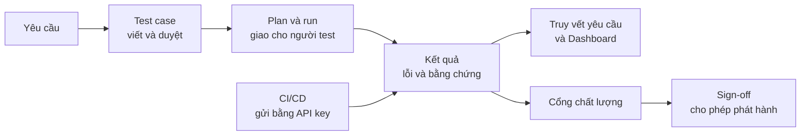
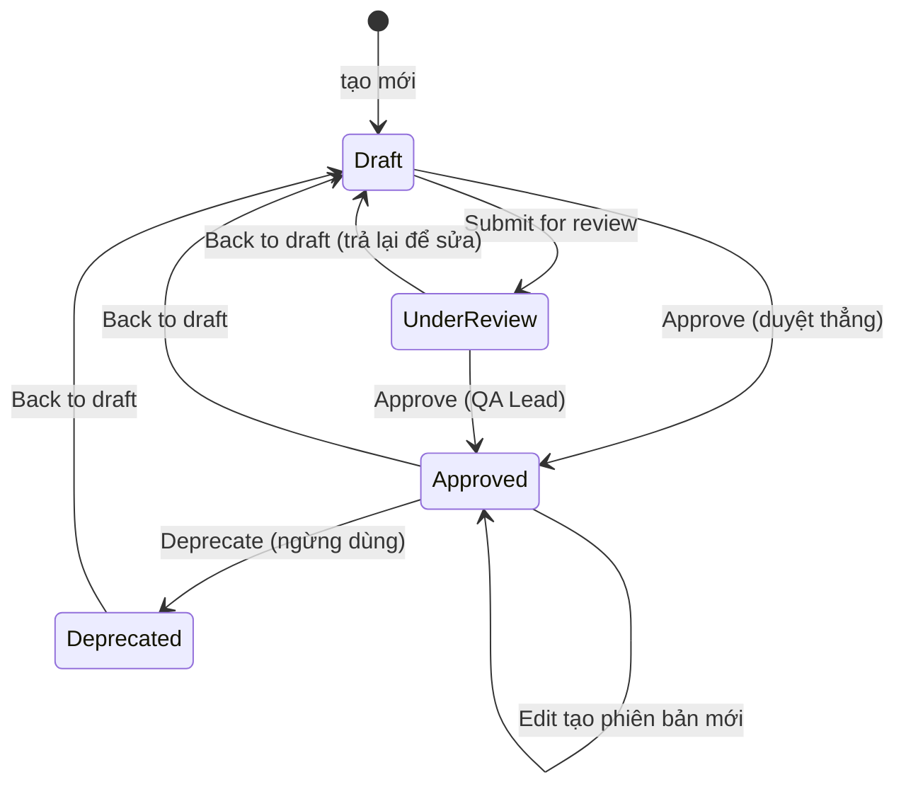
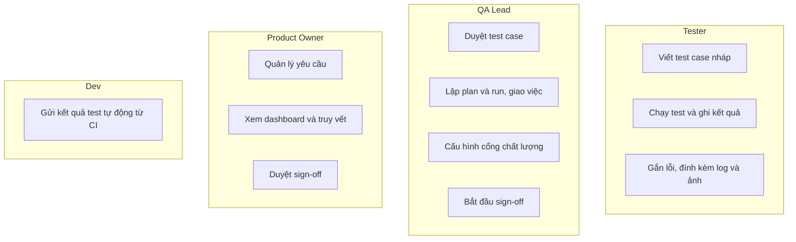
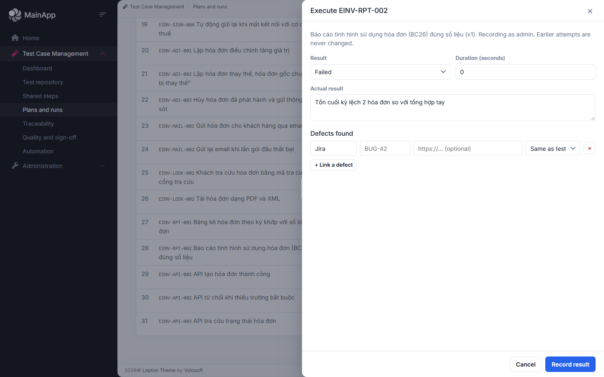
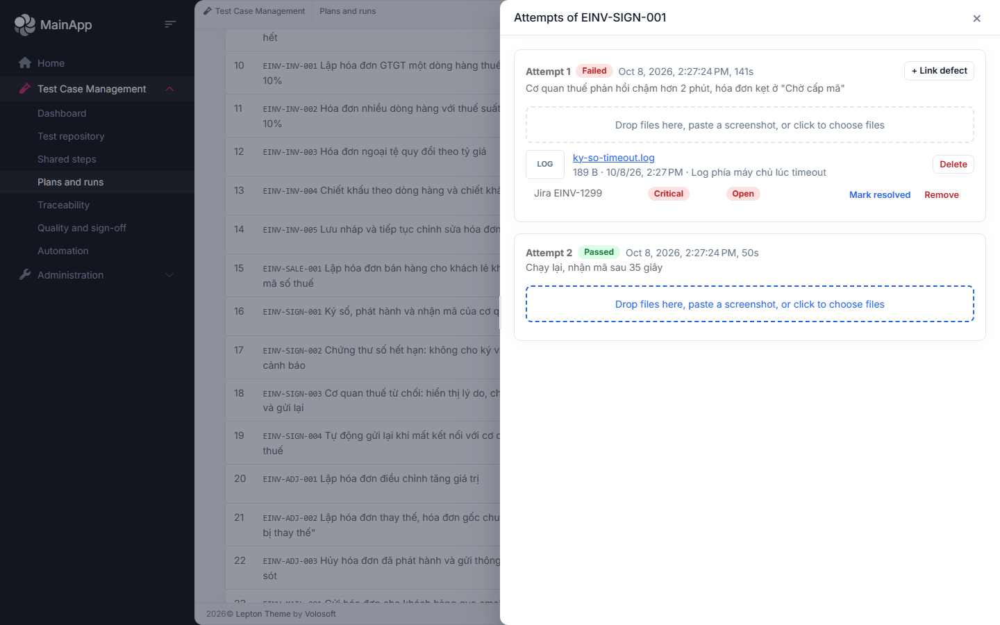
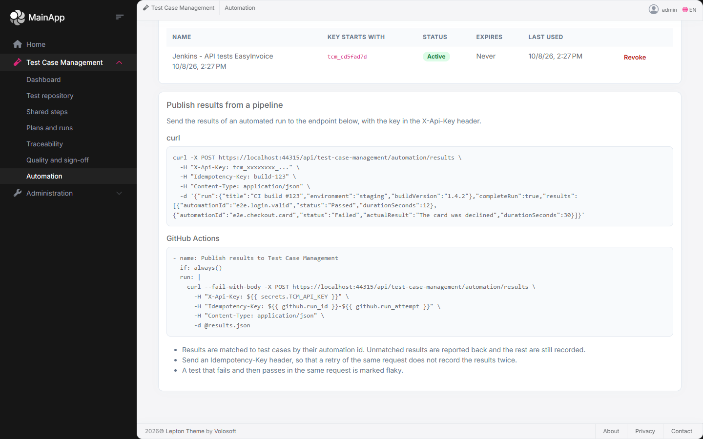

# Hướng dẫn sử dụng Test Case Management

Tài liệu thực hành cho cả đội: tester, QA lead, product owner và dev. Đọc hết mất khoảng 15 phút, làm hết các bài tập mất khoảng 45 phút.

- [1. Ý tưởng chính](#1-ý-tưởng-chính)
- [2. Ba sơ đồ cần nhớ](#2-ba-sơ-đồ-cần-nhớ)
- [3. Trước khi bắt đầu](#3-trước-khi-bắt-đầu)
- [4. Thực hành](#4-thực-hành)
- [5. Quy ước của đội](#5-quy-ước-của-đội)
- [6. Hỏi đáp và xử lý sự cố](#6-hỏi-đáp-và-xử-lý-sự-cố)
- [Phụ lục: quyền theo vai trò](#phụ-lục-quyền-theo-vai-trò)

> Các bài tập dùng **bộ dữ liệu mẫu EasyInvoice** (hóa đơn điện tử) trên môi trường tập. Tên nút trong tài liệu theo giao diện tiếng Anh (**Execute**, **Approve**...); đổi ngôn ngữ bằng nút ngôn ngữ ở góc trên bên phải, giao diện và thông báo lỗi sẽ chuyển sang tiếng Việt.

---

## 1. Ý tưởng chính

| Khái niệm | Hiểu đơn giản |
|---|---|
| **Yêu cầu** (requirement) | Điều sản phẩm phải làm được, ví dụ "Ký số hóa đơn bằng chứng thư số hợp lệ". |
| **Bộ test** (suite) | Thư mục chứa test case, lồng được nhiều cấp, chia theo luồng nghiệp vụ. |
| **Test case** | Một kịch bản kiểm thử: các bước, kết quả mong đợi, dữ liệu thử. |
| **Phiên bản** (version) | Mỗi lần sửa test case **đã duyệt** thì tạo ra một phiên bản mới; các lần chạy cũ vẫn giữ nguyên bản đã chạy. |
| **Bước dùng chung** | Đoạn bước dùng lại ở nhiều test case (ví dụ "Đăng nhập"). Sửa một chỗ, cập nhật được mọi nơi dùng. |
| **Plan** | Một đợt kiểm thử, thường tương ứng một đợt phát hành. |
| **Run** | Một lần chạy một nhóm test case trên một môi trường (Staging, UAT). Mỗi test case trong run là một **mục chạy**, được giao cho một người. |
| **Lần thử** (attempt) | Mỗi lần ghi kết quả cho một mục chạy. Chạy lại thì thêm lần thử mới, **không ghi đè** lần cũ. |
| **Cổng chất lượng** | Bộ điều kiện để được phát hành (tỷ lệ đạt tối thiểu, không còn lỗi Critical mở...). |
| **Sign-off** | Chữ ký xác nhận phát hành của đủ số người duyệt, sau khi cổng chất lượng đạt. |

## 2. Ba sơ đồ cần nhớ

### 2.1 Luồng tổng thể



### 2.2 Vòng đời của một test case



Chỉ test case **Approved** mới đưa được vào run. Sửa test case đã duyệt không làm hỏng các run cũ vì chúng giữ đúng phiên bản đã chạy.

### 2.3 Ai làm gì



## 3. Trước khi bắt đầu

1. Mở địa chỉ của môi trường tập (do QA Lead cung cấp), bấm **Login** và đăng nhập.
2. Trong thanh bên trái, mở nhóm **Test Case Management**. Chỉ những mục bạn có quyền mới hiện ra.
3. Nếu không thấy nhóm này, bạn chưa được cấp quyền: nhờ quản trị viên thêm quyền ở **Administration → Roles** (xem [phụ lục](#phụ-lục-quyền-theo-vai-trò)).

Các mục trong thanh bên: **Dashboard**, **Test repository**, **Shared steps**, **Plans and runs**, **Traceability**, **Quality and sign-off**, **Automation**.

## 4. Thực hành

### Phần A. Dành cho Tester

#### Bài 1: Tìm việc của mình và ghi kết quả Passed

1. Vào **Plans and runs**, mở run **"Hồi quy đầy đủ build 2.5.0-rc2"**.
2. Ở ô **Show** phía trên bảng, chọn **My tests** để chỉ thấy việc được giao cho bạn.
3. Chọn một test chưa chạy (cột Result là *Untested*) và bấm **Execute**. Một ngăn kéo hiện ra từ bên phải.
4. Làm theo các bước của test case, chọn **Result = Passed**, ghi thời gian nếu muốn, rồi bấm **Record result**.

Kiểm tra: dòng đó chuyển thành **Passed** và số **Executed** ở đầu trang tăng lên.

> Mẹo: ngăn kéo kéo đổi được độ rộng. Kéo thanh nhỏ ở mép trái của nó, hoặc dùng mũi tên trái/phải khi đang chọn thanh đó. Độ rộng được nhớ cho lần sau.

#### Bài 2: Ghi kết quả Failed kèm lỗi và bằng chứng



1. Bấm **Execute** ở một test khác, chọn **Result = Failed**.
2. Ở **Actual result**, mô tả **điều gì đã xảy ra thật** (không chỉ viết "lỗi"). Ví dụ: *"Tồn cuối kỳ lệch 2 hóa đơn so với tổng hợp tay"*.
3. Trong **Defects found**, bấm **+ Link a defect**, nhập hệ thống (Jira), khóa lỗi (ví dụ `EINV-1300`) và mức nghiêm trọng. Bạn tạo lỗi trên Jira trước rồi dán khóa vào đây.
4. Bấm **Record result**.
5. Đính kèm bằng chứng: ở dòng đó bấm **History**, kéo thả tệp vào vùng đính kèm của lần thử, hoặc bấm vào vùng đó rồi **dán ảnh chụp màn hình** bằng Ctrl+V.



Bấm vào tên tệp: ảnh và log mở xem ngay trong ứng dụng, các loại tệp khác sẽ được tải về.

#### Bài 3: Chạy lại sau khi lỗi được sửa (retest)

1. Ở dòng test đã Failed, bấm **Retest**.
2. Ghi **Passed** và bấm **Record result**.
3. Bấm **History**: bạn thấy **hai lần thử** (Failed rồi Passed). Lần cũ không bị xóa. Trạng thái hiện tại của test là lần thử mới nhất.

> Nếu một test cứ lúc Pass lúc Fail dù code không đổi, hệ thống sẽ đánh dấu nó là **flaky** (chập chờn) trên Dashboard. Hãy ghi lại điều đó trong kết quả thực tế để cả đội xử lý.

#### Bài 4: Viết một test case mới, dùng AI gợi ý bước

1. Vào **Test repository**, chọn bộ test cần thêm, bấm **+ New test case**.
2. Điền **Code** (theo [quy ước](#5-quy-ước-của-đội)), **Title**, độ ưu tiên và mức nghiêm trọng.
3. Bấm **Suggest steps with AI**, dán yêu cầu hoặc tiêu chí chấp nhận vào, bấm **Generate steps**. AI đề xuất các bước, bạn **tích chọn** bước muốn giữ rồi bấm **Add … step(s)**.
4. **Đọc kỹ và sửa** các bước cho đúng với hệ thống thật (tên nút, tên màn hình). AI chỉ gợi ý, người viết chịu trách nhiệm nội dung.
5. Bấm **Save**. Test case ở trạng thái **Draft**, nhờ QA Lead duyệt.

### Phần B. Dành cho QA Lead

#### Bài 5: Duyệt test case

1. Trong **Test repository**, lọc **Any status → Under review**, hoặc mở test case ở trạng thái Draft.
2. Bấm vào test case, đọc các bước. Nếu ổn bấm **Approve** (test case Draft có thể duyệt thẳng, hoặc đi qua **Submit for review** nếu đội muốn có bước xem xét riêng). Nếu chưa ổn, bấm **Back to draft** và báo người viết sửa.

#### Bài 6: Dùng bước dùng chung

1. Vào **Shared steps**, xem nhóm **"Đăng nhập EasyInvoice bằng tài khoản kế toán"** và nơi nó được dùng.
2. Thử sửa một bước của nhóm (ví dụ đổi chữ trong kết quả mong đợi). Các test case đang dùng sẽ báo **Behind** (cũ hơn nhóm).
3. Trong một test case, bấm **Update** ở bước dùng chung để cập nhật. Nếu test case đã Approved thì hệ thống tạo **phiên bản mới** và hỏi xác nhận trước.

#### Bài 7: Tạo run và giao việc

1. Vào **Plans and runs**. Nếu chưa có plan, bấm **+ New plan** đặt tên theo đợt phát hành, rồi chuyển sang **Active** bằng nút `⋯` ở dòng plan.
2. Bấm **+ New run**: nhập tên, chọn plan, môi trường, tích chọn các test case (chỉ test case đã **Approved** mới hiện).
3. Mở run vừa tạo. Ở cột **Tester**, chọn người chạy cho từng dòng. Khi **+ Add test cases** thêm test case, bạn cũng chọn người nhận ngay trong hộp thoại.
4. Dùng ô **Show** để xem khối lượng: mỗi người hiện kèm số đã làm trên tổng số, ví dụ *Nguyễn Thị Lan (7/7)*.
5. Khi tất cả đã chạy xong, bấm **Complete run**.

#### Bài 8: Đọc Dashboard và Traceability

- **Dashboard:** *Pass rate* (tỷ lệ đạt), *Burn-down* (còn bao nhiêu test chưa chạy so với kế hoạch), *Defect density* (lỗi trên 100 test đã chạy), *Flaky tests*. Chọn plan ở góc trên để xem riêng từng đợt.
- **Traceability:** mỗi yêu cầu có trạng thái *Passed / Failed / Blocked / Not run / Uncovered*. **Uncovered** là yêu cầu **chưa có test nào**, đây là chỗ cần viết thêm test trước khi phát hành. Bấm **Link tests** để gắn test case vào yêu cầu.


#### Bài 9: Cổng chất lượng và sign-off

1. Vào **Quality and sign-off**, chọn plan, bấm **Evaluate**.
2. Xem từng tiêu chí: **Pass** hoặc **Fail**, kèm danh sách lỗi đang mở.
3. Khi cổng **không đạt**, nút **Start sign-off** bị khóa: sửa lỗi, chạy lại test rồi đánh giá lại.
4. Khi cổng đạt, bấm **Start sign-off**, sau đó đủ số người duyệt (khác nhau) bấm **Approve**. Số liệu được đóng băng và có mã băm để không bị sửa về sau.

### Phần C. Dành cho Dev (kết quả test tự động từ CI)



1. Mỗi test case có test tự động thì điền **Automation ID**, trùng với tên test trong code (ví dụ `einvoice.api.create-invoice`).
2. Vào **Automation → New API key**, đặt tên (ví dụ "Jenkins"). **Sao chép khóa ngay**: nó chỉ hiện một lần.
3. Trong pipeline, sau bước chạy test, gửi kết quả:

```bash
curl --fail-with-body -X POST https://<máy-chủ>/api/test-case-management/automation/results \
  -H "X-Api-Key: $TCM_API_KEY" \
  -H "Idempotency-Key: build-123" \
  -H "Content-Type: application/json" \
  -d '{ "run": { "title": "CI build 123", "environment": "UAT" },
        "completeRun": true,
        "results": [
          { "automationId": "einvoice.api.create-invoice", "status": "Passed", "durationSeconds": 4 },
          { "automationId": "einvoice.api.validation", "status": "Failed", "actualResult": "Thiếu thông báo lỗi" }
        ] }'
```

- `Idempotency-Key` (ví dụ mã build) giúp **gửi lại không bị ghi trùng**.
- Automation ID không khớp test case nào sẽ được liệt kê trong phản hồi, các kết quả khác vẫn được ghi.
- Cùng một test xuất hiện nhiều lần trong yêu cầu được coi là các lần thử lại; test fail rồi pass sẽ được đánh dấu flaky.
- Khóa bị lộ hoặc không dùng nữa: bấm **Revoke** ở màn hình Automation.

## 5. Quy ước của đội

> Đây là **đề xuất khởi đầu**. Cả đội thống nhất và chỉnh sửa trong buổi đầu, rồi cập nhật ngay vào mục này.

**Đặt mã test case:** `<DỰ ÁN>-<NHÓM>-<SỐ>`, ví dụ `EINV-INV-001`. Mã là duy nhất trong cả hệ thống, nên dự án nào cũng phải có tiền tố riêng.

**Tên test case:** viết như một câu nói được điều cần kiểm tra: *"Hủy hóa đơn đã phát hành và gửi thông báo sai sót"*, không viết *"Test hủy"*.

**Độ ưu tiên và mức nghiêm trọng:**

| Mức | Dùng khi |
|---|---|
| Urgent / Critical | Luồng chính, lỗi là không dùng được sản phẩm hoặc sai tiền thuế |
| High | Luồng quan trọng, có cách làm khác tạm thời |
| Medium | Chức năng phụ |
| Low | Chi tiết giao diện, trường hợp hiếm |

**Tag thường dùng:** `smoke` (bộ kiểm tra nhanh trước mỗi bản build), `hồi quy`, `api`, `bảo mật`. Thêm tag mới khi cần nhưng không tạo hai tag cùng nghĩa.

**Khi nào được duyệt (Approved):** có đủ bước rõ ràng, mỗi bước có kết quả mong đợi kiểm tra được, có dữ liệu thử cụ thể, người duyệt **khác** người viết.

**Ghi kết quả:**
- **Failed:** luôn viết kết quả thực tế cụ thể; gắn khóa lỗi Jira; đính kèm log hoặc ảnh khi có.
- **Blocked:** dùng khi **không chạy được** vì lý do bên ngoài (môi trường hỏng, chờ chức năng khác); ghi lý do.
- **Skipped:** cố ý không chạy trong đợt này; ghi lý do.

**Đặt tên plan và run:**
- Plan: `<Dự án> <Phiên bản> - <Ghi chú>`, ví dụ *"EasyInvoice 2.5 - Phát hành tháng 11"*.
- Run: `<Loại> build <số build>`, ví dụ *"Smoke build 2.5.0-rc1"*.

**Khi nào tạo run mới:** mỗi bản build đưa lên kiểm thử là một run. Chạy lại trong cùng một build thì dùng **Retest**, không tạo run mới.

**Nhiều dự án dùng chung hệ thống:** mỗi dự án một bộ test cấp cao nhất (ví dụ `[HRM] ...`), mã có tiền tố riêng, plan riêng cho từng đợt phát hành.

## 6. Hỏi đáp và xử lý sự cố

**Tôi không thấy mục Test Case Management ở thanh bên.**
Tài khoản chưa có quyền. Nhờ quản trị viên cấp quyền cho vai trò của bạn ở Administration → Roles.

**Tôi không thấy nút Approve (hoặc Create, Delete...).**
Quyền duyệt, tạo, xóa được cấp riêng. Xem [phụ lục](#phụ-lục-quyền-theo-vai-trò) và nhờ quản trị viên điều chỉnh.

**Tôi sửa test case đã duyệt, sao có "Version 2"?**
Đúng thiết kế: mỗi lần sửa test case đã duyệt tạo phiên bản mới để các lần chạy cũ vẫn gắn với đúng nội dung đã chạy.

**Tôi không thêm được test case vào run.**
Chỉ test case ở trạng thái **Approved** mới được thêm. Một test case cũng chỉ xuất hiện **một lần** trong một run.

**Không có ô chọn người test ở cột Tester.**
Ứng dụng chưa cung cấp được danh sách người dùng cho module, hoặc bạn không có quyền quản lý plan. Nhờ quản trị viên kiểm tra.

**Tôi lỡ ghi nhầm kết quả.**
Không sửa được lần thử cũ (lịch sử chỉ thêm, không sửa). Hãy bấm **Retest** và ghi kết quả đúng; lần mới nhất là trạng thái hiện tại.

**Test "chập chờn" (flaky) là gì và làm gì với nó?**
Test lúc Pass lúc Fail dù code không đổi. Nó làm sai tỷ lệ đạt và làm mất niềm tin vào kết quả. Hãy báo cho đội để sửa test (thường do chờ phần tử chưa kịp hiện, phụ thuộc dịch vụ ngoài, dữ liệu dùng chung); đừng chỉ chạy lại cho qua.

**Cổng chất lượng báo không đạt nhưng tôi thấy test đã pass hết.**
Cổng còn xét **lỗi đang mở** (Critical/High) và việc **mọi test ưu tiên P1 đã chạy**, không chỉ tỷ lệ đạt. Xem từng dòng tiêu chí và danh sách lỗi mở ở dưới.

**Pipeline gửi kết quả bị ghi trùng.**
Gửi kèm `Idempotency-Key` (ví dụ mã build) để lần gửi lại được nhận ra.

**Gợi ý bằng AI báo "could not be reached".**
Dịch vụ AI không phản hồi hoặc cấu hình sai. Chưa có thay đổi nào được lưu. Thử lại sau, và báo quản trị viên kiểm tra cấu hình AI nếu lỗi kéo dài.

**Nội dung tôi nhập cho AI đi đâu?**
Đoạn yêu cầu bạn nhập được gửi tới dịch vụ AI mà quản trị viên đã cấu hình. Đừng dán dữ liệu mật hoặc dữ liệu cá nhân của khách hàng vào.

---

## Phụ lục: quyền theo vai trò

Bảng dưới là bộ quyền của **ba vai trò trong host mẫu**; ứng dụng của bạn cấu hình ở **Administration → Roles**.

| Việc | Tester | QA Lead | Product Owner |
|---|:---:|:---:|:---:|
| Xem test case, plan, run, dashboard, truy vết | ✔ | ✔ | ✔ |
| Viết và sửa test case | ✔ | ✔ | |
| Gợi ý bước bằng AI | ✔ | ✔ | |
| Duyệt, xóa test case | | ✔ | |
| Quản lý bộ test, bước dùng chung | | ✔ | |
| Chạy test, ghi kết quả, gắn lỗi, đính kèm | ✔ | ✔ | |
| Lập plan và run, giao việc, hoàn tất run | | ✔ | |
| Quản lý yêu cầu | | ✔ | ✔ |
| Cấu hình cổng chất lượng | | ✔ | |
| Duyệt sign-off | | ✔ | ✔ |
| Quản lý API key (Automation) | | ✔ | |

Quyền "gửi kết quả tự động" chỉ thuộc về **API key**, không thuộc người dùng nào.
